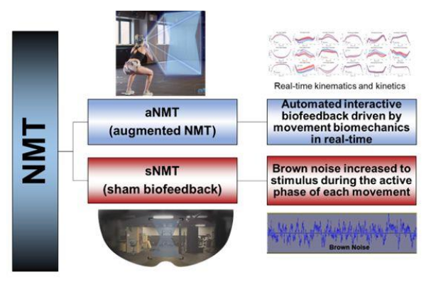

### Privacy and the NFL Combine

The professional sports combine is, among many things, a test of athletic intelligence. Harvard psychologist Howard Gardner included [bodily-kinesthetic intelligence](https://www.verywellmind.com/bodily-kinesthetic-intelligence-8650933) in his popular theory of multiple intelligences. (8 intelligences to be exact; the others: visual, linguistic, logical, musical, interpersonal, intrapersonal, naturalistic.) The athletes' cognition testing firm AIQ offers summary statistics from the company's [Athletic Intelligence Quotient exam](https://divi.ameravant.com/mmperformance/wp-content/uploads/sites/60/2022/12/AIQ-Reliability-Validity.pdf), an instrument that combine visual processing, short-term memory and stimulus-response times directed toward sport-specific contexts (football, baseball, basketball, soccer). My understanding is a little bit different from those two.

You can think of athletes' development as a filter. Between 2-10 percent of high school athletes progress to play college sports. An even smaller percentage of college athletes go on to play professional sports. Those elite college athletes with the ability to play professional NFL football have either consistently demonstrated pro-level talent in their college career, or they need to show that they can learn pro football-type athletic skills quickly. By doing so, those lower-tier college football players will have put themselves on a trajectory where, if it sustains, they will gain long-term NFL employment. 

Those football-related skills, the 40-yard sprints and the shuttle runs and the videotape interview interrogations, are where a college-age athlete must rapidly elevate their abilities, achieving competence in the short time between the end of the college season and the start of the NFL combine. Gain those essential combine skills with rocket speed and then maybe, just maybe, that decent-to-good college football player can also gain all of the other crucial skills (and with the required urgency) that an NFL player needs to thrive in the NFL. Is this high-stakes testing? Yes. Yes it is.

A 2017 Harvard Law School [legal paper](https://petrieflom.law.harvard.edu/2017/04/07/medical-records-the-nfl-combine/) by Jessica Roberts found that the NFL willfully ignores employee privacy laws with the health data the league collects on athletes during combine interviews and medical examinations. The league might argue that the job requirements are unique, and that once an athlete becomes part of the NFL they gain benefits through the NFL Players Union. Before an NFL contract however, these wannabe professionals are vulnerable. Last year one of the largest NFL combine prep consultancies, Exos, [merged](https://www.sportsbusinessjournal.com/Articles/2025/10/30/performance-leader-exos-buys-al-firm-infinite-athlete-nfl-safety-partner-biocore/) with the NFL's primary consultant on athlete biomechanics, another company called Biocore. The potential to overstep what's appropriate for athlete data collection is greater now as a result.

What does the athlete vulnerability in face of health and performance data look like? A 2024 [review paper](https://dl.acm.org/doi/abs/10.1145/3630106.3658945) by Awumey et al includes a case study of socio-technical harms experienced by athletes when employers collect biometric data. Two findings are especially relevant to NFL combine particiants. Classifications for athletes' data often fails to fully capture athletes' performances, resulting in profound distortions of the results. Employers can and do  withhold athletes' health and performance data during performance assessments, a worker-employee power assymetry that can in turn lead to athletes' confusion and alienation.

The best college football players in 2026 are better resourced than their 2017 equivalents, and should therefore have better representation as they navigate the pro football hiring gauntlet. As college football becomes increasingly professionalized, but a new set of [agent-athlete challenges](https://www.espn.com/college-football/story/_/id/47976859/street-agents-exploiting-athletes-nil-deals-coaches-warn) makes the business environment around college football more chaotic and, perhaps, less professional. You can expect the floor for athletes' protections to go up as the dollar figures increase, but as the NFL-Exos-Biocore axis shows, the forces working against athletes' privacy protection are strong and those protections remain at risk.

### Augmented-Reality Neuromuscular Training - aNMT

Greg Myer, Orthopaedics professor at Emory School of Medicine, has research ACL injury prevention for 25 years. His [current research](https://www.youtube.com/watch?v=w-hmTZSoEd0) focuses on neuromuscular training that uses virtual reality to coordinate real-time biofeedback and sensorimotor response integration. Basically, the system asks you to move the posterior chain along a potentially risky path, and it tracks movement and shows a user their alignment. If there is misalignment a user can see the problem and relate the bad position to their active spatial understanding of their body position. The goal is to create training that will make correct movement more automatic, and less cognitive, for athletes at risk of ACL damage.

Myer and his team recently published [results](https://journals.lww.com/acsm-msse/abstract/9900/the_effects_of_neuromuscular_training_and_additive.1006.aspx) in the journal *Medicine & Science in Sports & Exercise*. The paper showed that NMT improved landing biomechanics but the VR-based additive biofeedback did not influence outcomes. The authors conclude that increased somatosensory activity, that is, more of the tactile "feelable" feedback, predicts improved landing patterns.

Myer had [another paper](https://journals.sagepub.com/doi/full/10.1177/2325967125S00111) published earlier this year in *Orthopaedic Journal of Sports Medicine* (Open Access) that described his aNMT (augmented-reality NMT) system. The responsive feedback is mocap-derived rectangle that overlays the training setting, viewable in the VR headset. Researchers obtain baseline risk profiles by observing drop vertical plane knee kinetics. This study of 349 female athletes (soccer, volleyball, basketball) showed significant drops in preventable injury occurrences. 

Another recent Myer group [paper](https://www.sciencedirect.com/science/article/abs/pii/S0021929025005779) funded by the NBA did the validation testing for Theia3D markerless motion capture system. Operation instruction for a Theia3D system recommends positioning the cameras at the same vertical level as motion capture subjects. Researchers tested the effect of different camera position to what users should expect if the camera is positioned above the subjects. The paper has an [SSRN preprint](https://papers.ssrn.com/sol3/papers.cfm?abstract_id=5139421) with full, free text. 

The one problem that the authors found was systematic flawed measurements for hip flexion during kinematic tests that do not occur with maker-based system (which put markers at both hips). Results suggest that the error might be attributable to the definitions for the pelvis and hip joint that are coded into the software. Researchers also investigated the Theia3D system for its general usability across the 4-person operator set, and found the usability was not a problem, even for novice users. They also found that vertical position did not throw off measurements' accuracy.

Markerless motion capture systems are robust and effective tools, according to the study. The aNMT preventive biofeedback systems have not quite achieved the same standard for translation into practice. Both tools are expensive but the throughput is, not surprisingly, superior for the commercial Theia3D product. Commercial augmented-reality glasses made by Ray-Ban Meta have gained some market acceptance but are probably years away from accomodating the motion detection pipeline that the Myer aNMT system employs.

The two big trends at play here are the pervasiveness of camera-based tracking technology, and the personalization of wearable technology. Both have worst case scenarios that verge on surveillance when clear privacy bounds are not in place.

### News

* [The neuroscience of cracking under pressure](https://www.npr.org/2026/02/18/nx-s1-5712624/olympics-gold-pressure-brain) in *NPR Short Wave* by Rachel Carlson, Camila Domonoske, Rebecca Ramirez on February 18, 2026

* [Modern parenting means apps for sports, school and more. Where is the data going?](https://calmatters.org/education/2026/02/student-data-california/) in *Cal Matters* by Adam Echelman on February 20, 2026

* [Behind Olympic Gold: The Data Science Powering Winter Athletes](https://news.syr.edu/2026/02/10/behind-olympic-gold-the-data-science-powering-winter-athletes/) in *Syracuse University Today* on February 10, 2026

* [Hesitation is costly in sports but essential to life – neuroscientists identified its brain circuitry](https://theconversation.com/hesitation-is-costly-in-sports-but-essential-to-life-neuroscientists-identified-its-brain-circuitry-274680) in *The Conversation* by Eric Yttri on February 12, 2026

* [Rising to the NFL’s challenge: making football helmets safer](https://thestute.com/2026/02/20/rising-to-the-nfls-challenge-making-football-helmets-safer/) in Stevens Institute of Technology, *The Stute* student newspaper by Tasha Khosla on February 20, 2026

* [Two-week cumulative tendon load estimated from insole sensor contact forces is associated with plantar flexor function in Achilles tendinopathy](https://www.nature.com/articles/s41598-026-40438-1) in *Nature Scientific Reports* by Ke Song et al. on February 18, 2026

* [Why Consent Is Broken for Privacy and AI](https://danielsolove.substack.com/p/why-consent-is-broken-for-privacy) in Substack, *Solove on Tech* newsletter by Daniel Solove on February 15, 2026

* [Why is the NFL combine in Indy? A Purdue team doctor played a role.](https://stories.purdue.edu/why-is-the-nfl-combine-in-indy-a-purdue-team-doctor-played-a-role/) by Purdue University, *Purdue Stories* on February 23, 2026