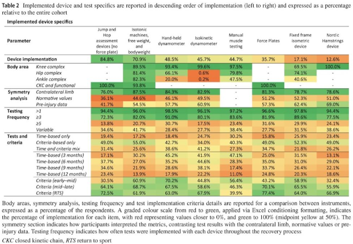

I, Brad Stenger, research athletes' data and privacy as a Computer Science PhD student at the University of Vermont. This newsletter touches on items in the news that are relevant to my research and, I hope, help to build a community of interested athletes, practitioners, policy-makers, researchers and product developers who share my research interests. Thanks for reading!

### ACL Re-injury is a Bigger Problem than ACL Injury 

At one point in Craig Welch's [article](https://www.nytimes.com/2026/02/26/magazine/acl-tear-women-girl-sports.html) in *The New York Times Magazine* on teen girls and ACL injuries, he reported attending his daughter's soccer game and counting seven players recovering from ACL tears. Evidence suggests that the number, which shocked Welch, should actually be higher.

[Recent studies](https://bjsm.bmj.com/content/bjsports/59/13/931.full.pdf) in Sweden and older U.S. [research](https://journals.sagepub.com/doi/abs/10.1177/0363546514530088) says that ACL re-injury is around 30 percent. The opposite leg ACL ruptures twice as often as the originally injured leg. Welch likely missed two, maybe three, more ACL tear recoverers in the youth league game he was counting. 2014 [research](https://opal.latrobe.edu.au/articles/thesis/Return_to_sport_following_anterior_cruciate_ligament_reconstruction_surgery/21845997/1/files/38769174.pdf) by Clare Ardern reported that 55 percent of patients returned to competitive sport participation after ACL reconstruction surgery.

Welch describes the emergence of specific active warmups for ACL injury prevention, specifically a program called 11+, as something capable of significantly reducing serious knee injuries in young women soccer players during practices and competition. Awareness among coaches of targeted warmups is 25-58 percent in the International Olympic Committee's FAIR [review of injury prevention interventions](https://bjsm.bmj.com/content/59/22/1618.abstract). 

A 2020 [survey](https://www.mdpi.com/1648-9144/56/9/417) of NCAA soccer coaches revealed that 62% percent of respondents were aware of 11+. 66 percent implemented 11+ in some way. 15 percent implemented the complete 11+ warmup as prescribed. [New research](https://www.thieme-connect.com/products/ejournals/abstract/10.1055/a-2795-9222) suggests that an 11+ warmup is more important for injured athletes, and substantially improves their landing performance (though still inferior to non-injured peers).

Prevention, or really, adherence to prevention only gets you so far. The Times article references a 50% reduction in serious knee injuries when teams do the 11+ warmup twice per week. But if you experience an ACL tear, a young female athlete is more likely to stop playing or experience re-injury than to return their previous level of competition.

One womens college sports strength coach I spoke with compared the ACL ligaments of women soccer and basketball players to the elbow ligaments of baseball pitchers. These ligaments are all overused, and what's being asked of them physically is not sustainable. As long as the situation remains the norm serious ligament injuries will be prevalent. Even if every youth and college soccer team implemented 11+ and cut injuries in half, there would still be a big ACL injury problem, prompting a big ACL re-injury problem.

Progress by researchers who study neural training for ACL rehabilitation changes. Dustin Grooms at Ohio University [uses cognitive methods](https://medschool.duke.edu/blog/research-seminar-addresses-neuroplasticity-optimize-rehabilitation-and-return-sport-after-acl) to improve athletes' proprioception and improve control over knee movements during ACL rehabilitation. Neural pathways to promote awareness of better knee positions reinforces strength development, and in theory, should improve overall athleticism beyond just return to play.

Methodological advances for ACL rehabilitation have little effect on traditional ACL rehab. A [new study](https://www.linkedin.com/posts/alessandro-compagnin-638110208_force-and-power-testing-during-anterior-activity-7411738859740217344-6bBl) by Alessandro Compagnin surveyed 1000 rehabilitation practitioners to ask them about force and power testing during the ACL rehabilitation process. The study found substantial heterogeneity in practitioners' rehab processes. 

The wide diversity of rehab approaches is both a problem and an opportunity. Neuromuscular assessment for return to play is inconsistent at best, error-prone at worst. The opportunity is to improve data sharing and clinical practice transparency in a manner that raises the floor for athletes' progress measurement and overall care. 

How do you organize for this opportunity? I suspect that some in the profession have tried, and all have failed. Emerging data collection technologies might provide a path forward but any of these companies will need to implement a business plan that factors costs and benefits associated with data in addition to whatever it takes to bring a new device to market.

### Habits, Confirmation Bias, and Want-to-try

What does injury prevention mean to you? Sports science evolved to prevent athletes' injuries. Injury prevention is a main reason for collecting the heart rate, training load and counter-movement jump data that sports scientists love. But no college athlete answers "sports science" to questions about injury prevention. I asked them.

To ask college athletes about injury prevention is to ask them what they themselves do for personal care amid a full schedule of practices, workouts, games, classes and everything else that goes with college. Their answers are, in short, a list of their current habits.

The personal link between habits and injury prevention was difficult to generalize. That's not a surprise. College athletes are different in all sorts of ways. We ask athletes questions about their habits but until the details jumped out of the interview transcripts, we never realized that injuries and habits were linked.

The explanation that makes the most sense is [confirmation bias](https://journals.humankinetics.com/view/journals/ijspp/20/9/article-p1306.xml). Student-athletes tell us what they believe about preventing injuries is the same as what they're doing to prevent injuries. Most of that comes down their habits: sleep, nutrition, training. 

The insight came out of reading [an article](https://undark.org/2026/02/12/opinion-health-wellness-products/) by James Smoliga in *Undark*, an online science magazine out of MIT. Smoliga explains how "worth-a-try" health products find their customers, usually with a solution to a problem that rests on some ambiguous evidence. But that solution and its evidence make sense to the believers who then become customers. 

"Worth-a-try" means a lot when a student-athlete is new to college sports, and maybe means less as they gain experience in life and in athletics. From what I can see, young athletes get good information from coaches and trainers, and their beliefs reflect it. They are on a good track, but there's a chance it doesn't stay that way. College student-athletes are works in progress.

When it comes to athletes' privacy, athletes' habits seem to be a useful indicator. Positive habits among athletes suggest that data collection and data privacy are about where they should be. In order to get the full picture however, taking the next step, which is to understand habit formation, helps.

We have some of that data. More evidence comes from the NCAA. The October 2025 SNAP (Student-athlete Needs, Aspirations and Perspectives) [survey](https://ncaaorg.s3.amazonaws.com/research/snap/Oct2025RES_SNAPStudy.pdf) asked student-athletes what subjects should they develop education materials for. Habits, specifically sleep and nutrition, ranked at the top of the list with "preparing for life after college" and "mental health."

Describing habits and habit formation, again, falls short of everything that we need to know in order to to assess data collection and privacy for young athletes (including college-age athletes). There is an innovation penalty if we only allow a short list of habits that restrict what "worth-a-try" can mean. College sports is a competitive environment where innovation can be a substantial competitive advantage.

All levels of sports are full of worth-a-try products, rich in ambiguous evidence. Validating products enhances credibility. Data sharing improves transparency. Technical understanding makes the truth easier to grasp. Assume that what's worth-a-try will never go away but neither will the fundamentals of athletic development: training, recovery, and nutrition. College athletes, we're finding, navigate different paths and they'll experience both extremes. That's the reality, and it's one of the essential contexts for understanding athletes' data privacy. 

### News

[When Reading the Abstract Isn’t Enough](https://sweatscience.substack.com/p/when-reading-the-abstract-isnt-enough) in *Substack*, Sweat Science newsletter by Alex Hutchinson on February 19, 2026

[How John Tavares' mental health focus has lifted his play](https://www.espn.com/nhl/story/_/id/48033963/nhl-john-tavares-maple-leafs-mental-health-foundation-goals-career) in *ESPN.com* by Kristen Shilton on February 26, 2026

[By applying analysis techniques they had been using to study the brain to their lab meetings, @lindadouw.bsky.social and team identified ways to boost communication among people with very different backgrounds.](https://bsky.app/profile/thetransmitter.bsky.social/post/3mfjvbcwrgs2u) in *Bluesky*, The Transmitter on February 23, 2026

[The Flawed V02 Max Craze](https://erictopol.substack.com/p/the-flawed-v02-max-craze) in *Substack*, Ground Truths newsletter by Eric Topol on February 23, 2026

[BEST thing on speed I’ve read in a while. Sprint Ability provides the "weapon," Aerobic Recovery provides the "recharge" necessary to use that weapon repeatedly.](https://x.com/Nick__DiMarco/status/2026114715379007575) in *X/Twitter* by Jorge Carvajal, Nick DiMarco on February 23, 2026