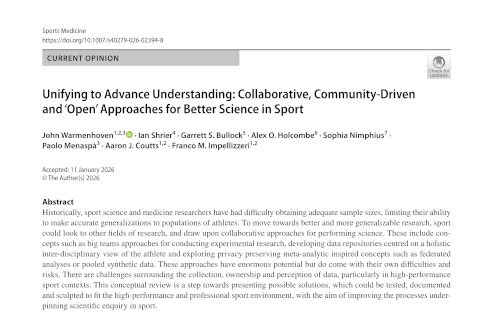

### Cycling is Sports Science Model Activity

Richard Kemp does good work [describing new training technologies](https://www.cyclingweekly.com/fitness/irresistible-tech-or-meaningless-data-are-body-sensors-the-next-frontier-in-marginal-gains) for competitive cyclists. Endurance cycling was the original domain for Dave Brailsford's training philosophy of marginal gains. "The core principle was that if you made 1% improvements in multiple areas, you could reap significant rewards overall," wrote Tim Lewis in *The Guardian*. Brailsford's Team GB cyclists dominated the 2008 and 2012 Olympics and the Tour de France for the 2010s. 

Lewis' [article](https://www.theguardian.com/sport/blog/2019/oct/20/marginal-gains-tarnished-bradley-wiggins-dave-brailsford), from 2019, makes the point that marginal gains had started to exhibit diminishing returns. Kemp is smart and recognizes that new training technologies might be a marginal gain, or they might be a costly waste of time and energy. This new Kemp article on biosensors in *Cycling Weekly* follows up another Kemp [technology review](https://www.cyclingweekly.com/fitness/marginal-gains-or-major-risks-introducing-and-assessing-cyclings-latest-training-hacks) from October 2025.

Kemp looks at real-time monitors for core body temperature, oxygen use and ventilation, hydration, and blood glucose. My short summary: accuracy is generally lacking, but the delta, the metric's real-time change measurement, can be useful. They are oversold as real-time indicators when these data plus algorithms often benefit from the additional context that comes later.

Yannis Pitsiladis of Hong Kong Baptist University is an expert that Kemp relies on who says that the technology is "still in its early brick-phone stage." It works, but "it's not yet miniaturised or fully integrated. The next step is ecosystem-level sensing - multiple validated inputs communicating in real time."

Cyclists might be the model athletic activity, the relatively simple example that generates insight into everything else that is more complex. A human on a bicycle is the [most efficient transport mechanism on earth](https://www.scientificamerican.com/article/a-human-on-a-bicycle-is-among-the-most-efficient-forms-of-travel-in-the/), better than birds, fish, horses, and cars. Power measurements can be captured with every pedal stroke. Each bike rider has their own bike even though they sometimes ride in teams. 

Cyclists' endurance, more than their pure speed or power, is what puts them on podiums. Training decides who wins cycling races, something that is true for all kinds of high-level competition, but more true with bikes. Jonas Vingegaard [seems poised](https://velo.outsideonline.com/road/road-racing/dominant-jonas-vingegaard/) for a breakthrough against Tadej Pogacar in this summer's Tour de France.

As the training data gains precision, the winners become more likely to be predetermined by athletes' volume and quality of training. Marcus Elliott, the P3 founder, once told me that he doesn't really like to watch sports. He said that he already knows how a game will unfold because he can see how players move and how fit they all are. 

If that assessment sounds like a gambling edge, it is. Athletes' training data can be similarly revealing. Gambling, and the demand for athletes' data it generates, is something that will have to be accounted for once these wearable biometrics move beyond the brick-phone stage.

### Sports are a Highway

A *Bloomberg* [article](Highways - https://www.bloomberg.com/news/articles/2026-03-03/mapping-the-economic-toll-of-downtown-freeways-in-us-cities) on the total cost of urban highways reminded me how traffic economics feels to me like sports injury prevention efforts. Despite enormous effort to improve things, the number of sports injuries does not go down. It's like how cities add highway lanes and those lanes fill up, and then the traffic is the same. 

Right on cue, a [new study](https://blogs.bmj.com/bjsm/2026/03/13/everything-you-kneed-to-know-about-the-highest-burden-match-injury-in-professional-mens-rugby-union/) looks at the past 20 years of knee injuries by professional rugby athletes in the UK and documents the same number of knee injuries now as there were 20 years ago.

The term for how freeway expansion invites more cars is "induced demand." The increase in road capacity reduces the cost of travel, and so people with cars drive more. The analogy is not actually all that good of a fit for describing the steady rate of injuries among professional athletes. The costs related to athletes participation are not necessarily dropping. Load management and minutes restrictions have reduced playing time in some sports, while other sports, like soccer and football, have added games to teams' calendars.

There is [evidence](https://www.ft.com/content/36ebc96e-18d7-4601-9826-d799d73f38b8) for athletes playing harder at the highest levels of team sports. [The increase](https://arizonasports.com/nba/phoenix-suns/physical-nba-injuries/3605881/) in athletes' physical demands has been well established. The economic principle that seems to be at work when it comes to athletes' injuries is [Jevons paradox](https://news.northeastern.edu/2025/02/07/jevons-paradox-ai-future/). Jevons observed that in 19th-century England technological improvements increased the efficiency of coal-burning engines, leading to more coal-burning, not less. The improved training with today's technology reduces injury risk, but it also makes a superior, higher-performing athlete. Only a bad coach would fail to recognize and deploy the tactical opportunities that come with improving athleticism. 

Technology and efficiency unlock new economic demand. New demand can lead to unintended consequences.  Pollution was the byproduct of more coal; injuries are the byproduct of more athleticism. Given the continuing progress on sports training technology, the number of athlete injuries might rise even higher in the months and years ahead.

Let's not throw away the induced demand analogy completely. Changes in US college sports have the possibility to increase the number of available paths to elite-level competition for young athletes. (Unless, of course, those changes reduce opportunities for young athletes.) If paths to the top open up, the situation can really change if there is a supply of overlooked or late-blooming talents to fill the new, expanded pipeline. Longer term, teenagers might opt to participate in real (not video game) sports.

Global soccer seems to be gaining an influx of young talent, though it is hard to tell what might have changed in the development pipeline. Graham Hunter at *ESPN.com* [writes](https://www.espn.com/soccer/story/_/id/48219008/alvaro-arbeloa-real-madrid-youth-revolution-straight-manchester-city-barcelona-pep-guardiola-playbook) that a youth revolution is underway at Real Madrid, and it might be a small part of a larger European soccer youth wave.

An economic lens on athlete development and injuries fits with how privacy works, at least in terms of costs and benefits. Privacy is a cost, but with advanced privacy technology you can set privacy into a budget that organizations can manage against the utility that they sacrifice when the budget for privacy increases.

### Collaboration = Better

My old academic advisor's advisor is [Alan Kay](https://computinged.wordpress.com/tag/alan-kay/), a computer scientist who prototyped the user interface that became the Apple Mac and the programming language that led to object-oriented methodology. Kay famously said early in his career, "The best way to predict the future is to invent it."

Warmenhoven et al. have [a new conceptual review paper](https://link.springer.com/article/10.1007/s40279-026-02394-8), "Unifying to Advance Understanding: Collaborative, Community‑Driven and ‘Open’ Approaches for Better Science in Sport" in *Sports Medicine*. Sports research needs what they're talking about when it comes to data sharing to support advanced research and analysis for athletes' health and performance. This paper leans towards prediction at a time when I think the world in general, and sports specifically, needs more invention.

Everyone that I talk to in sports wants fewer injuries and agrees that improved data sharing is crucial in order to realize athletes' injury prediction and prevention. The studies to understand how, why, and what inhibit data sharing throughout high-level sports have yet to be undertaken. The answers to those research questions will go a long way towards determining the ways that computer-supported collaboration will enable researchers to work together, using datasets that are large enough to answer the most important questions. 

How to improve collaboration using athletes' data? The answer is not conceptual. Just ask the questions and try to find the answers. Do the research, and the invention will follow.

### News

[Experts see a wide data gap in women’s sports science. This WNBA team owner wants to fix it](https://apnews.com/article/wu-tsai-alliance-female-athlete-d48cfcb738ca1e45fb1482b89ee35abd) in *Associated Press* by Doug Feinberg on March 6, 2026

[Businesses can’t require microchip implants for workers under new WA law](https://washingtonstatestandard.com/briefs/businesses-cant-require-microchip-implants-for-workers-under-new-wa-law/) in *Washington State Standard* by Jake Goldstein-Street on March 11, 2026

[Do we need medical imaging-informed musculoskeletal models for simulations in healthy adults? A new workflow based on magnetic resonance imaging highlights the importance of personalized geometry](https://journals.plos.org/ploscompbiol/article?id=10.1371/journal.pcbi.1014073) in *PLOS Computational Biology* by Ekaterina Stansfield et al. on March 16, 2026

[A Letter to All the Little Leaguers Out There](https://www.theplayerstribune.com/paul-skenes-mlb-baseball-pittsburgh-pirates-wbc-usa) in *The Players Tribune* by Paul Skenes on March 9, 2026

[Monitoring Training Effects in Athletes: A Multidimensional Framework for Decision-Making](https://link.springer.com/article/10.1007/s40279-026-02417-4) in *Sports Medicine* journal by Andre Rebelo et al. on March 13, 2026

[Crossing time zones and touchlines: an observational survey of practitioner perceptions on travel in elite North American soccer](https://www.tandfonline.com/doi/full/10.1080/24733938.2026.2642657?af=R) in *Science and Medicine in Football* journal by Luke Jenkinson et al. on March 16, 2026

[What is the hamate and why are so many players injuring theirs?](https://www.mlb.com/news/hamate-bone-injuries-in-baseball-explained) in *MLB.com* by Anthony Castrovince on February 12, 2026
