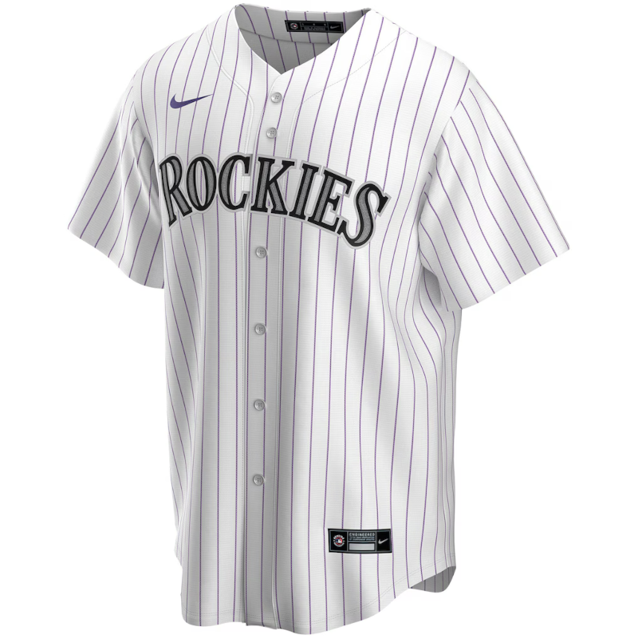

Bill Carter, a UVM professor and authority on student-athletes and the business of college sports, founded [NIL Forum](https://studentathleteinsights.com/nil-forum), a membership community that's everything you need to stay ahead in NIL. The community is a needed resource. If you are a stakeholder in U.S. college sports, which is everyone who works in U.S. sports, you should join at the founding member price of $300 for the year.

### No-Moneyball - An Innovation Narrative

The most interesting story in sports, in my opinion, is the Colorado Rockies.



I have been asking for opinions about why there is not more data sharing in professional sports. My assumption going into the investigation had been that a team's desire to have or maintain competitive advantage was the number one reason for teams' not sharing data. The opposite appears to be true. Teams don't risk losing their own competitive advantage as much as they risk a smarter, better-resourced team increasing their competitive advantage with the benefit of shared data.

The original Oakland A's moneyball showed that ingenuity could supplant financial resources. The new situation shows that ingenuity cannot supplant smart money. This is no-moneyball. It's not that teams cannot have an innovation advantage, but financial resources are a force multiplier that gives richer teams more opportunity to exploit their good ideas and then make those good ideas into even better follow-ups.

An [ESPN article](https://www.espn.com/mlb/story/_/id/48176507/mlb-2026-paul-depodesta-colorado-rockies-moneyball-coors-field) looks at Paul DePodesta becoming the president of baseball operations for Colorado Rockies baseball. What's interesting is how he plans to uncover and to eventually exploit the unique advantages of baseball in Denver. Baseball in Denver is completely different from baseball in other metros, and not in ways that help the home team. 

The altitude differences favor hitters over pitchers. The fitness advantage that soccer, hockey, and basketball teams have at altitude goes away with baseball's deliberate pace. DePodesta has, in many ways, a blank slate to formulate a new calculus for winning baseball by uncovering advantages that are unique to Colorado. It will have to be a different kind of baseball that wins in Denver.

The Rockies situation is consistent with the trend toward [constraints-led approaches](https://newsletter.bradstenger.com/posts/ADCN_4/index.html#journaling-with-wearables) in athlete training, but with constraints that are severe, affect everyone, and, in many cases, are still to be determined. This is where analysis needs invention in order to get some kind of foothold. Prior Rockies management regimes never found their foothold. Previous management never effectively differentiated players, skills, and game models. The Rockies had no chance to put those differences together into a sum greater than its parts.

The cause and effect between biomechanics and ball tracking have progressed to where the Rockies should be able to understand everything that can and does happen to a mile-high baseball in an MLB game. The article mentions low-spin gyrosliders as a pitch that might work better than traditional breaking balls at Coors Field. The Rockies have been teaching gyroballs to the pitching staff.
 
The thing that really stacks the odds against Colorado is that any advantage DePodesta finds goes away for half the team's games. Even if he solves the Rockies' home-field disadvantage, he also has to generate solutions for the always different, lower-altitude road games. Because the deck is stacked against the Rockies, the list of solutions will need to be long. The quantity of the Rockies' successful innovations will be the level of the teams' success.

Innovation stories are stories I can report and write better than most. The writer sets the stakes and chooses the details that matter for readers. Characters matter, but only so far as they contribute to the problem that is at the center of what goes on. As long as readers keep learning, you can expect them to stay with you. The most important thing for the writer, the characters, and the story is capturing the moment when an insight changes everything. That moment and that insight are the payoffs for all the effort by the readers. And the insight lingers, so a reader will probably give the writer (me!) more chances to give them more of this innovation story stuff. That's how I approach it.

I'm looking forward to the insight and the moment that is building for Paul DePodesta and the Colorado Rockies. There is also a risk that the Rockies' search for competitive advantage leads to unprecedented surveillance of athletes. Will the Rockies go too far? Maybe. It's another thing that I am eager to pay attention to. 

### Information Overload and the Hockeyification Trend

Ben Lindbergh, the Fangraphs podcaster and writer at The Ringer, [asks an important question](https://www.theringer.com/2026/03/23/mlb/keep-mlb-front-offices-off-the-field-pitch-calling-scouting-cards) for our data + sports era: how much information is too much information? He asks in the context of professional baseball scouting cards. These are small information sheets with relevant but probably obscure information contained on physical media (paper). An example scouting card would have, say, details for a pitcher or a fielder on how to pitch or how to position for a pinch-hitter.

Sports that have discrete play-by-play events, like baseball and football, lend themselves to this sort of information augmentation. Bill Walsh and the 49ers scripted the first 15 offensive plays of a game. ESPN reported last season that 20 NFL starting quarterbacks use wristband play sheets, something that pre-dates Walsh and goes back to 1965. Football information augmentation has been a collaboration between assistant coaches and players who work together on formulating the shorthand and then producing a super-dense information design that meets on-field needs.

Baseball isn't quite at that level but could be headed there. Lindbergh points out that assistant coaches have started playing a larger role in the catcher-pitcher collaboration. Some teams have assistant coaches calling pitches instead of catchers. Lindbergh also wishes that players could just play the game without the extra interference, recalling what Crash Davis told Nuke LaLoosh, "Don't think. It can only hurt the ballclub."

If there is one sports statistic that [associates with overthinking](https://herhoopstats.substack.com/p/winning-the-tip), it would be win probability. Win probability asks a model to project the likelihood of winning between two teams at each game second given the score and situation, even the very first seconds of a game. 

A game like baseball has no clock, so win probability, expected runs, and every other advanced stat rise and fall with every pitch. Putting a coach in charge of win probability is a step back from players deciding who wins. [Ambitious coaches](https://www.espn.com/soccer/story/_/id/48185198/how-assistant-managers-handle-players-personal-ambition) who want to raise their profile seem glad to have more on their plate. I don't think that anyone has asked the players how they feel.

Megan Chayka [did mention](https://www.sloansportsconference.com/people/meghan-chayka) "analytics fatigue" in passing during a hockey analytics panel at the Sloan Sports conference. I think that she meant it in reference to NHL hockey players who are five months into their season. 

The cognitive overhead of analysts' input into how to win games may not necessarily sync with the fast, instinctive hockey that they would otherwise play. The free-flowing action in hockey games makes it difficult for coaches to interject information to the players. Hockey players are asked to hold onto the details without anything close to a scout card or wristband. Analytics fatigue is, I expect, a real thing.

There are calls to make soccer and basketball more free-flowing, like hockey. Soccer teams have increased the tactical importance of set pieces, and according to Mark Thompson [writing for his blog](https://www.getgoalsideanalytics.com/football-2-0-look-like/), the change has reduced the action during other parts of the game. Baseball has put rules in place to speed the pace of play. Those rules, like pitch clocks, have improved the product. 

Call it hockeyification. More action improves any pro sports entertainment product, but more analytics does not lead to the same surefire entertainment upgrade. 

The problem is that more action AND more analytics wear down the athletes. Trainers will tell you that stress is stress, something that oversubscribed college athletes [regularly experience](https://www.frontiersin.org/journals/sports-and-active-living/articles/10.3389/fspor.2020.00042/full) when their athletics and academics overlap. Universities have learned to provide mental health support for stressed athletes. Teams have an opportunity to get out in front of the potential problems that come with players' analytics fatigue.

### Injury Surveillance

A [new report](https://www.tandfonline.com/doi/full/10.1080/24733938.2026.2642645) in the *Science and Medicine in Football* journal by Wilke et al. documents player health surveillance across global soccer's leagues and tournaments. Most leagues (29/49) do some kind of injury surveillance, while most tournaments (9/14) do not. The researchers conclude that "ongoing programmes are concentrated in a few countries, unevenly distributed across confederations, and higher in men’s competitions compared to women’s, though surveillance has been planned in several women’s leagues."

Another [recent study](https://www.tandfonline.com/doi/full/10.1080/24733938.2026.2642654) published in *Science and Medicine in Football* asked return-to-play practitioners how they differentiated between their expert judgment and data-driven analyses. The authors found a conflict between quantitative evidence and expert opinion regarding whether delaying RTP reduces injury risks. The analyses says delayed RTP does not reduce injury risks, whereas experts insist that delayed RTP does reduce injury risks.

Filling a need that exists between injury surveillance and RTP is a [tool for risk management](https://x.com/Aspetar/status/2033938959240200627) created by the Aspetar sports medicine center in Qatar. The conflict between data and opinion re: athletes' health needs objective computational tools to deliver guidance that bridges the gap. There are other examples of new computational tools:

```{=html}
 &nbsp; - The English FA and Google Cloud created the Female Athlete Health Framework ([link](https://www.theregister.com/2026/03/16/women_get_datadriven_health/)) <br/>
 &nbsp; - Swedish researchers apply systems immunology to assess athletes' physical capacity ([link](https://onlinelibrary.wiley.com/doi/10.1111/sms.70258)) <br/>
 &nbsp; - American researchers make a case for increasing the role for pharmacists in sports medicine ([link](https://pubmed.ncbi.nlm.nih.gov/41850730/)) <br/>
 &nbsp; - Australian researchers get in front of health challenges for 2026 World Cup in North America ([link](https://link.springer.com/article/10.1007/s40279-026-02415-6)) <br/>
 ```

Domain experts are needed to assemble this information in collaboration with computing professionals, and if it is done well, athletes will benefit.

### News

* [it was such a rip-roaring week in the prediction market world, i had to blog it... i'm not in DC or i'd be grabbing a drink at that polymarket bar to cap it off!](https://bsky.app/profile/knibbs.bsky.social/post/3mhjgmflncs2z) in *Bluesky* by Kate Knibbs on March 20, 2026

* [The new WNBA collective bargaining agreement could lead to longer seasons](https://bsky.app/profile/sportico.bsky.social/post/3mhheeun5ec2i) in *Bluesky* by Sportico on March 19, 2026

* [Here are the players who have shown some significant decline during the season, led by Jokic](https://bsky.app/profile/deanolytics.bsky.social/post/3mhq7ptelks2d) in *Bluesky* by Dean Oliver on March 23, 2026

* [For Mexico and Canada, injuries are striking just as World Cup hosting duty looms](https://www.theguardian.com/sport/2026/mar/20/mexico-canada-world-cup-squad-injuries) in *The Guardian* by Leander Schaerlaeckens on March 20, 2026

* [The blood–brain barrier can be damaged and leaky decades after an athlete retires from contact sport. This leakiness seems to trigger a lasting immune response that is closely tied to cognitive decline](https://bsky.app/profile/nature.com/post/3mhnny5g7fb2p) in *Bluesky* by Nature on March 22, 2026

* [In a new article published in J Biomech, Ozan et al. presents a framework to better understand how measurement errors affect biomechanical analyses of sport motion across joints.](https://bsky.app/profile/jbiomech.bsky.social/post/3mhltp4en3l2d) in *Bluesky* by Journal of Biomechanics on March 21, 2026

* [Among the many updates I expect in a new WNBA CBA, the two with regard to health I'm expecting to be the most significant are more required healthcare pros (right now, only 1 MD and 1 AT required) and an actual wearable tech policy.](https://bsky.app/profile/seehafer.bsky.social/post/3mhjki6vk6c2w) in *Bluesky* by Lucas Seehafer on March 20, 2026

* [Long-term squad management: global index](https://football-observatory.com/WeeklyPost538) in *Football Observatory* by Raffaele Poli, Roger Besson and Loïc Ravenel on March 18, 2026

* [Consistency over perfection, new resistance-training guidelines say](https://news.mcmaster.ca/consistency-over-perfection-new-resistance-training-guidelines-say/) in *McMaster News* by Andrea Lawson on March 16, 2026
