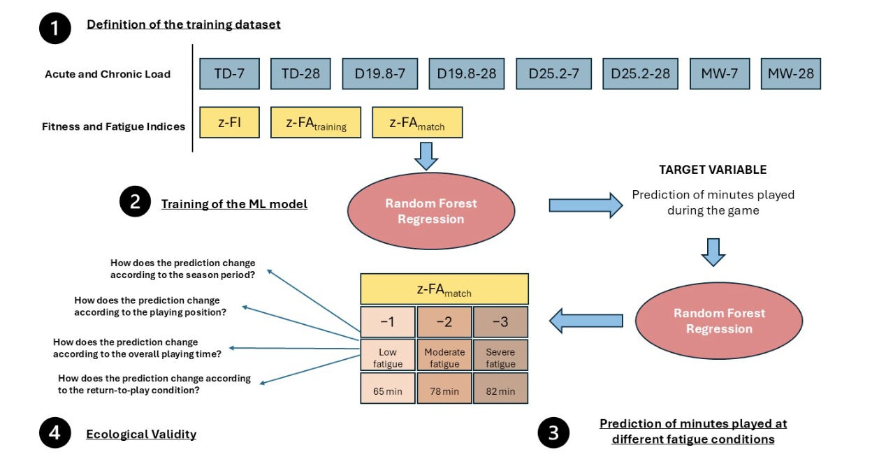

### University of Michigan NIL Anxiety Research Study

A University of Michigan [news release](https://news.umich.edu/more-money-more-problems-study-links-nil-commitment-to-rising-athlete-stress/) announced the results of a 351-athlete [survey study](https://scholarcommons.sc.edu/cgi/viewcontent.cgi?article=1634&context=jiia) that asked how NIL affects their student identity and their athlete identity. Survey responses came from Division I athletes at 11 universities across four major athletic conferences (ACC, Big 10, Big 12, SEC). 

The researchers wanted to see if NIL altered the salience of athletes' identities, specifically if there was a shift or a conflict between an individual athlete's student identity and their athlete identity. Researchers also asked if NIL commitments added to athlete stress, if the quality of their NIL experience increased or decreased athlete stress, and if the perceived fairness of the NIL process increased or decreased athlete stress. Survey questions were on 7- and 5-point Likert scales, and responses were subjected to regression analysis that used respondents' extent of NIL involvement (5-point Likert scale)  and participation in top NIL sports (football, baseball, basketball, softball, women's soccer) as controls.

The reported results showed that NIL commitment strengthened respondents' athlete identity and did not undermine their student identity. NIL does not encroach on student-athletes being students. Students with greater NIL commitments experienced more stress. The added stress did not come from failing to fulfill both their student and their athlete roles; it came from further overloading roles that were probably overloaded to begin with. 

Students who were satisfied with their NIL experience reported less stress and benefited from the financial gains. Student-athletes with less NIL opportunity (women, athletes in less popular sports, international student-athletes) reported feeling disadvantaged in the NIL process but not necessarily more stressed.

Quantitative analysis based on numerical answers to Likert-scale questions is a big help in studies of college athletes, and it also helps to focus questions and apply the proper scope to the questions. Asking about the effect of NIL on the athlete identity and on the student identity standardizes what is otherwise [a quagmire](https://journals.plos.org/plosone/article?id=10.1371/journal.pone.0115159) of individual preferences and personal experiences ([more](https://pmc.ncbi.nlm.nih.gov/articles/PMC11922074/)). My experience with open-ended responses and qualitative analysis has been that they work through highly variable responses that are difficult to navigate and really difficult to draw meaningful conclusions from.

The qualitative analysis in this study surfaced the importance of institutional support for athletes experiencing the NIL process and the overload (some of which stems from the complexity of NIL) that athletes experience. Improving institutional support is, on the surface, an easy answer for helping athletes with NIL. But this is where the wide diversity of student-athlete perspectives and experiences creates an almost insurmountable challenge. If NIL is time-consuming and complex, almost every student-athlete will deal with it in their own way based on their individual context comprised of their unique team and academic situations. 

An athletic department's mental health counselors do an amazing job with student-athletes' well-being but may not be able to add NIL to their plate because NIL is, according to the Michigan study, a pervasive issue. The winner-take-most nature of athletes' compensation makes the issue fundamentally different for the top 20 percent in an 80/20 Pareto distribution (though we may in time realize that the power law here has a longer tail, maybe even a far longer tail, than 80/20). For the 80 percent (or more) in the long tail, the NIL payoff is minimal, making the NIL process a distraction taking attention from sport and school.

Top athletes are the highest paid and have the most support to take advantage of the freedom they have to move among schools. Most athletes are not paid and have freedom to move but lack access to present or future support. Senator Tommy Tuberville just introduced legislation that adds friction to reduce college athletes movement. The legislation provides rules that help colleges have a measure of control over the top athletes, but the harm in reducing athletes' freedom extends to all student-athletes. Charlie Pierce, a columnist at Esquire, [says](https://www.msn.com/en-us/sports/other/we-have-more-important-things-to-worry-about-than-the-ncaa-transfer-portal/ar-AA1ZpqIr) the proposed changes are dead on arrival. 

The NCAA Academics and Eligibility Committee [recommended a set of new rules](https://apnews.com/article/ncaa-eligibility-rules-e857aefa08a7b4514f2192733acea11e) that say professional sports draft participation bars athletes from competing at the college level in the future. The committee also supports making agent representation available to pre-college athletes. Again, these are rules and practices that affect a tiny fraction of the 550,000 student-athletes at NCAA-member universities.

One reason for a lack of solutions that benefit college athletes is that they have little or no voice in the conversations that will shape their future. One way to give them a voice is by doing research on college athletes, like the University of Michigan has done. Michigan's work is valuable, but it is low-hanging fruit. The more substantial work that attempts to understand the range and diversity of college athletes, their interests, and the essential role they play is going to require substantial effort and support.

### Injury Prevention Occurs Between Competitions

Injury prevention is not a singular thing. It has facets that are, for the most part, engaged in between competitions. Recent news and journal articles gave me a chance to check in on some of these facets. Let's see what the state of the art research looks like. Good news, nearly all the studies focus on women athletes.

#### Monitoring
 	
The German professional basketball league and German Accident Insurance surveil players for injury and illness. Researchers gathered the data for 16 male pro basketball players over the league's 31-week season. Monitoring consisted of load measurement with self-reports for exertion and sleep quantity. Sleep quality, and mental and physical well-being were all measured on 11-point 0-10 Likert scales. The researchers found that higher internal load and lower sleep quality were associated with reduced well-being in professional male basketball players. Decreased physical well-being was associated with illness occurrence, supporting its relevance as a potential early indicator within athlete health monitoring frameworks. ([paper, BMC Sports Science, Medicine and Rehabilitation](https://link.springer.com/article/10.1186/s13102-026-01663-3))

Members of the Portuguese national women's soccer team participated in field-based research to assess melatonin timing and sleep patterns during a 7-day training camp. Athletes wore devices to measure sleep and light exposure. They also completed daily sleep diaries with well-being ratings. On one day, salivary melatonin was self-sampled hourly from four hours before habitual sleep onset to one hour after, and again at wake time and one hour after waking. Researchers found that "elevated melatonin one hour after waking, indicative of morning circadian misalignment, was associated with lower subjective well-being." ([paper, npj biological timing and sleep](https://www.nature.com/articles/s44323-026-00074-4))

Takeaway: If you are monitoring athletes, the fundamental comparison is with the athletes' well-being. I don't know this as fact, but well-being (positive and negative) seems to cut across both performance and injury risk. 

#### Testing

The PROfessional FEmale (PROFE) hip study is a multicenter cross-sectional study among three elite Dutch female football teams in Vrouwen Eredivisie. Researchers collected data from 100 female football players who completed questionnaires and physical testing of hip strength and hip range of motion. Previous research identified hip strength and ROM as important modifiable risk factors for hip/groin injuries. This study established normative values for strength and ROM in female football players, figures that will be useful to identify players' progression and to develop personalized injury prevention strategies. ([paper, Journal of Science and Medicine in Sport](https://www.jsams.org/article/S1440-2440(26)00099-X/fulltext))
	
Young soccer players vary in terms of athletes' sizes and levels of biological maturity. Irish researchers investigated how that variability among 15-16 year old international soccer players influenced tests of eccentric knee flexion strength, something that is tested with the Nordic hamstring exercise (NordBord). Body mass and predicted adult height are the most influential predictors. Body mass and biological maturation status should be considered when interpreting strength testing results during the Nordic hamstring exercise in female youth soccer players. Chronological age and height are less important age/size factors. ([paper, European Journal of Sport Science](https://onlinelibrary.wiley.com/doi/10.1002/ejsc.70135))

Takeaway: The list of requirements for a comprehensive injury prevention testing program is long, and growing longer.

#### Interventions
 
Iain Murray and a team of UK-based orthopedists summarize the success factors for ACL injury prevention interventions. Many interventions "share common neuromuscular principles and demonstrate similar reductions in injury risk when implemented effectively," they note, adding that program selection alone does not determine success and "implementation fidelity and contextual suitability are critical." They recommend top-down and bottom-up approaches to capture buy in from stakeholders. An effective top-down approach "allows for uniformity across the nation, with standardized funding allocation and integration into public health policy." A bottom-up approach tailors change to local contextual needs and empowers coaches and athletes. The authors of this summary want to see widespread implementation of ACL prevention interventions and recognize that a long list of challenges that make that goal difficult. ([paper, Bone & Joint Open](https://boneandjoint.org.uk/Article/10.1302/2633-1462.74.BJO-2026-0019))
 	
The blog at BJSM describes a recent review article that asks about "how well injury prevention interventions are used in female/woman/girls’ sport, and which dissemination and implementation (D&I) strategies best support their uptake and sustainment." The report produced five key takeaways. ([blog, British Journal of Sports Medicine](https://blogs.bmj.com/bjsm/2026/03/23/dissemination-and-implementation-of-injury-prevention-interventions-in-female-woman-girl-athletes-how-are-they-implemented-and-what-affects-their-use/))

> 1. **Implementation matters.** Prevention interventions are effective, but improved implementation is essential to better protect female/woman/girl athletes.
2. **Adoption is high, but fidelity/adaptation and sustainment is patchy.** Many interventions are adopted initially, but few studies examined how well they were implemented (e.g. with the right frequency, duration) and sustained.
3. **Identified barriers and facilitators provide cues to optimise future implementation efforts.** Time constraints, poor fit with sport demands, and low coach confidence hinder implementation, while positive attitudes, experience, and confidence support it.
4. **Effective D&I strategies exist and must be context-specific.** Education and practical workshops can support adoption, but interventions and implementation strategies must be adaptable, engaging, sport-specific, and backed by organisational policy. In-season supervision may improve implementation, but more rigorous trials are needed.
5. **Everyone has a role.** Parents, teachers, health professionals, and administrators strongly influence implementation and must be included in future research and strategy development.

#### Warmup
 
Sophia Nimphius and Daniel Kadlec [write](https://bjsm.bmj.com/content/early/2026/04/02/bjsports-2025-110614.info) in the *British Journal of Sports Medicine* that real, substantial ACL injury prevention occurs in training to a far greater degree than it occurs during pre- and mid-game warmups. "Warmup programs have limited long-term utility. Training intensifies, volumes and progressions must increase to change the prognostic factors proposed to reduce injury risk after adolescence," they write.

#### Prediction
 
Prediction goes a step beyond simply monitoring. It puts the monitoring data to use in meaningful ways. James Malone [reports](https://maloneperform.substack.com/p/predicting-match-fatigue-in-football) on a study out of Italy's Parma Calcio football club. The club's performance analyst, Mauro Mandorino, put four years of athlete monitoring data into a "machine learning model that integrated training load, fitness, and fatigue data to estimate how long players could tolerate match demands." The model (diagrammed below) predicts key fatigue inflection points at 57 minutes, 65 minutes, 78 minutes, peaking with severe fatigue at 82-85 minutes. ([paper, Applied Sciences](https://www.mdpi.com/2076-3417/16/4/2139))

### News

[Return to Play and Performance Following UCL Reconstruction and Repair in Major League Baseball Position Players](https://pmc.ncbi.nlm.nih.gov/articles/PMC12979877/) in *Orthopaedic Journal of Sports Medicine* by Michael Mastroiani et al. on March 10, 2026

[“We're forced to be resilient”: exploration of prospective risk and protective factors of resilience among women athletes](https://www.frontiersin.org/journals/sports-and-active-living/articles/10.3389/fspor.2026.1718372/full) in *Frontiers in Sports and Active Living* by Emily Matheson et al. on March 12, 2026

[Epidemiology and Incidence of Surgically Treated ACL Injuries in Division I Collegiate Athletes](https://journals.sagepub.com/doi/10.1177/23259671261418054) in *Orthopaedic Journal of Sports Medicine* by Thomas Kremen et al. on March 27, 2026

[Early Sports Specialization Is Associated with Increased Orthopaedic Injury Incidence in NFL Athletes](https://lermagazine.com/special-section/conference-coverage/early-sports-specialization-is-associated-with-increased-orthopaedic-injury-incidence-in-nfl-athletes) in *Lower Extremity Review* on March 28, 2026

[The Association Between Early Sport Specialization and Injury and Career Outcomes Among National Football League Athletes](https://onlinelibrary.wiley.com/doi/10.1002/ejsc.70120) in *European Journal of Sport Science* by Gnaneswar Chundi et al. on January 12, 2026
 
[Mark Cuban thinks the NBA should shorten games to 40 minutes, but there's one big problem with that concept](https://www.cbssports.com/nba/news/nba-shorter-games-mark-cuban-proposal-load-management/) in *CBS Sports* by Sam Quinn on March 29, 2026

[The Premier League is the most physically demanding top league with the worst fixture congestion and the most money to sign good depth. So why does it use its subs the least?](https://bsky.app/profile/johnspacemuller.com/post/3mi2r3of64s2r) in *Bluesky* by John Muller on March 27, 2026
