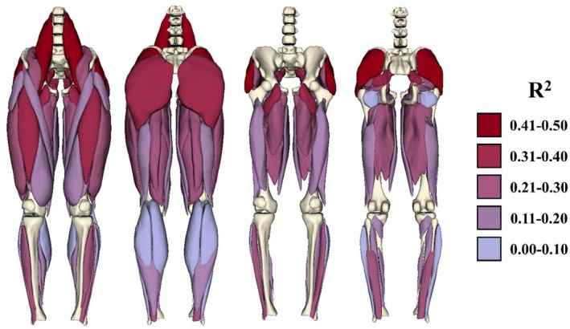
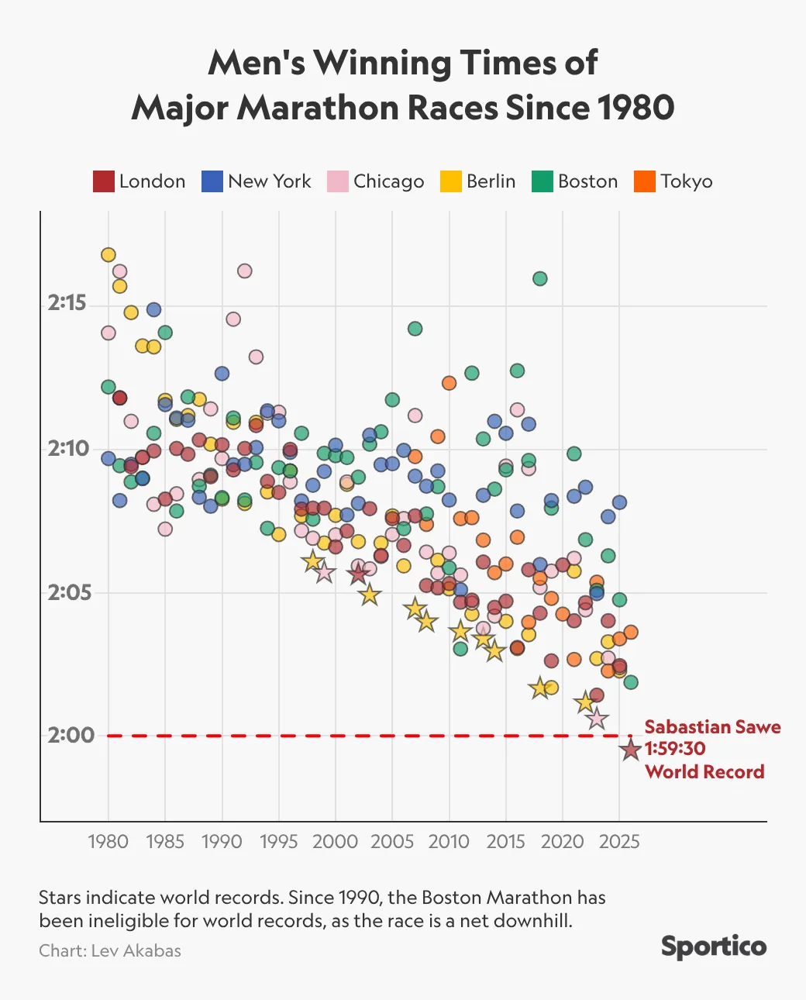

The Athletes Data Community Newsletter is produced by Brad Stenger, a PhD student at the University of Vermont, who works on data sharing and privacy technologies for athletes' data.

### Hamstring Injury Risk Study Group (HAMIR)

The HAMIR Study Group (Hamstring Injury Risk, pronounced "hammer") led by Bryan Heiderscheit at the University of Wisconsin has a new paper, [Lower-Body Muscle Volumes Can Explain Half of the Variance in Sprint Speed Between Collegiate American Football Players](https://onlinelibrary.wiley.com/doi/10.1111/sms.70283), in *Scandinavian Journal of Medicine and Science in Sports*.

The paper presents findings showing that football players (college, and likely applicable to professional) have a muscular profile that is consistent with track sprinters, where the mass distribution of hip flexors (specifically psoas major), abductors (specifically gluteus medius), and extensors (specifically gluteus maximus) are the muscles whose volumes most influence sprinting speed. Still, these muscles account for approximately 60 percent of speed, meaning that other factors (the paper authors mention muscle-tendon geometry, muscle physiology, and anthropometrics) play important roles in determining footballers' speed.

Heiderscheit talked about this and other research in podcasts last year ([PT Inquest](https://ptinquest.com/episode-386-hamstring-strains-in-american-football-live/) and [PSATS](https://podcasts.apple.com/us/podcast/psats-podcast/id1702780388)). Sprinting is a major source of hamstring injury, but so are accelerations and decelerations. HAMIR has completed data collection in [its clinical trial](https://clinicaltrials.gov/study/NCT05343052?tab=study) to develop predictive measures for hamstring injury risk, with 699 Power 5 college football players enrolled in the trial that finished last June. And it doesn't look like the investigators will have any kind of simple cause and effect that explains the hamstring injury situation. The human variability is too great, and the biomechanics are too complex.

That is not to say that there has not been important progress. [Another study](https://www.nature.com/articles/s41598-025-16926-1) published last September with lead authors Lara Riem and Olivia DuCharme from Springbok Analytics used the HAMIR study group data and combined MRI imaging, biomechanical modeling, and deep learning to model hamstring injury severity. 

Current injury assessment methodology requires clinicians to assign a muscle injury classification score based on the appearance and description of edema (swelling and fluid buildup). The Springbok model produced results that are similar to clinical injury classification but better. The method "enables objective, automated, quantitative studies of hamstring injuries, offering detailed visualization of injury extent to potentially improve athlete diagnosis and treatment."

Heiderscheit mentioned on the PSATS podcast that his team planned to start a study of NCAA basketball players with support from the NBA. This study would also use the Springbok MRI + biomechanics modeling technology, and it would look beyond just hamstrings and into calf muscles, patellar tendons, and Achilles tendons.

Drawing on elite college athlete populations to research injuries and inform sports medicine practice for professional athletes is something that needs to happen in order to increase the scale of available data so that professional sports leagues and teams can manage the injury risk, especially for the most talented, most valuable athletes. 

Heiderscheit mentioned on PT Inquest that his clinical trial did not enroll enough athletes to gain the knowledge necessary to predict hamstring injury. There should be a way to scale up these investigations so that lots of college athletes can participate and can also benefit financially from cost savings that come with reducing pro athletes' injury risk.

### Athlete Development: Investment or Practice

MLS Next Pro is, with USL, the U.S. minor league professional soccer league that feeds MLS, America's big-city pro soccer league. The global investment firm KKR [has agreed](https://www.nytimes.com/athletic/7242594/2026/04/30/mls-next-pro-kkr-investment-new-markets/) to make a strategic investment in MLS Next Pro. MLS and KKR have founded Hometown Soccer Holdings to oversee development of new soccer properties in small and mid-size U.S. cities.

Tom Glick, a founding executive at Hometown Soccer Holdings, told Paul Tenorio from *The Athletic* that "this deal is built around a belief that Next Pro can be the top league for player development in the U.S." and that "going into new markets will also help reach more players, something that should raise the profile for grassroots soccer in local communities."

Local soccer might be competing directly with college sports for local fans' entertainment dollars if they are not careful. Where I live in Vermont, the minor-league USL2 Vermont Green FC is careful to not overlap with the University of Vermont. Vermont Green also complements the soccer player development going on at the universities and clubs where players come to Burlington from. The product is good, and fans come out, but the UVM soccer field (capacity 2600), where Vermont Green plays, is 1400 seats smaller than the school's hockey arena across the street.

The strategic investment comes at a time when a handful of teenagers, homegrown by MLS clubs, have thrived during the early season. Players like Julian Hall, Adri Mehmeti, Jude Terry, and Zavier Gozo have made their mark and seem poised to advance to high-profile soccer leagues in Europe. Analyst Simon Evans at *The Soccer Business* blog [argues](https://thesoccerbusiness.com/mls-clubs-face-a-teenage-talent-test/) that they will be wise to keep from jumping overseas at the first opportunity. The younger the soccer talent, the greater the development project is for the European club, and the more that can go wrong.

The increased profile and investment for grassroots player development should improve the pipeline of young players who progress to the U.S. Mens National Team. You know what else would help USMNT? Practice. Mexico's national soccer team [starts its World Cup player camp](https://www.usatoday.com/story/sports/soccer/worldcup/2026/04/28/mexico-world-cup-roster-liga-mx/89738247007/ ) on May 6, bringing together the most promising players in Liga MX and, in theory, developing cohesion that teams with less practice won't have.

Cohesion is an important aspect of young athletes' development, something we see in our research. There is a real tension that exists between an athlete's individual identity and the social identity that comes from playing on a team. When a coach or another team authority oversteps an athlete's personal identity boundaries, there can be conflict.

As the investment in college and young minor league sports grows, the number of stakeholders in developing athletes increases. That is more opportunity for identity conflicts between athletes and their teams. If the trend in sports business development is large-scale mixed-use real estate development, that can be a lot of money and a lot of people with inordinate stakes in college-age athletes. When the incentives are at odds with individual athlete identity and team social identity, then personal sacrifice that fosters group success is more difficult.

### London Marathon

One week removed from the marathon world record by Sabastian Sawe, and the surprise has worn off, replaced by a sense that technology made this event inevitable.

Chris Chavez [writes](https://citiusmag.substack.com/p/sabastian-sawe-marathon-world-record-recap-london-2026) that three technical advances led to Sawe's race time: shoes, fuels, and maybe but probably not drugs.

The point to make about the shoes is not just the race benefit but also the training benefit. State-of-the-art running trainers make the miles easier, which in turn makes the recovery easier, with the possibility for a virtuous cycle. Chavez mentions that Sawe trained as much as 150 miles in a week leading up to the race, even though he had been working through injuries at the beginning of the year.

Competitive cyclists, multisport athletes, and ultra-distance athletes have incorporated improved, higher-energy fueling into training for a few years now. The winners checks for high-profile marathons raise the stakes among the best in the world, who will seek every marginal gain to get an edge. Sawe was drinking 300-calorie sugar drinks throughout the race, having done the gut-guzzling practice during training in partnership with Maurten, the energy food company that sponsors him. Sawe might have even gone faster if he hadn't skipped a sugar drink bottle during the race.

Will Carroll's excellent *Under the Knife* newsletter has [an opinion](https://undertheknife.substack.com/p/utk-special-42826) that better fueling is out there for lots of athletes to benefit from, including baseball pitchers. 

I think that there has to be an endurance threshold for a significant gain from fueling. The more explosive athletes who don't utilize big cardio engines do not really need the caloric inputs to sustain themselves. But maybe there is an opportunity for innovation that reduces the rapid accumulation of wear and tear on explosive athletes, like pitchers.

### News

[Piero Hincapie, William Saliba and Gabriel personify Arsenal's warrior spirit as battle against fatigue continues in trophy hunt](https://www.skysports.com/football/news/12040/13538432/piero-hincapie-william-saliba-and-gabriel-personify-arsenals-warrior-spirit-as-battle-against-fatigue-continues-in-epic-trophy-hunt) in *Sky Sports* by Nick Wright on May 1, 2026

[Does Your Brain Bonk After a Marathon?](https://runlongrunhealthy.substack.com/p/does-your-brain-bonk-after-a-marathon) in Substack, *Run Long, Run Healthy* newsletter by Brady Holmer on April 30, 2026

[Texas Tech QB Gambling Probe Ratchets Up Betting Worries](https://www.sportico.com/law/analysis/2026/brendan-sorsby-gambling-addiction-ncaa-legal-implications-1234891322/) in *Sportico* by Michael McCann on April 27, 2026

[Brendan Sorsby Story: How It Broke + Penalties Explained](https://espn.com/radio/play/_/id/48621858) in *ESPN College GameDay* podcast by Rece Davis, Pete Thamel, Dan Wetzel on April 28, 2026

[The Dangers of Winning at All Costs for Youth Athletes](https://www.psychologytoday.com/us/blog/in-the-trenches/202604/the-dangers-of-winning-at-all-costs-for-youth-athletes) in *Psychology Today* by Tess Kilwein on April 24, 2026

[Survey reveals extent of pressure parents put on kids through sports](https://www.usatoday.com/story/sports/2026/04/28/project-play-kids-survey-parents-pressure-youth-sports/89828176007/) in *USA Today* by Stephen Borelli on April 28, 2026

[A Disastrous Federal Privacy Bill](https://danielsolove.substack.com/p/a-disastrous-federal-privacy-bill) in Substack, *Solove on Tech* newsletter by Daniel Solove on April 25, 2026

[Wearable glucose monitors offer real‑time data, but for healthy people no guidelines exist to interpret the numbers](https://theconversation.com/wearable-glucose-monitors-offer-real-time-data-but-for-healthy-people-no-guidelines-exist-to-interpret-the-numbers-276012) in *The Conversation* by Liao Yue on April 28, 2026

