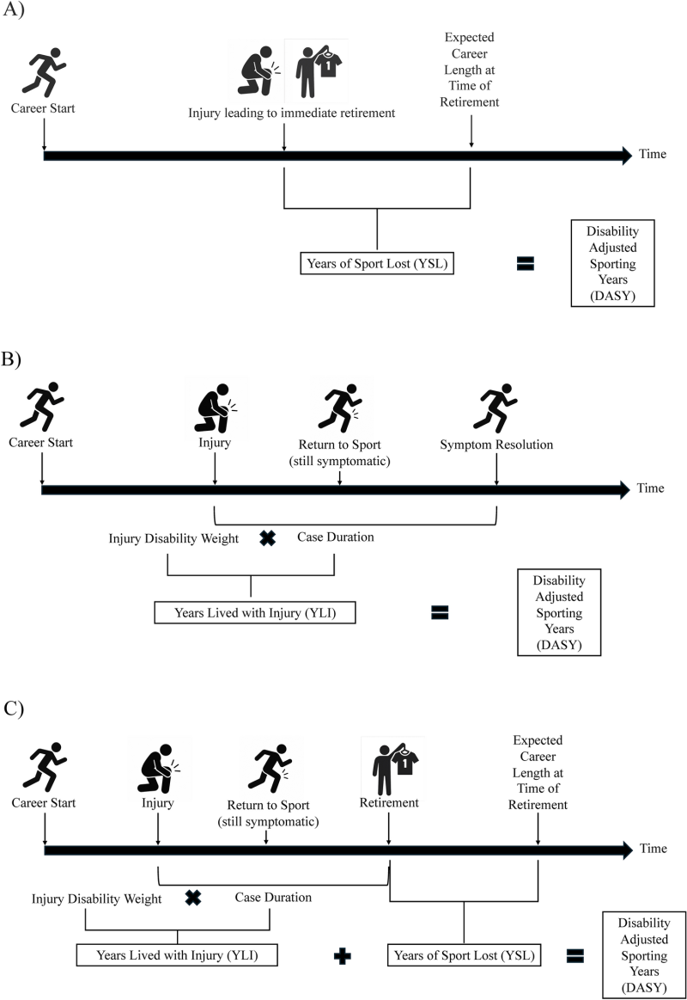

### The Disability-Adjusted Sporting Year (DASY)

Eric Post from USOC Sports Medicine and colleagues have developed [DASY](https://www.linkedin.com/posts/eric-post-445a5a68_from-public-health-to-player-health-introducing-activity-7445104154789916672-Eh43), a disability-adjusted sporting year metric that captures a more comprehensive view of the health consequences of sports injury. Current sports injury epidemiology uses a days-missed from competition metric. The binary play/don't play calculation fails to capture the subtle distinction between injury state during return to play and the short- and long-term effects of diminished physical capacity.

The DASY metric emulates what population health research does with the Global Burden of Disease (GBD) metrics for distributed geographic analysis. GBD spells out the local magnitudes of health loss associated with specific health outcomes. For example, the Institute for Health Metrics and Evaluation at the University of Washington [recently derived](https://ghdx.healthdata.org/record/ihme-data/gbd-2023-disability-weights) the burden of 375 different health maladies (diseases and injuries) according to 88 different risk factors to calculate fine-grained healthy life expectancy in 204 global locations.

One critical aspect of GBD is its measured years lived with disability (YLS), a measurement for the health loss associated with a non-fatal specific health outcome. (Fatal outcomes have their own measurement, YLL, years of lives lost.) DASY relies on an analogous measure to YLD, the "years lived with injury" or YLI. "Years of sport lost" (YSL) is the DASY match for GBD's YLL.

"DASY accounts for both the career-altering consequences and the lived burden of injury, offering a more complete and athlete-centered measure of impact," the authors [write](https://link.springer.com/article/10.1007/s40279-026-02423-6).

The authors do not quite articulate a full proof-of-concept. They do offer a simulated example, applying DASY to a college women's volleyball use case in a probabilistic simulation that estimates metrics for five injuries (concussion, ACL injury, hamstring strain, ankle sprain, and low back injury). Injury data comes from NCAA Injury Surveillance Program published figures.

Results show "Concussions demonstrated the highest DASY value (mean 34.6, 95% confidence interval [CI] 12.9–67.1), despite only a moderate traditional injury burden (mean 88.7 [95% CI 52.3–143.1] days lost per 10,000 AEs)." And "ankle sprains had a substantially higher traditional injury burden than low back injuries, yet their DASY values were much more comparable." Also, "ACL injuries demonstrated the highest traditional injury burden (mean 115.7 [95% CI 53.3–198.5] days lost per 10,000 AEs) and the second highest DASY value (mean 16.9 [95% CI 5.6–33.6])." AEs are accident exposures.

Discrepancies between DASY and time-loss measures demonstrate the expanded view on injury impact. Concussions and lower back injuries appear to have real, functional impacts shown with DASY that go beyond missed competition. Since 

The authors' DASY simulation yada yadas one critical parameter for YLS and YLI, the disability weight. Disability weights, the authors write, quantify the impact of disabling health outcomes on human lives. Since YLS does incorporate injury outcomes, YLI benefits from direct imports or, at least, good guidance for estimates based on sports medicine research literature.

YLI does not create its own disability weights, at least not from source in the way that the YLS does. Disability weights are scores between zero (0, perfect health) and one (1, death) using pairwise-comparison methods in expert surveys.

Pairwise-comparison is an elegant, effective way to calculate preferences and rankings without asking for preferences and rankings. Princeton computational sociologist Matthew Salganik first demonstrated its utility in his All Your Ideas project (https://github.com/allourideas/allourideas.org), which used an open-source project that was, in its day, copied widely. (Well, I copied it.) Now, pairwise-comparison surveys can be executed in the popular Qualtrics survey platform.

Advanced injury surveillance data structures have been built into athlete management systems. Kitman Labs recently announced its LogicBuilder product for implementing data rule sets for sports injuries that support longitudinal analysis, causal inference, and clinical research. (https://www.kitmanlabs.com/blog/logic-builder-performance-medicine/)

Recent injury surveillance projects in hockey and soccer provide elementary understanding using frequentist injury-count and time-loss measures. You can also see the valuable research questions that a more sophisticated approach will enable.

The NHL, helped by Washington University researchers, released an [official injury epidemiology study](Knapik_EpidemiologyProHockey.pdf) covering every season between 2012-13 and 2022-23. The study notes that injury density during playoffs increases due to the "heightened intensity and physicality" with an "increased risk of accidental collisions, intentional checks, and high-impact plays" that "could predispose players to both acute traumatic injuries and fatigue-related overuse injuries." DASY should be able to partition in-season and playoff injuries and assign different disability weights that account for the increase in effort and stakes that occur in championship competitions.

A collaboration between the FIFA Medical Centre at University Hospital in Regensburg, Germany, and the German Football League created a one-season health registry for the first and second Bundesliga divisions of both genders (men: 2022-23, women: 2023-24). This sort of data resource facilitates comparisons to reveal "sex-specific differences in injury distribution and time-loss in German professional football." 

The [paper](https://bmjopensem.bmj.com/content/12/2/e003003) authors suggest that gender-based analysis is a starting point for biomechanical analysis of what's common and what's different. For example, "While ankle sprain was the most frequent injury for both sexes, in female football, injuries of the knee were predominant, while in male football, in particular, injuries of the thigh muscles were reported."

The German registry also accounted for athletes' time-loss from illness (12% of total time-loss). The ability to scope disability weights by gender or by 100% inclusivity is an interesting lens to assess injury prevention. And accounting for illness in the athletes' health profiles is consistent with DASY's Global Burden of Health origins. 

The NFL, IQVIA, and Biocore published a [study](herzog-et-al-2026-data-driven-gradual-preseason-practice-acclimation-ramp-reduces-lower-extremity-strains-in-the.pdf) examining "training camp practice schedule strategies across NFL clubs to identify practice schedule factors associated with lower LEX strain incidence." Lower LEX strains refer to lower extremity strains, specifically to the hamstring, quadriceps, calf, and adductor. The paper reports that "approximately 1 in 4 players sustained a LEX strain between 2015 and 2019." The study's dataset connected athlete electronic medical records to player tracking data from preseason practices and encompassed 6720 during the years between 2018 and 2023. 

The results: "LEX strain rates per club-practice for clubs using a gradual acclimation strategy were lower for practices throughout preseason." It is easy to see how a more precise measurement like DASY enables greater results specificity for this type of targeted study.

### Secrets are not Helpful

*The New York Times Magazine* published a feature by Devin Gordon - The Longevity Secrets Helping Athletes Blow Past the Limits of Age. These "secrets" are bound to be short-lived, and not because the paper of record told everyone. It will take lots of people to invent, study, and prove the benefits of new technologies and practices for injury prevention and sports medicine. The work has to be out in the open. Secrets will not help anyone in the long run.

In the short run, the future is not very evenly distributed, to quote science fiction author William Gibson, and the Gordon article shows how uneven the sports technology landscape is. There are successful oldsters like Alysha Clark (basketball), Andrew McCutchen (baseball), Matthew Stafford (football), Hilary Knight (hockey), Elana Meyers Taylor (Olympics bobsled), and Lindsey Vonn (Olympics skiing) hanging on by mastering their recovery processes, sometimes with expensive technology (Atlas brain signal reader, Ammortal recovery chamber) and sometimes with help (babysitters, nutritionists, surgeons). 

If professional athletes' success is rare, then old athletes' success is super-rare. You only get to master the old athletes' recovery howto if you have established your bonafides earlier in your sports career. And large-scale studies have begun to prove methods that give athletes the best chance for a long career in pro sports.

A recent study of 401 (male) soccer athletes [study](https://esskajournals.onlinelibrary.wiley.com/doi/10.1002/ksa.70392) by FIFA Medical in Italy, examined on-field rehabilitation (OFR) for return to sport after ACL reconstruction. OFR has become a popular bridge from medically supervised rehabilitation to athletes' return to team environment. OFR sets the stage for return to training, return to competition, and return to performance for an injured athlete. The authors found that their cohort "had high RTP (88%) and low ACL re-injury risk (10%)." The greater the exposure to OFR, the higher the likelihood of RTP. In young players, "greater OFR compliance was associated with a reduction in ipsilateral ACL re-injury."

Fewer secrets mean better evidence. Better evidence means fewer guesses, and more positive outcomes. Eventually that translates to the best possible sport product on the field, court, or pitch.

### News

[Optimizing Athletic Performance and Safety With Wearable Technology](https://journals.sagepub.com/doi/10.1177/26350254251406285) in *Video Journal of Sports Medicine* by Helina VanBibber et al. on April 8, 2026

[UCI Sports Nutrition Project: Plate to Performance—Culinary Nutrition Support for Professional Road Cycling](https://journals.humankinetics.com/view/journals/ijsnem/36/3/article-p335.xml) in *International Journal of Sport Nutrition and Exercise Metabolism* by Dana Lis and Nicki Strobel on April 6, 2026

[On-Field Assessment of Joint Load in Football Using Machine Learning (Part II)](https://www.mdpi.com/1424-8220/26/8/2562) in *Sensors* journal by Anne Benjaminse et al. on April 20, 2026

[Countermovement Jump and Quantitative Electroencephalography Assessment in Division I Football Athletes: An Exploratory Neurophysiological Study of Return‑to‑Play Readiness](https://ijspt.scholasticahq.com/article/161023-countermovement-jump-and-quantitative-electroencephalography-assessment-in-division-i-football-athletes-an-exploratory-neurophysiological-study-of-re) in *International Journal of Sports Physical Therapy* by Robert Mangine et al. on May 1, 2026

[OPTIMISING PLAYER READINESS FOR THE FIFA WORLD CUP 2026](https://journal.aspetar.com/en/journals/volume-15-targeted-topic-sports-medicine-in-football-fifa-world-cup-2026/optimising-player-readiness-for-the-fifa-world-cup-2026) in *Aspetar Sports Medicine Journal* by Paul Balsom, Richard Hawkins, Tony Strudwick on April 2, 2026

[Why are so many athletes transferring from Stanford?](https://stanforddaily.com/2026/05/07/athletes-transferring-from-stanford/) in *The Stanford Daily* student newspaper by Madisyn Cunningham on May 7, 2026

[Every four years, Stefan Szymanski and I massively update Soccernomics. The new US edition is out tomorrow](https://bsky.app/profile/simonkuper.bsky.social/post/3ml4hgiqn722n) in *Bluesky* by Simon Kuper on May 5, 2026

[What Shohei Ohtani’s start against Marlins says about how Dodgers are handling his workload](https://www.latimes.com/sports/dodgers/story/2026-04-28/marlins-dodgers-shohei-ohtani) in the *Los Angeles Times* by Maddie Lee on April 28, 2026

[2026 swing path visuals are now available at Baseball Savant](https://bsky.app/profile/mikepetriello.bsky.social/post/3ml4x4jaoys2x) in *Bluesky* by Mike Petriello on May 5, 2026

[I wrote something about Brandon Vazquez's path from rock bottom to back on the pitch in ~300 days for Austin FC.](https://bsky.app/profile/cboehm.bsky.social/post/3ml7b6g6dp224) in *Bluesky* by Charles Boehm on May 6, 2026