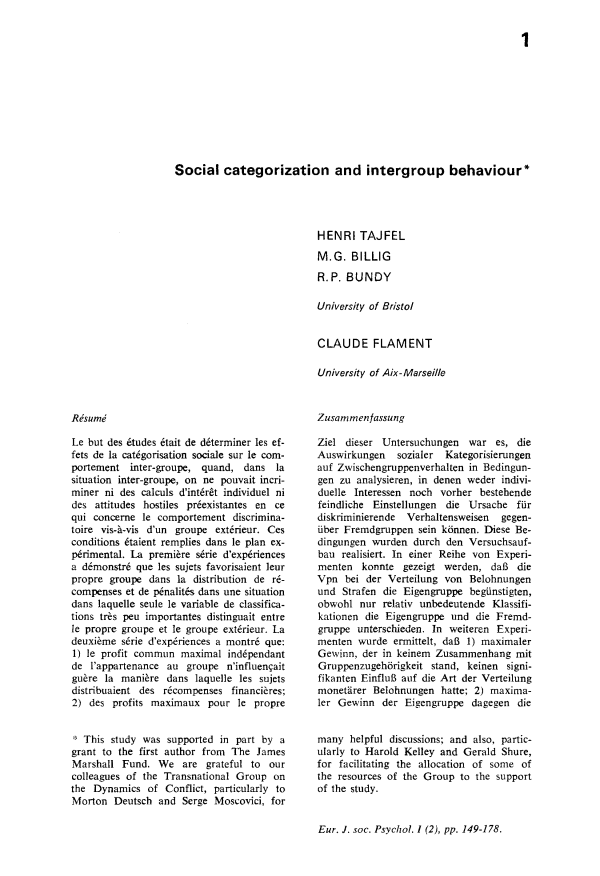

### A World Without Leaderboards

Nick Dimarco is a software developer who makes stuff with athletes' data. He has a [howto](https://nickdimarco.substack.com/p/leveraging-ai) for building Nick Dimarco is a software developer who makes stuff with athletes' data. He has a [howto](https://nickdimarco.substack.com/p/leveraging-ai) for building lightweight athlete management apps using an AI coding assistant. App number one is the dashboard for athletes' performance data with a tile for every key performance indicator (KPI). App number two is an off-season training recorder. Both apps have leaderboards as their central design.

One thing that has become clear in my research on privacy and athletes' data is that coaches love leaderboards, and athletes don't. Actually, it is not quite that simple. 

Some athletes do not like leaderboards, usually the ones who are stuck at the bottom, who are often younger and less experienced. Athletes at the top of the leaderboard often don't like that this happens to their teammates. Leaderboards are, in a fundamental way, a privacy problem. Teams don't need to share athletes' data using leaderboards, and some athletes clearly do not benefit. But leaderboards, there they are.

There's psychology to show that any sort of number in a team context can reinforce the team's culture, tilting it toward either anti-social or pro-social behaviors. Henri Tajfel, before he conceptualized [social identity theory](https://www.ebsco.com/research-starters/psychology/social-identity-theory) (how individuals define themselves based on their group memberships), investigated how arbitrary differences amplified ingroup versus outgroup social dynamics, writing in a 1971 paper ([Social categorization and intergroup behavior](SocialCategorizationAndIntergroupBehaviour.pdf)) that the "clearest effect on the distribution of rewards was due to the subjects’ attempt to achieve a maximum difference between the ingroup and the outgroup even at the price of sacrificing other ‘objective’ advantages."

[Stories](https://www.nytimes.com/2022/11/10/sports/college-athletes-body-fat-women.html) about athletes' body composition comparisons leading to dysmorphia and disordered eating have prompted coaches to say that any sort of body comparison talk is 100% off limits. But the number could be anything. Endurance training numbers, my research found, are something that athletes would rather not share, even with coaches. Like body composition, endurance is closely linked to a lot of athletes' identities, and it feels more personal than other kinds of data.

Even though athletes have real dislike and discomfort with leaderboards, leaderboards will not be going away. Leaderboards are pervasive for all sorts of reasons. One reason is the business models for athletes' results aggregators for individual sports (swimming, skiing, track) and scouting services for team sports (football, basketball, etc.). Strava is, like other social media, a comparison machine. A world of numbers and athletes is a world of leaderboards.

According to Geoff Burns and Michael Crawley, [writing](https://aeon.co/essays/what-ethiopian-running-says-about-the-limits-of-human-ability) for Aeon magazine, there is a land with athletes and without numbers. The place is Ethiopia, where "distance running expertise is seen as something that is intuitive, learned from others, honed through experience, and deeply dependent upon a group training dynamic." This is not sports science. This is not "monitoring of an ever-increasing number of physiological variables and individualized, precisely engineered training." It's a great essay.

"Ethiopian athletes see the process of expending and monitoring energy as a collective responsibility." Energy among training partners is finite and zero-sum, Burns and Crawley write, "for one athlete to gain within this system necessarily involves another athlete losing something." This is a culture that has solved the leaderboard problem.

Is it possible to have numbers and to not have leaderboards? There is another place, Volodalen, in Switzerland, where Cyrille Gindre oversees a human performance research lab that links athletes' cognition, emotions, and motor patterns, captured in the [Mind to Move](https://motorpreferencesexperts.com/blog/science-approach-6/volodalen-rethinking-motor-preferences-cyrille-gindre-42) principle that articulates gait biomechanics in terms of imagery and personality.

Gindre writes in a new Sports Medicine journal [paper](https://link.springer.com/article/10.1007/s40279-026-02449-w), "Running technique is individualized, not universal. Each runner naturally develops a style that fits their body, strengths, and context. Embracing this individuality—rather than copying elite techniques—leads to better efficiency and fewer injuries."

All athletes have a personal identity that comes from their physical sport experience and a social identity that comes from their team participation. Mind to Move elevates an athlete's personal identity and does it without sacrificing the additional information that comes with performance data. The theories coming out of Volodalen are new. A Mind to Move skill development pathway, something that is extremely personalized, might just work in a team sport like soccer or basketball if it can be incorporated into the team's culture and its athletes' social identities.

### Stakeholders and College Athletes' Data

I traded emails this week with Bill Carter, who runs [Student Athlete Insights](https://studentathleteinsights.com/) and the [NIL Forum](https://studentathleteinsights.com/nil-forum). He told me that athletes' data is going to turn up in surprising places as agents and universities explore every angle they can think of. The [story](https://www.sfgate.com/collegesports/article/cal-star-qb-parents-transfer-22257767.php) of the University of California quarterback whose parents are targets of recruiters made me wonder, what could these recruiters possibly be telling those athlete parents?

There is an expanding universe of people who want athletes' data. There is also an expanding universe of people who don't want athletes data but get it anyway. Some of the expansion comes from the increasing interest in athletes data throughout the diverse collection of college sports' stakeholders.  

Billy Napier, then University of Florida football coach, [leaned heavily](https://247sports.com/college/florida/longformarticle/florida-football-gators-recruiting-lands-commitment-2027-defensive-lineman-cain-van-norden-285479553/#2827686) into tracking data and athlete surveillance back in 2022. It was an effort to improve the school's competitive trajectory. (It failed.) The point: If a college sports stakeholder has an idea for how to leverage athletes' data, there is little to stop the person from following through on it.

Only three U.S. states have laws that offer privacy protections for biometrics to the general public: Illinois, Texas, Washington. The Illinois Biometric Information Privacy Act (BIPA) has the highest privacy standard. It requires individuals consent to collect and/or disclose biometric identifying information, as well as a reasonable standard of care for managing biometric identifying information. Outside of Illinois (and Europe's GDPR regulations), there is very little legal governance of college sports' stakeholders' actions that make use of athletes' data.

The emergence of private equity investment introduces a financial discipline to the college sports' stakeholder landscape. It could compel athletes' data users to think of it in terms of asset value. That puts student-athletes in a precarious position where financial interests could supersede basic individual rights to autonomy and well-being. It will be important to have student-athletes' data privacy safeguards in place.

### News

[Why Soccer Still Defies Statistical Analysis](https://www.wired.com/story/book-excerpt-how-to-watch-soccer-like-a-genius-nick-greene/) in *Wired* by Nick Greene on May 12, 2026

[Is the Modern NBA Breaking Its Stars?](https://www.theringer.com/2026/05/14/nba/nba-injuries-leg-calf-hamstring-achilles-data) in *The Ringer* by Kirk Goldsberry on May 14, 2026

[Why Steve Kerr stayed with the Warriors](https://www.espn.com/nba/story/_/id/48686303/steve-kerr-decision-return-coach-golden-state-warriors-steph-curry) in *ESPN.com* by Wright Thompson on May 14, 2026

[Want to hire the next Jürgen Klopp? This is how data can help clubs pick a manager](https://www.espn.com/soccer/story/_/id/48758776/want-hire-next-jurgen-klopp-how-data-help-clubs-pick-manager) in *ESPN.com* by Sam Tighe on May 14, 2026

[“College soccer is part of the American way of life... If we get the academic-year calendar model, we could arguably become one of the best developmental leagues in the world.” A look back at what I believe was the first time I wrote about this... 10 yearsss agooo](https://bsky.app/profile/cboehm.bsky.social/post/3mlrc2qmo7k2n) in *Bluesky* by Charles Boehm on May 13, 2026

[An Evidence-Based and Mechanistic Approach to Reducing the Risk of Anterior Cruciate Ligament Injury: An Exercise and Sport Science Australia Position Statement](https://link.springer.com/article/10.1007/s40279-026-02450-3) in *Sports Medicine* journal by Tyler Collings et al. on May 14, 2026

[From plan to practice: development, awareness, and implementation of sports injury and illness risk management plans in a professional male football setting](https://www.jsams.org/article/S1440-2440(26)00193-3/fulltext) in *Journal of Science and Medicine in Sport* by Bahar Hassanmirzaei et al on May 13, 2026

[Sport-specific prevalence of relative energy deficiency in sport (REDs) risk among Finnish female national- and international-level athletes](https://www.jsams.org/article/S1440-2440(26)00190-8/fulltext) in *Journal of Science and Medicine in Sport* by M. Wynne-Ellis et al. on May 7, 2026

[Tanking is ruining NBA basketball. Can math save it?](https://www.scientificamerican.com/article/tanking-is-ruining-nba-basketball-can-math-save-it/) in *Scientific American* by Joseph Howlett on May 11, 2026

[~$248M in player salaries…Here’s the list of the 33 players who suffered a torn ACL and their estimated earnings in 2025!](https://x.com/ACLrecoveryCLUB/status/2054221185060417721) in *X/Twitter* by ACL Recovery Club on May 12, 2026

[Greatest of All Time: Development of a Ranking System to Determine the Most Successful Olympic and World Championship Runners Since 1896](https://link.springer.com/article/10.1007/s40279-026-02443-2) in *Sports Medicine* journals by Brian Hanley, Carl Foster et al. from May 9, 2026

[How Sports Friendships Can Protect Mental Health](https://www.psychologytoday.com/us/blog/in-the-trenches/202605/how-sports-friendships-can-protect-mental-health) in *Psychology Today* by Tess Kilwein on May 14, 2026