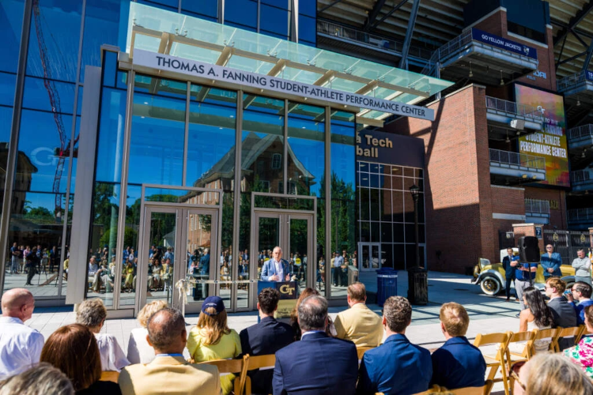

### Training Centers Business

Sandpipers, a Las Vegas-based competitive swim team, has a [new $18.9 million training facility](https://www.swimmingworldmagazine.com/news/sandpipers-of-nevada-reimagining-americas-path-to-olympic-swimming/). Georgia Tech, where I attended grad school, has a [new $90 million training facility](https://www.sportsbusinessjournal.com/Articles/2026/05/18/georgia-techs-90m-facility-shows-new-business-calculus-for-college-athletics/). The U.S. Soccer Federation has a [new $250 million training facility](https://sports.yahoo.com/soccer/article/us-soccer-gets-a-228-million-national-home-of-its-own-with-new-training-center-in-rural-georgia-145344647.html). The *Inside American Soccer* [podcast](https://www.youtube.com/watch?v=Np8P3jqOrx4) asked U.S. Soccer CEO JT Batson, why so much? "You have to spend money to make money," he said.

The volumes of data collected on athletes make these spaces human performance laboratories. It's field-based research mostly at present, but the line between a pure laboratory setting and a modern training facility will only blur. So let's compare how a lab building and a training facility can produce financial gains.

These facilities, like the biotech labs of a prior era, have functional spaces. This is where the training/researching happens. The facilities also have shared spaces for collaboration and community. There is typically a grand public space where fundraising occurs. The goal is to maximize the functional space, but don't shortchange on the fundraising space, and fit in offices and workspaces where possible (with natural light) in the places that make sense.

The construction capital goes to the space where the work gets done and to where donors and stakeholders can gather. No magic formula. Specialized technical workspaces are just very expensive.  Biotech lab buildings cost hundreds of millions of dollars. Training facilities are not quite as specialized or technical as biotech, but the trajectory for sports training construction has moved in the direction of more specialized and more technical.

The [centerpiece](https://www.ktnv.com/news/a-new-olympic-sized-outdoor-swimming-pool-is-coming-to-the-city-of-las-vegas) of the new Sandpipers training is a 50-meter outdoor pool to go with an existing 50-meter indoor pool. Swimmers win world and Olympic medals in pools this size. They break world records in pools this size. Sandpipers have access to world-class pools year-round.

The Georgia Tech facility [leverages success that Emory Healthcare has experienced](https://ramblinwreck.com/fanning-center-officially-opens/) collaborating on performance research and sports medicine with Atlanta's professional teams and with experts like P3. Now the Yellowjackets are in the fold.

The situation reminds me of an experience when I worked in university technology licensing early in my career. A Yale biochemist was an incredibly productive source for high-potential pharma compounds. He was an empiricist. He'd try shit out and see what happens, where his peers were often more theoretical. So Yale back him in a startup company that basically doubled the size and headcount of his lab. More hands and brains for him to try shit out.

Sports science is, at present, highly empirical. Georgia Tech has a chance to expand on Emory's footprint and try a lot of shit out. That makes the research return on investment here a good bet, better than other schools, but not necessarily a sure thing.

Research is nowhere near the economic driver that NIL is for college sports though. So how does an expensive training facility factor into those economics?

Privacy research has informed what I understand to be gray areas between individual athletes' personal development and what their team can accomplish. NIL makes universities walk a tightrope -- hard bargaining with student-athletes by saying the team and the program are responsible for athletes' development and exposure while, at the same time, bending over backwards to support athletes' goals and hard work. The training facility is the place where both need to happen. 

Nothing happens unless the athlete buys in to the university. According to the *Recreation Management* trade journal, facilities used to get buy-in with amenities like barber shops and bowling alleys. With NIL, [amenities are replaced](https://recmanagement.com/articles/155821/athletic-prowess) by functional spaces like media rooms and academic support. 

Sports psychologists refer to an athlete's identity as what is central to personal development and to social identity as how belonging to a team affects their behaviors and decisions. The university training facility plays a pivotal role in athletes' NIL, their personal identity, and their social identity. That's a lot to design for.

The U.S. Soccer facility outside Atlanta further muddies the tension between athletes' personal identity and their team-oriented social identity with the national identity (with its national attention) that comes with playing for your country. Simon Kuper, speaking to [*The Away End* soccer podcast](https://www.iheart.com/podcast/1119-the-away-end-with-daniel-316027679/episode/episode-17-seeking-beauty-with-author-simon-kuper-333490754), told how lots of players don't enjoy their World Cup experience. "In a World Cup there is only soccer. You're locked up all day," Kuper says. "Some players can't take it. The cabin fever is terrible."

*The Guardian* recently [profiled](https://www.theguardian.com/sport/2026/may/16/sabastian-sawe-secret-sauce-inside-lab-sub-two-hour-marathon-maurten-sweden) the athlete performance lab that Maurtens, the company that makes innovative energy and nutrition products for endurance sports, has in Switzerland. Product development and testing is a straightforward context for athletes to train and for stakeholders to collect data on the training athletes. The company-athlete benefit is close to a pure win-win. (Nike has [a major presence](https://www.ussoccer.com/stories/2026/01/nike-founding-partnership-arthur-blank-national-training-center) at the U.S. Soccer training facility.)

Professional sports teams' training facilities are roughly analogous to companies with performance products using a lab to develop and test products. The emphasis shifts to on-court or on-field entertainment products, and teams measure their results against the teams that they play in their league. 

The *Sports Business Journal* [list of new training facilities](https://www.sportsbusinessjournal.com/Articles/2026/05/18/new-facilities-more-than-a-place-to-practice/) highlights two trends among professional teams. Professional women's teams have been evolving their product rapidly, and [new training facilities meet an unmet need](https://www.netsdaily.com/nyliberty/109909/liberty-practice-facility-makes-progress). Established teams with giant audiences have [multi-use real estate development](https://www.nhl.com/utah/news/smith-entertainment-group-and-intermountain-health-announce-groundbreaking-partnership-and-creation-of-world-class-sports-performance-center-co-located-with-utah-jazz-and-utah-mammoth-practice-facilities-release-5-13-26) coincident with training facilities. The broader community participation adds revenue without really diluting what athletes and teams need from their facility.

Everything that goes into designing and then using a data-rich athletic training facility borders on surveillance and can, at times, cross over into privacy violation. My research shows that it is a fuzzy line separating what is and what is not surveillance in these settings. The difference can vary from athlete to athlete and has to do with an individual athlete's identity and a team's social identity. When the team encroaches into what's personal to an athlete, privacy has been diminished and possibly breached.

The challenge and the solution for creating environments the right way is the central observation from [A Pattern Language](https://arl.human.cornell.edu/linked%20docs/Alexander_A_Pattern_Language.pdf), the classic design how-to published 50 years ago and authored by Christopher Alexander.

[What matters](https://en.wikipedia.org/wiki/A_Pattern_Language) is "the idea people should design their homes, streets, and communities." Why this matters comes from "the observation most of the wonderful places of the world were not made by architects, but by the people."

### Privacy Is Friction

ESPN writer Pete Thamel [asked](https://www.espn.com/college-football/story/_/id/48810760/college-sports-big-budget-spending-sustainable) whether college sports big budget spending is sustainable. One aspect of the solution that Thamel does not address is friction, something that comes up when legislators and college sports stakeholders seek mechanisms for slowing down the rapid change that the world of U.S. college sports has been seeing.

This is a subtle reminder that privacy is friction. It can be applied to public policy and provide benefit to industry while simultaneously enhancing the rights and protections of the public.

A 2023 [paper](https://www.ftc.gov/system/files/ftc_gov/pdf/jimenez-hernandezdemirerlipeng.pdf) by leading economists documented the effect of the European General Data Protection Regulation (GDPR) on cloud data storage, a good proxy for the data intensity of the economy at large. Seven years into GDPR, the authors found that data storage by EU companies was 26% less than comparable US companies. The cost of data increased 20%, and the production cost of information increased 4%.

Another [study](https://thearf-org-unified-admin.s3.amazonaws.com/MSI_Report_23-%20141.pdf) looked at how online search quality changed with GDPR inside and outside the EU. Researchers found that consumers had greater confidence using and transacting on the Internet with more privacy safeguards in place. Researchers also found that large companies had an advantage and an easier time managing compliance.

European regulators applied the brakes with GDPR. It slowed things down economically and increased costs, but the consumer situation improved. 

In the U.S., the state of Illinois created the Biometric Information Privacy Act (BIPA) in 2008. BIPA says that companies handling biometric data must have informed consent and established guidelines and cannot sell, trade, or profit from individual's biometric data. Litigation followed, as technical violations [spawned lawsuits](https://www.illinoispolicy.org/illinois-biometric-data-law-a-threat-to-businesses/).

In recent months BIPA [has been cited](https://capitolnewsillinois.com/news/battle-over-data-centers-in-illinois-pits-consumer-costs-vs-state-competitiveness/) a reason for data center developers to site projects outside the state.

The friction can also be a forcing function to make sure that there's progress towards resolution of complex socio-technical issues. Just saying that it's an option for regulating college sports.

### News

[You shouldn't care about combine measurements](https://loganadamsnba.substack.com/p/you-shouldnt-care-about-combine-measurements) in Substack, *Prospects & Concepts* newsletter by Logan Adams on May 18, 2026

[How Arteta changed Arsenal's culture and turned them into champions](https://www.premierleague.com/en/news/4662274/how-mikel-arteta-changed-arsenal-culture-and-turned-them-into-premier-league-champions) in *PremierLeague.com* by Sam Cunningham on May 19, 2026

[Can the ‘steroid Olympics’ show the sporting community how to support athletes better?](https://www.nature.com/articles/d41586-026-01552-2) in *Nature*, World View, by April Henning on May 18, 2026 

[The Enhanced Games miss the point: science can clean up sport](https://www.nature.com/articles/d41586-026-01574-w) in *Nature*, World View, by Kim Wolff on May 18, 2026

[Wearable polygraph detects hidden stress](https://news.northwestern.edu/stories/2026/05/wearable-polygraph-detects-hidden-stress) in Northwestern University, *Northwestern Now* by Amanda Morris on May 13, 2026

[How do you make good decisions when millions are on the line? My latest, with a throwback to my own psych research with Walter Mischel and insights from one of the best poker players in the world, Jason Koon](https://bsky.app/profile/mkonnikova.bsky.social/post/3mlwfrhfdrk2m) in Bluesky by Maria Konnikova on May 15, 2026

[Training alone, driven together: The impact of social identity on physical effort in cycling endurance tasks](https://www.sciencedirect.com/science/article/pii/S1469029226000786) in *Psychology of Sport and Exercise* journal by Julien Pellet et al. from April 22, 2026

[Multidimensional performance characteristics of youth academy and club soccer players](https://journals.plos.org/plosone/article?id=10.1371/journal.pone.0348716) in *PLOS One* journal by Ulrikke Norill Kvalvaag et al.

[UC Irvine researchers invent a wearable, bioelectronic sweat sensor for long-term health monitoring](https://news.uci.edu/2026/05/13/uc-irvine-researchers-invent-a-wearable-sweat-sensor-for-long-term-health-monitoring/) in University of California-Irvine, *UC Irvine News* by Brian Bell on May 13, 2026