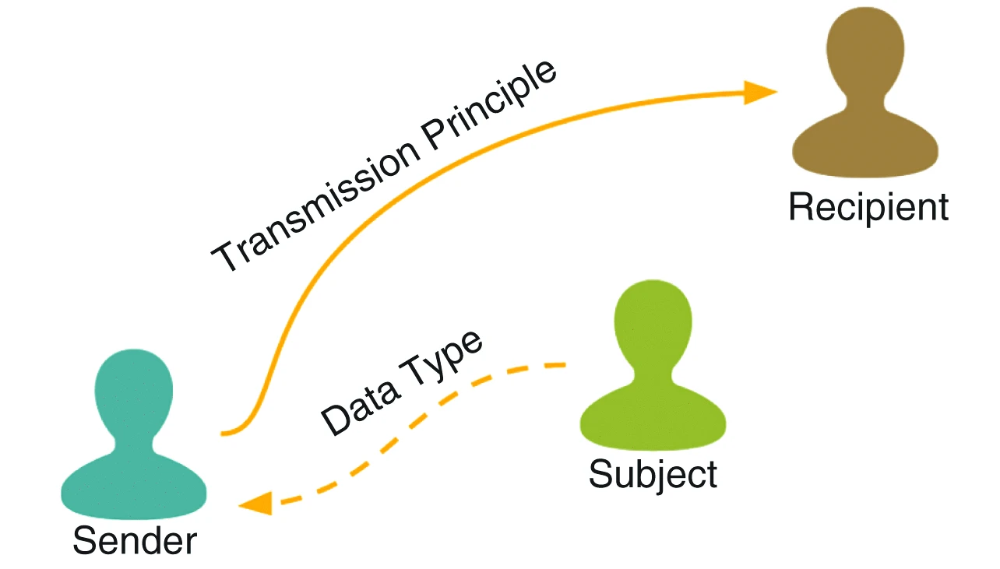

I, Brad Stenger, produce The Athletes Data Community newsletter as a Computer Science PhD student at the University of Vermont. The newsletter connects my research into privacy and data sharing for athletes' health and performance data to related news subjects in technology, sports and policy. Thanks for reading! Please point colleagues interested in getting the newsletter to [newsletter.bradstenger.com](https://newsletter.bradstenger.com) for signup and searchable archive.

### Southampton FC Spying

Southampton FC was [caught spying](https://www.bbc.com/news/articles/clypx97y1w7o) on opponents' training sessions in the days leading up to games with opponents in the English League Championship. What's wrong with spying, other than it being against the rules? 

My research uses an interpretive framework called contextual integrity to objectively assess the appropriate flow of information and, with it, when and if the sacrifice of privacy is a proper outcome given the norms and expectations for the circumstances. If you apply the framework to the type of cheating that Southampton admitted doing, you can understand the subtle distinctions that affect real-world decision-making about athletes' and teams' privacy.

[Contextual integrity](https://www.cs.cornell.edu/~shmat/courses/cs5436/malkin.pdf) divides an information flow into five distinct parameters: subject, data type, sender, transmission principle, and recipient. Two other quasi-parameters, benefit and purpose, help to define the social context for the information flow. Let's use CI to break down the Southampton spying case.

The subject is the source of data collection. The collective team that does its practicing is the subject here. The data type would be the video, plus any documented observations, plus any training load tracking or biometric data. 

The sender is the person observing and videotaping the practice. An intern was the Southampton employee that the other teams identified taking in the practices. 

The transmission principle is game preparation, and the recipient is, ultimately, the head coach. The structure of the information flow is not all that different when it comes to this phase of game prep for either one of the two teams. Only one team is supposed to have the information, though.

At least that is the norm. Teams [have the expectation](https://insights.devonshires.com/post/102mx5x/tinker-tailor-southampton-spy) of complete privacy. In the Championship, league rule EFL Regulation 127 forbids observing the other team while training during the 72 hours before a fixture. EFL Regulation 3.4 says teams should "act toward each other with the utmost good faith." Southampton admitted to both of these violations in the lead-up to 3 different games.

Rule-breaking is not necessarily norm-breaking. Sam Cunningham, a British soccer journalist, [notes](https://news.uk.cityam.com/story/2427675/content.html) that Southampton manager Tonda Eckert started his career in Germany, assistant coaching a youth team in Cologne that was accused of spying. German soccer, apparently, has more widespread spying, and the practice is more tolerated than in the UK.

Purpose is sometimes referred to as the sixth contextual integrity parameter, and it helps to make sense of the transmission principle. The purpose of spying is competitive advantage, like a lot of coaches' strategic work. Because spying gains a competitive advantage that the other team does not, the benefit is substantial, and that benefit comes primarily to the primary recipient, the soccer team manager. In Southampton's case, the benefit was greater than the risk and penalty of getting caught.

Eckert faces a UK Football Association charge in the spying scandal and could face individual punishment. He has also admitted to authorizing the observations during an EFL investigation. But it might be an entirely different situation if the same thing had occurred in Germany.

Say that German coaches spy regularly on opponents, and teams have significantly lower privacy expectations as a result. It is a measurably different norm for the same or similar social context. The information flow that is inappropriate in England is appropriate (or less inappropriate) among German soccer stakeholders. 

Contextual integrity is a way to capture that subtle distinction. Doing a CI study is a matter of asking participants in the social context the who, what, how, and why for the CI parameters. Those questions can be in the form of interviews or a survey. Tease out the norms and expectations from the responses, and an analyst will have some sense for whether the information flows are appropriate. 

Sometimes the research question is not assessing information flows. The CI framework can also be used to document information flows and social norms in order to understand the privacy expectations of stakeholder groups in that social context.

The exercise in constructing the interview or survey is a lot like doing the pre-mortem analysis that coaches will use for game preparation. My research will draw up the scenarios where the information flow goes bad and then test to see which assumptions hold. Use CI this way, and you have a forecastable model that you can make evidence-based decisions against. 

For example, an English soccer team owner can offer helpful guidance to his new manager from another country who believes in the maxim, "If you're not cheating, then you're not trying." With contextual integrity, you can say with confidence that this is what cheating looks like, and this is what trying looks like.

### Menstruation and Performance Research

It has become inadequate to say that menstruation affects athletic performance without going into the what, how, why, and when of the changes relative to the sport demands on women athletes. Three new research articles take important steps toward a 360-degree understanding of periods and the differences between general and athletic populations.

The first article is an editorial in the *British Journal of Sports Medicine*, [Period pain in female athletes: a call to action—time to fill the evidence gap and develop tailored management pathways](https://bjsm.bmj.com/content/early/2026/05/21/bjsports-2025-110565) ([pdf](https://pure.bangor.ac.uk/ws/portalfiles/portal/86367988/Female-Athlete-Period-Pain-Editorial-R3_290426_clean.pdf)). Pain as a symptom of menstruation can be debilitating, but it also varies throughout the population. The call to meet the "urgent need to better understand female athletes' lived experience of period pain" is also an opportunity to move past one-for-all pharmacological approaches to something more personal and holistic, write the authors.

The other two articles are research papers. One paper looks at a general population. The other, an athletic population.

The gen-pop paper appeared in the *npj digital medicine* journal, [The menstrual cycle through the lens of a wearable device: insights into physiology, sleep, and cycle variability](https://www.nature.com/articles/s41746-026-02799-9), by Scott Delp's Stanford lab. Delp is also Director of the Wu Tsai Human Performance Alliance at Stanford. Wu Tsai HPA funded the work.

The researchers collected sleep and biometric data from 2600 women using Whoop wearables. They "generated novel quantifications of daily biometrics across ages and cycle lengths, finding that cycle length is strongly associated with how much cardiorespiratory metrics vary across the cycle." Cycles vary from person to person, but their length relates to other aspects of physiology.

The researchers also "observed greater cycle variability for participants who slept 6 versus 8 hours. A within-participant natural experiment showed that decreased sleep resulted in biometric changes regardless of cycle phase." This would seem to be especially important for athletes, given the significance of sleep for sport training recovery. But more investigation will be needed to confirm the finding for athlete populations.

The other research paper is in the *Sports Medicine* journal, [The Effect of Menstrual Cycle Phase, Symptoms, Motivation, and Readiness to Perform on Resistance Training Performance](https://link.springer.com/article/10.1007/s40279-026-02459-8). It puts cycle tracking in the context of strength training. The finding here: "Menstrual cycle phase appears to have minimal effect on resistance training performance."

The authors make sure to mention, "motivation and symptom profiles may influence resistance training across the menstrual cycle." And those could be first-order menstrual symptoms like pain or second-order effects from cycle length variability and its effect on training and performance.

One thing that I have come to realize as I develop research questions around cycle tracking, data sharing, and privacy is that all athletes (not just women) have a stake in this work. The ways that data and meaning can be distilled from population-level to a team-level to an individual-level will carry. 

There are all-athlete questions about nutrition, cognition, and neuromuscular kinematics that are just as variable and personal as what women experience with menstruation. The progress on menstruation and cycle tracking is a starting point for all kinds of important research work.

### News

[KSI Opens Satellite Location at University of North Florida](https://today.uconn.edu/2026/05/ksi-opens-satellite-location-at-university-of-north-florida/) in University of Connecticut, *UConn Today* on May 22, 2026

[Inside Baseball: Student Analytics Team Loves ‘Figuring Out How to Win’](https://datascience.virginia.edu/news/inside-baseball-student-analytics-team-loves-figuring-out-how-win) in University of Virginia, *UVA Data Science News* by Andrew Ramspacher on May 11, 2026

[Adam Silver’s NBA Is in Crisis. Does He Know How to Fix It? — The Atlantic](https://www.reddit.com/r/nba/comments/1t76r79/adam_silvers_nba_is_in_crisis_does_he_know_how_to/) in *reddit/r/nba* by theatlantic, Katie Anthony on May 8, 2026

[Interview with Andrea Pirlo](https://bsky.app/profile/ghostgoal.bsky.social/post/3mmvjpcr5qk2k) in *Bluesky*, *Sky Sports* by Adam Bate on May 28, 2026

[The New Language of Fatigue](https://runlongrunhealthy.substack.com/p/the-new-language-of-fatigue) in Substack, *Run Long Run Healthy* newsletter by Brady Holmer on May 28, 2026

[How To Avoid The Trap of Zombie Training](https://feelthebyrn.substack.com/p/how-to-avoid-the-trap-of-zombie-training) in Substack, *Feel The Byrn* newsletter by Gordon Byrn on May 28, 2026

[Can You Put a Price on Risk in Football?](https://thexgfootballclub.substack.com/p/can-you-put-a-price-on-risk-in-football) in Substack, *The xG Football Club* newsletter by Alex Marin Felices on May 28, 2026

[Our 2026 World Cup predictions are live!](https://bsky.app/profile/probberechts.bsky.social/post/3mmtruydrdk25) in *Bluesky* by Pieter Robberechts on May 27, 2026

[Oura unveils its Ring 5 with a thinner, lighter design starting at $399](https://techcrunch.com/2026/05/28/oura-unveils-its-ring-5-with-a-thinner-lighter-design-starting-at-399/) in *TechCrunch* by Aisha Malik on May 28, 2026

[IOC boss Kirsty Coventry: "I don't believe in paying athletes."](https://bsky.app/profile/nkalamb.bsky.social/post/3mmtwzggu2k2r) in *Bluesky* by Nathan Kalman-Lamb on May 27, 2026

[As more athletes speak openly about depression, anxiety and suicide, a minority of fans are weaponizing it](https://theconversation.com/as-more-athletes-speak-openly-about-depression-anxiety-and-suicide-a-minority-of-fans-are-weaponizing-it-282697) in *The Conversation* by Scott Parrott on May 26, 2026

[NEW: Hudl Statsbomb Release Free Data for Five Top Women's Leagues](https://bsky.app/profile/statsbomb.com/post/3mmtmvms5v22c) in *Bluesky* by Hudl Statsbomb on May 27, 2026

[Large-scale study of the hip, knee, and ankle reveals sex and angle-dependent muscle volume and torque scaling relationships](https://www.sciencedirect.com/science/article/abs/pii/S0021929026001375) in *Journal of Biomechanics* by Mario Garcia et al. on May 26, 2026

