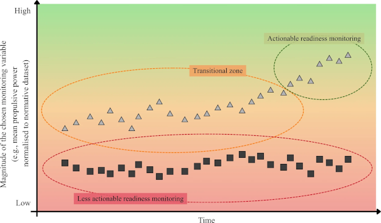

### Team Sports Neurobiology

University of Colorado researchers put EEG caps and IMUs on experienced tango dancers. Together, the wearables simultaneously measured brain activity and lower body movement, giving a clear indication of whether brains at work and bodies in motion are in sync. 

Tango is improvisational and forces partners to predict what their partner will do. Synchronized motion is difficult to do but easy to spot with the IMU. It turns out that when dancers' motion is in sync, so are the brains.

The phenomenon is called interpersonal brain synchronization, or inter-brain coupling. Researchers have observed the coupling in social and collaborative settings where the coordination mechanism is spoken language. 

The Colorado research is the first example where the coordination is embodied, since there was no music playing for dancers to work off of.

“When we dance, our brains are actually coupling,” said Thiago Roque [to the *ZME Science* news service](https://www.zmescience.com/medicine/mind-and-brain/scientists-put-brain-scanners-on-tango-dancers-and-found-their-minds-moving-together/). “We are synchronizing our brains through our behavior.” Roque thinks that this research will have utility for teams during training that want to learn teammates patterns when play gets improvisational.

Inter-brain coupling is just one example of human biological machinery automatically aligning social and personal activity. The neuro-social epicenter of the brain is the prefrontal cortex, which is also where decision-making occurs.

Recent experiments in mice showed that the prefrontal cortex governs a group's collective resilience. Scientists used cold temperatures to see if and when the animals would huddle for warmth and when they would increase activity, two strategies to get warmer. The mice self-organize, huddling around group members who stop moving, and they huddle more as group size increases.

“When one individual in a group is compromised, the group doesn’t fall apart—it adapts. That collective resilience is encoded in the brain, and we’re now beginning to map the brain circuits behind it,” said Tara Raam [to *Neuroscience News*](https://neurosciencenews.com/collective-social-resilience-brain-30347/). 

The prefrontal cortex tracks the choices of social partners as closely as its own choices, comprehensively monitoring the group's collective state.

The hormone oxytocin [has been called](https://www.thelancet.com/journals/landia/article/PIIS2213-8587(13)70004-4/fulltext) the "sport hormone" ([more](https://pmc.ncbi.nlm.nih.gov/articles/PMC3444846/)) Oxytocin gets released in the body in response to touch. It is credited for eliciting the powerful bonding between mother and child that occurs during nursing. In a sports team context, [observational studies showed](https://abcnews.com/Health/winning-touch-nba-teams-touch-win-study/story?id=13801567) that teams who touched more had better won-loss records.

University of Zurich [research](https://www.news.uzh.ch/en/articles/media/2026/oxytocin-group-competition.html) recently measured oxytocin levels in the urine of soccer players before and after matches. Oxytocin levels increased after matches, more so against rival communities. Those rivalries could be familiar opponents, or they could be unfamiliar opponents with known alternative beliefs. "This suggests that oxytocin is sensitive to the salience of the opposition," says professor Adrian Jaeggi.

The writer Alex Hutchinson has long written about neurobiology and human performance. His [latest Substack](https://sweatscience.substack.com/p/three-science-takeaways-from-a-long) explores his participation in a long-distance team relay road race in Canada. He mentions the concept of "social energetics," something that "describes the changes in how we allocate energy in the presence of others."

Hutchinson points to research where rowers showed increased pain tolerance after workouts, "but that the increase was twice as big when they worked out with their teammates compared to when they did it alone."

In sports and in biology and in sports biology, everyone goes together.

### Problems with KPIs

James Malone is a UK trainer and writes The Football Scientist newsletter. He has [a howto](https://maloneperform.substack.com/p/how-to-identify-meaningful-kpis-in) for doing KPIs (key performance indicators) right. 

Mostly he says that packaged indicators from sports data services are mostly for monitoring athletes, and they are not super-useful. "Knowing what a player has done is useful, but understanding how they are responding is often far more valuable," he writes.

The quality of a KPI comes down to its utility for decision-making, writes Malone.

Karol Kruczek covers similar territory in [his research article](https://www.frontiersin.org/journals/physiology/articles/10.3389/fphys.2026.1855985/full), "The readiness-preparedness bias: recalibrating monitoring logic." The bias he and his co-authors describe comes from preparedness indicators that are only useful who are not fully prepared for competiton. 

Once these underprepared athletes are competition-ready, basing athlete training volume decisions on monitoring indicators becomes increasingly unwise. At this advanced point, readiness indicators become more relevant for training plan decisions.

Preparedness refers to sport-specific capacity to tolerate, recover from, and adapt to training and competition. It reflects the athlete’s ability to repeatedly do performance-relevant work, not any sort of in-the-moment feeling about how good (or how bad) it is to train. Readiness refers to the athlete’s current state of functional availability to train or compete, regardless of short-term training effects (fatigue, recovery status, soreness, psychological state, etcetera).

"Readiness status interpreted without benchmark context may offer only limited descriptive value, whereas preparedness should be judged against sport-, level-, sex-, role-, and task-specific reference criteria selected for their causal proximity to competitive demands." The practical conclusion is that athletes' "load management should be embedded within a pre-planned yet responsive periodisation framework, not as a reactive brake on it." Failing to do so "may deprive athletes of the very exposure required to build resilience to elite competition."

Monitoring logic is a moving target, according to the paper. KPIs need to be nimble in order to respond to changes that come to athletes' capabilities, team needs, data descriptiveness, and coaching insights.

My research has looked into KPIs from athletes' perspectives. Athletes, in general, trust coaches to be competent when KPIs have been applied, but they also understand that any KPI is inherently biased. Despite a KPI's appearance as an objective yardstick (for performance or readiness or preparedness or whatever), the athletes see and experience the bias that can work for, or work against, their individual goals and objectives.

When athletes experience the short end of KPI bias, they ask for transparency, anything that will help them to recalibrate personal goals and objectives. Fail to offer transparency to athletes, and as a result, the coach will take a competency hit.

Student-athletes set themselves up for success as a matter of personal responsibility. They have outperformed peers and achieved a high level in their sport. When KPIs help, they are all ears, but they also know from experience that KPIs don't always help.

### News

[The Race to Make the Fastest Running Shoe](https://www.nytimes.com/2026/06/04/style/running-shoes-speed-nike-adidas-puma.html) in *The New York Times*, Style Section by Calum Marsh on June 4, 2026

[Interchangeability of external player load variables from different athlete tracking systems in English Premier League soccer players](https://www.termedia.pl/Interchangeability-of-external-player-load-variables-from-different-athlete-tracking-systems-in-English-Premier-League-soccer-players,78,56509,0,1.html) in *Biology of Sport* journal by Ronan Kavanagh et al. on May 8, 2026

[Defensive Responsibility: A New Way To Measure Defensive Output](https://www.hudl.com/blog/defensive-responsibility-defr-statsbomb) in *Hudl Blog*, News on June 4, 2026

[The current injury incidence rate (formula: total injuries * 1000 ÷ total games played by all athletes) in the WNBA is 66.3](https://bsky.app/profile/seehafer.bsky.social/post/3mnhui3vsk22o) in Bluesky by Lucas Seehafer on June 4, 2026

[Are Endurance Athletes Matching Their Carbs to Training Load?](https://runlongrunhealthy.substack.com/p/runners-arent-matching-their-carb) in Substack, *Run Healthy Run Long* newsletter by Brady Holmer on June 4, 2026

[What network science can tell us about the 2026 World Cup](https://news.northeastern.edu/2026/06/03/soccer-analytics-world-cup-network-science/) in Northeastern University, *Northeastern Global News* by Cesareo Contreras on June 3, 2026

[10 Essential Books and Writings on Privacy by Design](https://danielsolove.substack.com/p/10-essential-books-and-writings-on) in Substack, *Solove on Tech* newsletter by Daniel Solove on June 3, 2026

[Probiotics in football (soccer): a survey on practitioner’s current perceptions and practices](https://www.tandfonline.com/doi/full/10.1080/24733938.2026.2682129) in *Science and Medicine in Football* journal by Tindaro Bongiovanni et al. on June 2, 2026

[Injury and Illness Prevalence and Incidence in Swedish Olympic Athletes: A 3-year Prospective Cohort Study](https://link.springer.com/article/10.1186/s40798-026-01035-8) in *Sports Medicine* journal by Kalle Torvaldsson et al. on June 3, 2026

[Prevalence of stress urinary incontinence and associated factors in elite female football players: Better understanding for better prevention](https://www.jsams.org/article/S1440-2440(26)00194-5/fulltext) in *Journal of Science and Medicine in Sport* by Emmanuel Orhant et al. on May 18, 2026

[The Relationship Between Games Missed for Rest or Load Management and Injury in the National Basketball Association, 2014–15 Through 2022–23](https://link.springer.com/article/10.1007/s40279-026-02457-w) in *Sports Medicine* journal by Mackenzie Herzog et al. on May 30, 2026

[The away game: beating travel fatigue at the FIFA World Cup](https://www.hmmrmedia.com/2026/05/the-away-game-beating-travel-fatigue-at-the-fifa-world-cup/) in *HMMR Media* by Craig Pickering on May 29, 2026