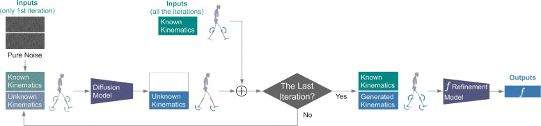

### Simulations and the State of the Art

The video assistant referee at the World Cup has something other VARS in all other sports do not have. FIFA did head-to-toe body scans for every player. Combine the avatars with location tracking for players and the ball, and the VAR will have unparalleled fidelity for the virtual simulation for the game they referee.

"The real technical challenge here is using a single scan of a player, taken while they’re standing still, and applying that digital twin to Hawk-Eye’s skeletal pose data in active gameplay scenarios—when the players are running, jumping, or sliding," [wrote](https://arstechnica.com/gadgets/2026/06/cameras-sensors-and-3d-body-scans-all-the-tech-helping-eliminate-blown-calls/) Ben Dowsett for *Wired.com*. The differences are tiny, and the production is expensive, but in a World Cup, the margin of victory is equally small, and the stakes are enormous. So the cost and effort will be worth it, even if the precision turns out to be unnecessary.

*Ars Technica* automotive beat writer Jonathan Gitlin [wrote up](https://arstechnica.com/cars/2026/06/whats-so-special-about-a-formula-1-driver-in-the-loop-simulator/) the simulators that Formula 1 auto racing teams spend upwards of $10 million on, just to give drivers something to practice with. In order to feel like a car, the integration of the digital twin car and the physics being modeled needs to be tight, delivering feedback as close to instant as possible. The lag in these sims is down to 3 milliseconds.

To achieve that level of precision is very close coupling between the computers and the different machines that mechanically replicate (instead of just calculating) the stresses on the vehicle suspension in a turn or on the tires interfacing the road.

“The evolution since my first time on the simulator is tremendous. The visuals, of course; the movement of the platform is another thing. I would say the hardware has massively improved, and the latency is something we fight for with computer power every day, but the latency is really everything to give the driver the right feedback,” the driver Simon Pagenaud told Gitlin.

Scott Delp leads the digital twin effort for the Wu Tsai Human Performance Alliance at Stanford. His group has developed a reinforcement learning model, [GaitDynamics](https://pmc.ncbi.nlm.nih.gov/articles/PMC11957236/), that predicts "the effects of gait modifications on knee loading" and "predicts kinematic and force changes that occur with increased running speeds." The AI advances what a digital twin simulation of (running) athletes can accomplish.

"Right now the simulation tools that we build really require a lot of really specific expertise for people to generate an accurate simulation and then analyze it sufficiently," Delp told [an obscure science podcast](https://vph-society.org/media/episode-18-human-motion-resolved-with-scott-delp/) last year. AI makes it easier and less costly to develop viable models at the scale of individual athletes.

The GaitDynamics model has already [helped to examine](https://arxiv.org/abs/2602.12694) midsole foam materials used for distance running shoes. Delp says that it's possible to tune a running shoe, matching an athlete's tendon stiffness to shoe stiffness for maximum energy return.

It's fast, cheap, or good. Pick two. The World Cup simulation is fast, somewhat expensive, but still exceedingly simple. The F1 simulation is fast, good, and extremely expensive. The open source tools that Delp and Wu Tsai work on are cheap and good, but the progress is (as of now) slow.

Can we get to all three: fast, cheap, and good? Maybe. The bottleneck is not the lag. The bottleneck is the emodied expertise in someone like Simon Pagenaud who knows what something that is high-performance should feel like, and can also explain to an engineer what that difference is between feeling right and feeling wrong. 

### Athletes' Surveillance Future Tipping Points

[Surveillance pricing](https://epic.org/issues/consumer-privacy/surveillance-pricing/) is when consumers see different, individualized (usually higher) prices based on the service or product due to personal information that has been collected. It is the latest privacy issue to reach a tipping point insofar as state and federal legislatures are writing laws to safeguard public interests.

Surveillance is often pervasive, and the information collected is subject to incentivized and profit-seeking behavior. Organizations that have personal data will use it if they have something to gain by doing so.  If there are harms that result, it often takes time to identify the wrongdoing and then write laws against it. 

Athletes do not really experience abnormal surveillance pricing in general. Youth sports might expose have-to-spend circumstances, but it is hard to see dramatic cost increases coming from collected personal data. Things like [the Varsity Blues athlete college admissions scandal](https://www.pushkin.fm/podcasts/revisionist-history/the-tipping-point-revisited-georgetown-massacre-part-1) had exploitive middlemen, but those middlemen worked within the rules of a corrupt system.  

One of the services that colleges provide to student-athletes is to limit their exposure to personal costs associated with competing in high-level sports. That could change as agents become a larger presence, with the potential to exploit athletes. The Protect College Sports Act [has rules](https://thehill.com/newsletters/keeping-score/5897555-protect-college-sports-act-unveiled/) for agents that protect athletes.

[Surveillance wages](https://www.morningstar.com/news/marketwatch/20260401139/employers-are-using-your-personal-data-to-figure-out-the-lowest-salary-youll-accept), where pay rates are individualized using algorithms based on employees' personal information, loom as an emerging issue. NIL clearinghouses can be cross-referenced against university-held athletes' data by athletic departments, [as told by](https://athleticdirectoru.com/articles/beyond-payroll-the-real-demands-of-paying-student-athletes/) Jason Belzer, an attorney. The [absence of employee rights](https://www.nacua.org/resource/the-college-athlete-employee-flsa-and-the-end-of-amateurism/) for student-athletes leaves them at a substantial disadvantage in these cases.

Gambling is another problematic example of surveillance economics, for obvious reasons. Sports leagues [depend on](https://indianacapitalchronicle.com/2026/03/31/protecting-college-athletes-starts-with-transparency/) sports books to surveill patrons and report suspicious betting activity. Sports leagues also [willingly share](https://www.espn.com/college-sports/story/_/id/44849987/ncaa-share-data-logos-sportsbooks-expanded-deal) their data with sports books, but so far that data does [not extend to athletes' biometric data](https://law.vanderbilt.edu/betting-on-biometrics/). So far the 2016 (set to run until 2027, possibly longer) [agreement](https://mgoblue.com/news/2015/7/6/general-reunited-michigan-and-nike-announce-partnership) between University of Michigan and Nike is the only financial transaction known to include athletes biometric data sharing [to date](https://www.nytimes.com/2016/09/11/sports/ncaafootball/wearable-technology-nike-privacy-college-football.html).

### News

[Relationship Between Ankle Plantar Flexion Angle and Tendon Gap in Achilles Tendon Rupture: A Prospective Study Using Portable Handheld Ultrasonography
](https://www.cureus.com/articles/488505-relationship-between-ankle-plantar-flexion-angle-and-tendon-gap-in-achilles-tendon-rupture-a-prospective-study-using-portable-handheld-ultrasonography#!/) in Cureus Journal of Medical Science by Gregory Waryasz et al. on May 28, 2026

[Anterior Cruciate Ligament (ACL) Injury Mechanisms in Men’s Major League Soccer: A Systematic Video Analysis](https://www.cureus.com/articles/498211-anterior-cruciate-ligament-acl-injury-mechanisms-in-mens-major-league-soccer-a-systematic-video-analysis#!/) in Cureus Journal of Medical Science by Casey Clarke et al. on May 31, 2026

[Return-to-play criteria for hamstring injuries in elite European football: a survey of current practice](https://www.tandfonline.com/doi/full/10.1080/15438627.2026.2673038#d1e353) in Research in Sports Medicine journal by Paolo Perna et al. on May 14, 2026

[Oh no they're doing meat wall analytics](https://bsky.app/profile/johnspacemuller.com/post/3mnsec6hrd22j) in Bluesky by John Muller on June 8, 2026

[Wearables Have Measured Steps, Sleep, and Glucose. Is Cortisol (and Other Hormones) Next?](https://thespoon.tech/wearables-have-measured-steps-sleep-and-glucose-is-cortisol-and-other-hormones-next/) in The Spoon blog by Michael Wolf on June 8, 2026

[Meet Travis Smith, the Strength Coach Behind Roki Sasaki’s Dominant Rise and Viral Dugout Moments](https://dodgersnation.com/travis-smith-roki-sasaki-dodgers/2026/06/08/) in Dodgers Nation blog by Noel Sanchez on June 8, 2026

[Epicore Quantifies Daily Hydration Needs](https://insider.fitt.co/epicore-quantifies-daily-hydration-needs-readiness-score/) in Fitt Insider newsletter by Ryan Deer on June 9, 2026

[ETH researcher analyses opponents of Swiss national team](https://ethz.ch/en/news-and-events/eth-news/news/2026/06/eth-researcher-analyses-opponents-of-swiss-national-team.html) in ETH Zurich, News & Events on June 9, 2026

[Menstrual status and bone health in athletes from different sports – a retrospective analysis](https://link.springer.com/article/10.1186/s13102-026-01781-y) in BMC Sports Science, Medicine and Rehabilitation journal by Gina Oistuen et al. on June 9, 2026

[USC and Lincoln Riley reportedly set to name college football's first Director of AI](https://www.footballscoop.com/2026/06/10/usc-and-lincoln-riley-reportedly-set-to-name-first-director-of-ai-in-college-football) in Football Scoop by Doug Samuels on June 10, 2026

[This World Cup could be the most high-tech yet — the innovations to watch for](https://www.nature.com/articles/d41586-026-01866-1) in Nature, News Q&A, by Mariana Lenharo on June 11, 2026

[More Matches, Less Time: Are We Training the Right Physical Demands?](https://maloneperform.substack.com/p/more-matches-less-time-are-we-training) in Substack, The Football Scientist Newsletter by James Malone on June 12, 2026

