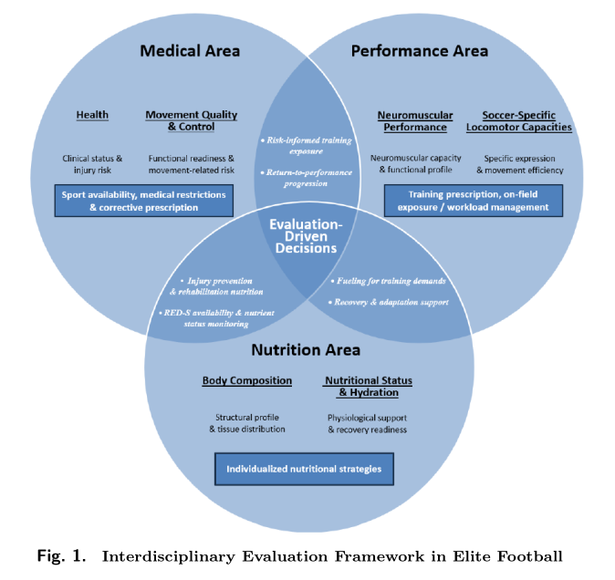

### World Cup Predictions: Moving Beyond Elo

Nate Silver made his World Cup predictions. And he seems quite proud of [the PELE model](https://www.natesilver.net/p/pele-methodology) and ratings system (Predictive Elo with Lineup Equalibria). Elo is the way that tennis and lots of other sports ranks teams based on the zero sum math of one team wins, one team loses. Performance quality judgement criteria is wins, though a "win" can be defined a few different ways. Silver's PELE assigns credit based on matches' score differentials.

Silver adds a few market related factors to add some nuance to PELE. He uses countries' national gross domestic product, the size of a country's economy, to differentiate big country from small country. National team players' market value wage is another PELE data point. 

TILT is a complimentary model that Silver uses with PELE to account for teams' tactical propensity towards either offense or defense. When used together, PELE and TILT will predict whether Team A is better than Team B and then go the next step by predicting a score for the match.

The most likely winner of the World Cup according to PELE will be Argentina, Spain, England, or France. So the model knows how to pick favorites. But be skeptical. Ecuador, ranked #15 in PELE (#29 FIFA) tied 0-0 against bottom-ranked Curacao (#83 FIFA).

Simon Brundish offers an alternative quantitative lens to see how the World Cup is likely to play out. The focus here is on real-world factors that will affect players on every team and will compound with every game played, especially as the stakes and the competition-level increase.

Brundish produces [an impressive gauge of players' fatigue](https://sportscienceguy.substack.com/p/everybody-is-tired-now) coming into this year's world tournament. The best players, the ones who are paid the most, who play in the best leagues, who play the most minutes in the most games, who bear the greatest expectations from fans, they are tired. And the highest ranked teams have more great (and exhausted) players. Fatigue doesn't just compromise talent, it presents an opportunity for less extraordinary but higher functioning players who play important roles on mid-tier squads.

Brundish also describes other real-world aspects of the World Cup tournament that bear on physical performance, potentially amplifying fatigue. [Travel, altitude and heat](https://sportscienceguy.substack.com/p/hot-sticky-and-breathless) stand to have major implications on match and tournameent outcomes. The best way, according to Brundish, to manage players' readiness in tough weather environments is to provide a long-enough (~15 days) acclimation period, which hasn't been an option for most teams. 

Acclimation will need to occur during the opening weeks' matches. Fatigue will complicate the situation. Top-tier teams can manage, but mid-tier teams that fight for next round spots could suffer. Travel will be inevitable for all teams who move into the quarterfinals and beyond. For them, the journal *Sports Medicine* published a [scientific blueprint](https://link.springer.com/article/10.1007/s40279-026-02455-y) for optimized sports team travel.

Craig Pickering [covers similar territory](https://www.hmmrmedia.com/2026/06/playing-to-the-limit-the-science-of-fatigue-and-recovery-at-the-world-cup/) for *HMMR Media*, citing much of the current science related to recovery. Pickering, whose background is primarily with track athletes, says that consistency with recovery is important for consistent on-field performance.

England will be using [special Yuyu](https://news.uk.cityam.com/story/2433982/content.html) cold-water bottles, frozen overnight beforehand and sized extra-large, long enough to drape around players' necks and down their arms. Heat transfer is something that humans have evolved perspiration mechanisms as adaptions for just these situations. Humidity can be factor when it is high and sweat accumulates rather than evaporates. Some athletes risk dramatic increases in core body temperature along with performance-limiting dehydration. Both conditions can affect cognitive function, another important variable for a game like soccer.

Young players who might not experience the same level of fatigue as a more experienced elite player, can reach a performance peak (or just show a different role) given the opportunity for country instead of club. Examples pop up all over the media coverage. [Yasin Ayari](https://futiapp.substack.com/p/yasin-ayari-is-perfectly-imperfect) of Sweden and [Ayyoub Bouaddi](https://www.ft.com/content/accb33e7-4b8c-4c1a-b55f-694f5380bce5?syn-25a6b1a6=1) of Morocco are subjects in two interesting profiles. The best-of lists are [easy to find](https://www.espn.com/soccer/story/_/id/48786147/ranking-21-best-mens-u21-players-world-cup-yamal-guler-neves).

The Silver PELE model accounts for age, giving some benefit to younger squads. Brundish examines age and size (his Big Lads Index) to make World Cup [squad profiles](https://sportscienceguy.substack.com/p/world-cup-fatigue-index) and differentiated ages by position and peak production (for example, forwards peak during age 23-25, midfielders 24-28). Most squads, according to Brundish, build teams around prime-age players. A team can go too far with youth and will miss the presence of World Cup veterans if they go that route. 

The last bit on non-Elo insight into World Cup prediction comes from Ted Knutson, via the [Bet the Process podcast](https://podcasts.apple.com/us/podcast/world-cup-episode-with-ted-knutson-sponsored-by-novig/id1291010585?i=1000771946749). Knutson says that quality coaching makes a difference between winners and losers in the World Cup. Some coaches, he says, know how to prepare for and win tournament games. 

The short-term, physical reality, no-Elo analysis favors the U.S. World Cup team and suggests that USMNT will outperform its won-loss expectation. USMNT has easy travel and reasonable West Coast weather compared to teams based in the East and Midwest. The players are relatively young but not so young as to be inexperienced. Many of the most important players have had injuries or smaller roles that kept them from big minutes in top leagues. They should be relatively fresh. And Pochettino is [a tournament-ready tactical coach](https://bsky.app/profile/paultenorio.bsky.social/post/3mol5by7xds2g) who previously took Tottenham to second place in the Champions League.

What is worrisome is that this World Cup tournament appears set to break (as in injure) some of the world's finest soccer players. From the round of 16 down to the final, the games should be competitive. Healthy, rested teams will have an advantage, not so different from the NBA champion Knicks and the NHL champion Hurricanes.

### Moving Toward Athlete-Centric Training

*Nature* has [a printed interview](https://www.nature.com/articles/d41586-026-01865-2) with Vincent Gouttebarge, who authored with Adam Glenhill and others the paper, [Protecting Mental Health and Wellbeing at the Men's Football World Cup](https://link.springer.com/article/10.1007/s40279-026-02458-9) (paywalled, sorry), in the journal, *Sports Medicine*. The interview is a howto for leagues and teams who want to prioritize the mental well-being of athletes, but the starting point is education. 

Players need the mental health literacy to ask for help even if it means overcome a social stigma that favors keeping quiet. Coaches needs the same mental health literacy in order to advocate and support players, and to not perpetuate any forms of social stigma.

Inter Miami, the MLS club based in South Florida, [recently published](https://sportperfsci.com/a-decision-driven-framework-for-interdisciplinary-player-evaluation-in-elite-football/) a version of the team's player evaluation metrics. The framework is a comprehensive set of tools that integrate the club's Performance, Rehabilitation, Nutrition and Medical departments. The paper that explains their framework does not include any actual data.

The evaluation framework does not have a well-being or mental health metric or observation criteria, instead choosing to focus on status, readiness, and capacity measures. The paper authors claim that "this structure enables a balanced and interdisciplinary characterization of player status across physiological, mechanical, and behavioral dimensions" and "these domains interact to support integrated decisionmaking related to player availability, training exposure, and performance development." Mental health, however, is a blind spot.

Human-centered computing is an active area of computer science research. [The movement to make computing human-centered](https://engineering.stanford.edu/news/james-landay-paving-path-human-centered-computing) started twenty or so years ago, as software became prevalent and the Internet started on its path toward becoming a major presence. The initiative relied on instilling a design sense among what had been mostly technical programmers and engineers.

My Masters degree is in Human-Computer Interaction. The work combined computer science with human factors psychology and design, and it set the stage for human-centered computing. The evolution was purposeful, with a clear intention to put the focus squarely on the human needs, benefits, and experiences that have to do with computers and technology.

Human-centered computing managed to have tentacles that brought the ethic to other domains. For example, student-centered education initiatives seek to replace instructor-friendly rigid methodology with more learner-friendly flexible instruction. Less momorization. More projects. Less uniformity. More autonomy.

Athlete-centered training, if it were to follow human-centered precepts, would emphasize well-being and a comprehensive understanding of athlete health that includes its cognitive and mental aspects.

### News

[How the Hurricanes' jock-nerd alliance won the Stanley Cup](https://www.espn.com/nhl/story/_/id/49063240/nhl-2026-playoffs-stanley-cup-final-carolina-hurricanes-win-championship-rod-brindamour-eric-tulsky) in *ESPN.com* by Greg Wyshynski on June 14, 2026

[Working Memory Performance is Reduced after a Marathon Race and Associated with Low Energy Availability in Females](https://journals.lww.com/acsm-msse/abstract/2026/06000/working_memory_performance_is_reduced_after_a.14.aspx) in *Medicine & Science in Sports & Exercise* journal by Katherine Boere et al. on June 1, 2026

[Privacy in consumer wearable technologies: a living systematic analysis of data policies across leading manufacturers](https://www.nature.com/articles/s41746-025-01757-1) in *npj digital medicine journal* by Caibhe Doherty et al. on June 14, 2026

[Sean Sweeney takes over in Orlando, and says Magic wound up convincing him that the fit was right](https://apnews.com/article/magic-sean-sweeney-coach-orlando-2a6ab95d290a60eff4217a23f2206a85) in *Associated Press* by Tim Reynolds on June 18, 2026

[How Karim López Became Mexico’s Biggest NBA Prospect in Decades](https://www.si.com/nba/how-karim-lopez-became-mexicos-biggest-nba-prospect-in-decades-digital-cover) in *SI.com* by Chris Mannix on June 18, 2026

[TCU Launches Roach Institute of Athlete Engineering](https://www.tcu.edu/news/2026/tcu-launches-roach-institute-of-athlete-engineering.php) in Texas Christian University, News on June 16, 2026

[UTK Special Hamageddon III: Revenge of the Hamates](https://undertheknife.substack.com/p/utk-special-61626-b90) in Substack, *Under the Knife* newsletter by Will Carroll on June 16, 2026

[The female VO2max problem: why your Garmin number may not reflect your fitness](https://the5krunner.com/2026/06/19/female-vo2max-garmin-accuracy/) in *the5krunner.com* by Shradha Puri on June 19, 2026

[Quantifying and Comparing Training Load Metrics in Cycling: A Methodology Review](https://journals.humankinetics.com/view/journals/ijsnem/aop/article-10.1123-ijsnem.2026-0028/article-10.1123-ijsnem.2026-0028.xml) in *International Journal of Sport Nutrition and Exercise Metabolism* by Arthur Bossi et al. on June 17, 2026

[Sleep deprivation shows in your spit](https://www.futurity.org/sleep-deprivation-saliva-3338442/) in *Futurity*, University of Zurich by Michael Scholz on June 12, 2026

[Time in heart rate zones during training and matches in professional football: a descriptive analysis of nearly 1000 microcycles from 20 teams](https://sportperfsci.com/time-in-heart-rate-zones-during-training-and-matches-in-professional-football-a-descriptive-analysis-of-nearly-1000-microcycles-from-20-teams/) in *Sport Performance & Science Reports* by Martin Buchheit et al. on June 17, 2026

[The organisation of medical and performance departments in European elite football teams](https://www.tandfonline.com/doi/full/10.1080/24733938.2026.2685134) in *Science and Medicine in Football* journal by Benedict Gondwe et al. on June 13, 2026