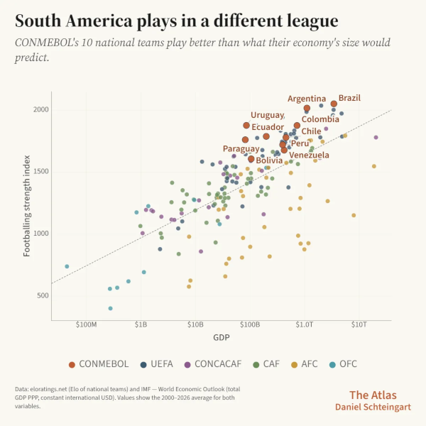

Brad Stenger produces the Athletes Data Community Newsletter (the ADCN). He is a PhD student at the University of Vermont where he researches data sharing and usable privacy for athletes' health and performance data.

### Wearables Information Overload and Data Minimization

Personal wearables have reached the data overload stage, according to more than one news article. That is bad news for users and for health professionals, but the downside extends to athletes. 

Consumer wearables, more than specialized athletes wearables, define what's best in terms of user interface. They also gather far more data, helping to make algorithms significantly more effective models for athletes' predictions. Most importantly, problems in consumer devices are warnings for what lies ahead for athletes and their data.

Oona Hanson is a family dietitian with a Substack, *Parenting Without Diet Culture*. [She describes](https://oonahanson.substack.com/p/the-hidden-risks-of-wearable-tech) the loss of normal human instincts and intuition that can sometimes come with unhealthy relationships to wearables. You can stop listening to your body and instead listen to the device telling you advice, making recommendations, or setting goals based on your data and how your data match to thousands of other people's data, as interpreted by algorithms.

When I run with my GPS + heart rate watch, I also pay attention to how I feel. Some running coaches suggest leaving the watch at home in order to achieve a greater sense of pace and effort by feeling.

There are a bunch of metrics that I can access during a run and a bunch more that I can view on a dashboard afterward. Some of them are raw data points; others reinterpret the raw data through algorithms. The relationship between you and your wearable information is, by design, geared toward overload. Even if one or two numbers offer satisfaction from a quality effort on a given day, more numbers suggest more opportunity for improvement, a next level, a stretch goal.

A healthy perspective on these interfaces understands that these algorithms have been developed to work on thousands of people simultaneously at a lowest common denominator. It would be impossible to expect accuracy, but realistic with proper contextualization to come up with a useful interpretation. My training status is often "Poor" according to my watch but I don't necessarily feel that way.

Simar Bajaj, [writing](https://www.nytimes.com/2026/06/24/well/health-wearables-doctors-rfk-apple-watch.html) in *The New York Times*, points to heart rate, step counts, and basic sleep patterns as reasonably accurate and clinically useful information that come off of a wearable. More sophisticated measures that derive from algorithms based on sleep and heart rate are less accurate and not yet proven to be medically useful. These (at present) dubious metrics include blood pressure, blood oxygen, VO2 max, heart rate variability, and sleep stages. 

That is not to say that these values are worthless. Put them in a context that accounts for the whole picture of how you feel and what could be affecting your health, and then make sense of what a number might mean. If that interpretation is useful, you might continue with doing the mental exercise, and if it isn't useful, move on.

The abundant information from wearables is a source of chaos for health professionals. "These validity concerns create a professional dilemma: dismissing wearable-generated data risks alienating engaged patients, while acting on potentially inaccurate readings risks clinical harm," this from a recent article in the Journal of Consumer Affairs, as told through [a ZDNet article](https://www.zdnet.com/article/the-wearable-health-boom-is-creating-a-data-overload-for-doctors-what-happens-next/) by Erin Carson.

There are pre-college, college, and post-college athletes who use consumer wearables in their team context, and there are other athletes who supplement team data collection with a personal wearable. Both instances produce a firehose of athletes' data to sort through. The combinations of data sources and the higher stakes amplify the chaos at the intersection of validity, accuracy, and utility.

Privacy advocates have been talking up "data minimization" as a helpful step in getting a handle on data overload, both for its harmful effects on well-being and for its downstream privacy risk.

Data minimization is, according to EPIC (Electronic Privacy Information Center), [a pillar of data security](https://epic.org/ftc-finalizes-settlement-with-illuminate-education-heeding-epics-call-to-strengthen-data-minimization-requirements/). Other data security safeguards are important for managing privacy risk, but "the best way to prevent and lessen data security risk to consumers is to minimize the data that companies collect, process, and retain in the first place."

Automobiles are [a cautionary tale](https://carbuzz.com/gms-data-privacy-scandal/) for data minimization (and if you squint, something that is a lot like a wearable technology). GM will pay the State of California a $12.75 million fine for selling drivers' location and driving behavior data without consent. The system for data collection is the OnStar emergency response service, which knows when, where, and how drivers drive. GM sold OnStar data to insurance companies who, in turn, raised car insurance rates for some individuals.

Some organizations have adopted the school of thought that collecting athlete data in all its forms will prove useful, even if you cannot see utility in any near-term scenario. Who knows what future computing or analytical advance will be the unlock that surfaces hidden benefits in a gigantic athletes datastore?

The short-term overload and long-term security problems are substantial issues. Data minimization is worth the effort if you value the usability of the data for athletes and for collaborators using athletes' data.

### South America's Soccer Talent Pipeline

Why is South America so good at football? International demographer Daniel Schteingart [tells us](https://atlasdevelopment.substack.com/p/why-south-america-is-so-good-at-football) at his Substack in his article, *Why South America Is So Good at Football*.

 
Schteingart's Footballing Strength Index shows that all ten South American nations play "better than what their economy's size would predict."

The explanation (and its evidence) showcases the lack of economic opportunity. Soccer is one of the few available paths for young people seeking an upwardly mobile career trajectory. Young athletes do not have a range of sports to choose from in many South American countries, so the options for a talented athlete can be severely limited.

25 of the top 40 youth academies for training soccer players for professional careers are in South America, according to CIES ([link](https://football-observatory.com/WeeklyPost518)). Only 8 of the top 40 youth academies, as ranked by professional earnings of player transfers according to CIES ([link](https://football-observatory.com/WeeklyPost540)), are in South America. The skills and ability transfer does not make its way down to the financial bottom line for the main producers in South America's soccer talent pipeline.

So there is a singular sports pathway through soccer for South American youth, and there are highly regarded youth academies for developing soccer players. The top tier is elite, but lower tiers are numerous given the limited options for young athletes. 

The situation is set up for abuse. ESPN.com and reporter Steve Fainaru [investigated](https://www.espn.com/soccer/story/_/id/49000669/argentina-world-cup-champions-soccer-futbol-youth-development-system) the lower-tier youth academies in Argentina (called pensiones) and found the same kind of abuse that also has surfaced in Latin American youth baseball, in Chinese youth basketball, and in U.S. figure skating and gymnastics.

Norway is a country where 93 percent of children play on a sports team. (It's 55% in the U.S.) "The system isn’t designed to separate the weak from the strong, nor to identify future stars early, but to keep as many kids playing for as long as possible," writes Andrew Greif in an NBC News [preview](https://www.nbcnews.com/sports/soccer/eight-rules-made-norway-winter-sports-superpower-will-help-world-cup-rcna348175) of Norway's World Cup team.

Government can choose to align incentives with public health, with quality of life, or with a status quo where adults take advantage of children.

Athletes' data collected through youth sports can be used to support public health and to protect children, but only if policies are in place, like the Children's Rights in Sports that girds the Norwegian youth sports system.

Norway and Brazil are on a collision course for the World Cup round of 16. The game should be a great matchup.

### News

[Jets' Demario Davis spends nearly $1M annually on body recovery](https://www.espn.com/nfl/story/_/id/49166500/new-york-jets-demario-davis-body-recovery-1-million) on *ESPN.com* by Rich Cimini on June 28, 2026

[The Heat Risked It All for the Right Guy … at the Wrong Time](https://www.theringer.com/2026/06/26/nba/giannis-antetokounmpo-trade-miami-heat-contract-extension-age) in *The Ringer* by Kirk Goldsberry on June 26, 2026

[Bones communicate with the rest of the body to support overall health – here’s the science behind your skeleton](https://theconversation.com/bones-communicate-with-the-rest-of-the-body-to-support-overall-health-heres-the-science-behind-your-skeleton-279735) in *The Conversation* by Priya Bhardwaj on June 22, 2026

[How Messi, Mbappe and Haaland use their brains (as well as feet) to gain a psychological edge at the World Cup](https://theconversation.com/how-messi-mbappe-and-haaland-use-their-brains-as-well-as-feet-to-gain-a-psychological-edge-at-the-world-cup-283672) in *The Conversation* by Eric Zillmer on June 18, 2026

[USMNT coach Mauricio Pochettino's tenure has been built around empowering the entire pool rather than any set of "regulars."](https://bsky.app/profile/paultenorio.bsky.social/post/3moyktcbwac27) in Bluesky, *The Athletic* by Paul Tenorio on June 23, 2026

[Enhancing fear of re-injury classification after ACL reconstruction by integrating biomechanical and electromyography data using multimodal machine learning methods](https://www.sciencedirect.com/science/article/pii/S0021929026002010) in *Journal of Biomechanics* by Abdolamir Karbalaie et al. on June 24, 2026

[Physiology Friday 323: Are Training Adaptations Reproducible?](https://www.physiologicallyspeaking.com/p/physiology-friday-323-are-training) in Substack, *Physiologically Speaking* newsletter by Brady Holmer on June 26, 2026

[Why do we run? A cross-sectional analysis of motivation profiles and training characteristics in the Garmin-RUNSAFE Running Health Cohort Study](https://www.jsams.org/article/S1440-2440(26)00235-5/fulltext) in *Journal of Science and Medicine in Sport* by Chloe Blacket et al. on June 16, 2026

[Backing innovation in Australian sport: AIS and Built partner to support The Park](https://www.ausport.gov.au/media-centre/news/ais-and-built-partner-to-support-the-park) in AIS Media Centre, News on June 26, 2026

[Factors Influencing Consultant Knee Surgeons’ Decision Making in Anterior Cruciate Ligament (ACL) Injury Management in Athletes: An International Delphi Study](https://link.springer.com/article/10.1007/s40279-026-02480-x) in *Sports Medicine* journal by Greg Young et al. on June 25, 2026

[Validity of using a smartphone-based markerless motion capture system for quantitative analysis of human dynamic movements](https://www.tandfonline.com/doi/full/10.1080/14763141.2026.2689518) in *Sports Biomechanics* journal by Huaqing Liang et al. on June 19, 2026

[Clemson Student-Athletes Set to Partner with Nike](https://clemsontigers.com/news/2026/06/23/clemson-student-athletes-set-to-partner-with-nike) in *ClemsonTigers.com* on June 23, 2026

[The Detroit Public Schools Health Corps: a student-led model for delivering sideline and preventive sports medicine in underserved communities](https://link.springer.com/article/10.1186/s13102-026-01809-3) in *BMC Sports Science, Medicine and Rehabilitation* by David Abdelnour et al. on June 16, 2026

