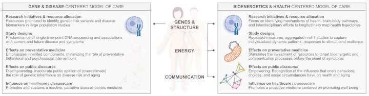

### The New Mitochondria Metabolism

Mitochondria are the sections in cells that turns oxygen from respiration and nutrients from digestion into electrical energy that the human body uses to do work. That work can be physical or cognitive. Mitochondria are crucial to muscles and crucial to brains. 

Researchers have been working toward an advanced understanding of how mitochondria work and what mitochondria do. We'll look at what's new in the field and how it applies to athletes.

NPR's *TED Radio Hour* [podcast](https://www.npr.org/2026/05/15/nx-s1-5807942/think-mitochondria-is-just-the-powerhouse-of-the-cell-think-again) has a useful explainer for mitochondria's role in the emerging understanding of human metabolism. The pod gives 18 minutes to Columbia University medical research, Martin Picard. Picard has been working up a theory that how the body manages energy supply and demand is central to human health. 

Picard also appears in a recent article at *The Transmitter*, a [deep dive](https://www.thetransmitter.org/mitochondria/the-fast-expanding-repertoire-of-mitochondria-in-the-brain/) into mitochondria and the brain. The brain is energy intensive, using 20 percent of the body's calories. The author, Giorgia Guglielmi, describes how the energy mitochondria provide is a limiting factor for cognition and memory. The chemical byproducts of energy production are important signals for governing brain function, she also writes. 

Mood, sleep, and stress response are neurological conditions that are, in part, controlled by metabolism. People are different because our individual energy systems are unique. Some animals are more or less resilient to stress. The wide variation is due to differences in mitochondrial activity in the brain and its correlation with anxiety-like behavior and social avoidance, Picard told Guglielmi.

There is exciting recent progress into how mitochondria fail to function and how proper function can be restored. Mitochondrial diseases are difficult to diagnose because of how prevalent mitochondria are in the body and because symptoms like fatigue are seen in other, more common disease types. 

Harvard undergraduate Konstantinos Maliaris used his [senior capstone project](https://seas.harvard.edu/news/konstantinos-maliariss-senior-project-more-accurate-way-test-mitochondria-cells) to test real-time mitochondrial health. Researchers at Karolinska Institute in Stockholm [identified unique genetic machinery](https://news.ki.se/how-mitochondria-build-their-protein-factories) that creates proteins that are necessary for energy production. Other researchers at the University of Basel [have developed](https://singularityhub.com/2026/04/21/scientists-revive-failing-cells-with-mitochondria-transplants/) a delivery system called MitoCatch that can attach healthy, transplanted mitochondria to damaged cells.  

An athlete would not experience this sort of cell-level failure. Genes, disease, or age can cause mitochondrial dysfunction, and it's not characteristic of athlete populations. Is there an athletic boost possible from turbocharging mitochondria? Not likely. Mitochondria already scale up to meet physiological demands in what is already a finely tuned system. 

Israeli researchers [blocked a protein](https://wis-wander.weizmann.ac.il/life-sciences/slimming-mitch), MTCH2 ("Mitch"), that regulates mitochondria and found that it becomes a less efficient energy producer. The result: cells burn more fats than carbohydrates, a kind of artificial ketosis that isn't really helpful for athletes. It could be an obesity drug, though. 

Research is showing paying attention to nutrition will help mitochondrial function. [New findings](https://uni-koeln.de/en/university/news/news/news-detail/from-food-to-fuel-how-leucine-enhances-mitochondrial-energy-production) at the University of Cologne in Germany demonstrate how leucine, a branched-chain amino acid, stabilizes key mitochondrial proteins and boosts energy production. 

Other German scientists at Fritz Lipmann Institute [recently found](https://www.sciencealert.com/the-cells-in-your-body-fade-with-age-but-there-may-be-a-way-to-reverse-it) that one reason mitochondria slow down with age is because of a decline in phosphatidylcholine, a specific fat molecule. Choline is the essential nutrient that generates phosphatidylcholine, and it (like leucine) is plentiful in animal proteins.

Supplements probably are not necessary, but animal protein is a much better source of essential amino acids and nutrients than plant protein. A quality diet suffices. Bad diets can penalize an athlete though, depending on individual athlete variation.

Is there data that describes athletes' mitochondria health? Tests for metabolic biomarkers are available, but they do not merit the cost. Not when VO2max measurement (or estimate using a wearable) for oxygen utilization provides a good reading on mitochondrial function. Howard Luks has [an excellent rundown](https://www.howardluksmd.com/vo2-max-its-not-just-about-your-mitochondria/) on VO2max and how it ties to mitochondrial health.

Martin Picard has called for [a top-to-bottom reappraisal](https://tseenergy.substack.com/p/from-genetics-to-energetics) of human health, saying that principles of energy conservation and transfer in the body are an effective window into what's working and not working in the human body. Athletes, especially athletes who have created lifelong habits, have the sort of high-functioning metabolisms that usually coincide with good health.

While it is easy to see how athletes will help this research, how does this research help athletes? Everything that gives a clearer picture on metabolism and mitochondrial function speaks to the diversity and individualization of athletes' personal energy systems. 

In time, athletes will have greater responsibility to be their own experts in how their bodies work best. If everyone in sports can keep the metabolic guessing to a minimum, athletes' learning should be easier.

### NCAA Eligibility Affect on Athletes

Hockey is one sport where new NCAA rules for age eligibility have fundamentally changed which athletes get to play and which teams have the best opportunities to win. Track and field is another sport where top athletes fall outside the new age requirements.

The NCAA [approved new bylaws]((https://www.ncaa.org/news/2026/6/23/media-center-division-i-adopts-age-based-eligibility-model.aspx)) that state athletes have a 5-year window that starts with the first academic year after an athlete turns 19. Athletes are eligible to play all five of those seasons. Redshirts, eligibility waivers, and other extensions are gone, for the most part. Pregnancy, military service, and religious missions are still okay. 

The NCAA rules [face a hearing]((https://www.insidethegames.biz/articles/a-judicial-verdict-looms-over-ncaas-new-eligibility-model)) in a Cincinnati courtroom for an injunction that will set aside the new rules. College athletes who graduated in 2022 will not have the chance for an automatic fifth year of eligibility since their eligibility has officially expired under the old, 4-year rule for most athletes. 

The decision to start the clock at age 19 [fits far better]((https://myhockeyrankings.com/news?b=4445)) with the junior hockey programs in North America when age 18 would have been untenable. Hockey players who choose to play 2 years of junior hockey will have four years of college eligibility.

*LetsRun.com* [showed](https://www.letsrun.com/news/2026/07/the-end-of-the-28-year-old-freshman-inside-the-ncaas-new-age-cap/) that bringing an end to 28- and 29-year-old NCAA champions might not be a bad thing.

Age-based eligibility is the starting point for a new normal in college sport, which makes sense. Some late-blooming athletes could get closed out, but the NCAA rules might lead to new, alternative pathways for elite athlete development.

A new standard 5-year window might increase the stakes for universities and for athletes to collaborate effectively and provide financial returns within that time window. If that occurs, the importance of athletes' data and the volume of athletes' data collected will probably both increase.

### News 

[I wrote about Folarin Balogun. The handshake. The grace. The positivity. The perspective.](https://bsky.app/profile/henrybushnell.bsky.social/post/3mptdoiq6ss26) in *The Athletic* by Henry Bushnell on July 4, 2026

[Premier League new boys Coventry City FC put through their paces by Coventry University sports science experts and students](https://www.coventry.ac.uk/news/2026/coventry-city-fc-coventry-university-sports-science/) in Coventry University, News by Press Team on July 3, 2026

[Multi-ligament knee injuries in elite football players are career-threatening injuries. But how exactly do they occur?](https://x.com/KSSTA/status/2072893017501950415) in X/Twitter, *Knee Surgery, Sports Traumatology, Arthroscopy* journal by Ethan Ru et al. on July 2, 2026

[The Development, Validation and Reliability of the Sports Injury Prevention Behavior Determinants Questionnaire](https://onlinelibrary.wiley.com/doi/10.1111/sms.70329) in *Scandinavian Journal of Medicine & Science in Sports* by Roar Amundsen et al. on July 2, 2026

[Soccer in America: The Complex Ecosystem and the MLS Academy Pathway](https://joeeisenmann.substack.com/p/soccer-in-america-the-complex-ecosystem) in Substack, *Ironman Performance* newsletter by Joe Eisenmann on July 1, 2026

[New AIS research has informed our development of a new Certificate IV in Wellbeing Science, giving high performance coaches practical, science-backed tools to better understand their own wellbeing and navigate the pressures of the role.](https://x.com/theAIS/status/2071908629117014097) in X/Twitter by Australian Institute of Sport on June 30, 2026

[issue 555 | My attempt to process an unforgettable, historic day at Western States.](https://themorningshakeout.substack.com/p/the-morning-shakeout-issue-555) in Substack, *the morning shakeout* newsletter by Mario Fraioli on June 30, 2026

[Polygenic Score Identifies Athletes at Increased Risk for Slower Recovery After Sport-Related Concussion: A Concussion Assessment, Research, and Education (CARE) Consortium Study](https://link.springer.com/article/10.1007/s40279-026-02477-6) in *Sports Medicine* journal by Zhiqi Zhang et al. on June 30, 2026

[Reliable Change of Blood-Based Biomarkers Following Acute Sport-Related Concussion: A CARE Consortium Study](https://link.springer.com/article/10.1007/s40279-026-02479-4) in *Sports Medicine* journal by Anna Croghan et al. on June 30, 2026

[How Arizona Football uses Sports Science](https://www.youtube.com/watch?v=HKqdYKGMBLA) in YouTube, Arizona Wildcats (video, 5:00) on June 29, 2026

[Garmin next-gen sensors: 2026 onwards](https://the5krunner.com/2026/06/29/garmin-next-sensors-2026/) in *the5krunner.com* by the5krunner on June 29, 2026

[From collegiate athlete to sports performance pro: the student becomes the expert](https://sc.edu/study/colleges_schools/public_health/about/news/2026/aug-grad_worley_exsc.php) in University of South Carolina, Arnold School of Public Health by Erin Bluvas on June 29, 2026

[From simulation to sideline: translating finite element modeling into clinical decision-making for pediatric ACL injury and rehabilitation](https://www.frontiersin.org/journals/sports-and-active-living/articles/10.3389/fspor.2026.1868803/full) in *Frontiers in Sports and Active Living* journal by Alexandria Mallinos and Kerwyn Jones on June 28, 2026

[How to Spot and Develop Talent](https://thegrowtheq.com/how-to-spot-and-develop-talent/) in *The Growth Equation* blog by Steve Magness on June 25, 2026