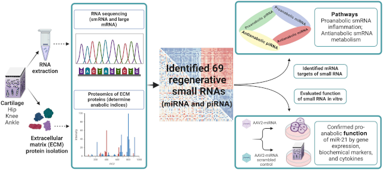

### Technician-Analyst-Translator Roles in Sports Science and Athlete Performance 
College athletic departments, mostly at larger schools with more athletes and bigger budgets, now hire specialists for a role in their athlete performance and sports science group that is a combination of technician, analyst, and translator. I have been surprised to learn how essential this role has become, in part because I have been applying for these jobs.

Ever since technology has been in place to automate athletes' data collection, strength coaches have asked for (and paid for) technicians to operate the equipment. Sometimes those technicians have also been called upon to work on the data that has been collected, which means prepping data for team analysts or producing data reports for coaches themselves.

Some universities have taken steps to integrate academic research groups with athletic departments. For departments like Exercise Science and Kinesiology, the athletic department technician has a crucial role to play in field studies that are central to their work. Field studies haven't displaced laboratory research, but field studies have [increased in number and importance](https://newsletter.bradstenger.com/posts/ADCN_8/index.html#sports-research-funding-sports-research-methods).

It is also possible to integrate athletic and research collaboration through engineering. Texas Christian University [recently launched](https://www.tcu.edu/news/2026/tcu-launches-roach-institute-of-athlete-engineering.php) its Roach Institute of Athlete Engineering, having poached Reuben Burch, who had previously [established](https://www.msstate.edu/newsroom/article/2024/04/msu-launches-new-athlete-engineering-institute-drive-innovations-human) the Athlete Engineering Institute at Mississippi State University. At the University of Vermont, where I study, the Bioengineering Department will offer its first-ever Sports Engineering class this Fall.

The translator refers to the challenge of translational research, taking the research that originates in an experiment or a question and then delivering on its practical benefit and the solution it offers to real-world problems.

These occurrences are not brand new. Dave Tenney [hired](https://www.geekwire.com/2015/from-microsoft-to-the-mls-ravi-ramineni-crunches-data-to-help-the-sounders-win/) Ravi Ramineni at the Seattle Sounders to be his athlete performance technician/analyst in 2012. Ramineni would go on to become a vice president and oversee all the organization's research initiatives. 

Kim Blair founded the Center for Sports Engineering in MIT's Department of Aeronautics and Astronautics way back in 2000. He would [help Purdue to found](https://www.jconline.com/story/news/2019/10/14/purdue-puts-name-human-frog-olympic-star-ray-ewry-sports-engineering-center/3974501002/) the Ray Ewry Sports Engineering Center in 2019 and to establish the International Sports Engineering Association in the U.S. ([2026 ISEA conference](https://events.wsu.edu/isea2026/) at Washington State.)

What is new is the formal recognition of a cross-discipline, cross-organization role in sports organizations. The National Strength and Conditioning Association outlines the role in [a job description template](https://www.nsca.com/globalassets/certification/cpss/hiring-information/coordinator-of-performance-and-sport-science-example-job-description.pdf) for a "coordinator of performance and sports science." Not every athletic department's operating definition of sports science extends to and includes university research, but there appears to be a growing recognition that it can, and that it should.

I recently visited Natalie Kupperman at the University of Virginia. She has a PhD in Physical Therapy and had been an athletic trainer in the UVA athletic department, where she carried out a number of significant field studies. As the university moved to create a School of Data Science, one objective is to have the school work closely with university athletics, and so Kupperman had her academic homebase. Kupperman has one foot in the university research operation and one foot in the university athletic community, effectively cementing the two. It's been a fruitful collaboration that is poised to grow.

Notre Dame is another world-class research university that has touted its research-sports connection. Responsibility for translating the work falls to junior staff, according to the school's sports performance [job posting](https://jobs.smartrecruiters.com/UniversityOfNotreDame/3743990013754676-research-innovation-associate) for a Research & Innovation Associate. The position description emphasizes research translation along with the technician and analyst responsibilities. All indications are that the position will be supported, on both sides of the aisle, academic and athletic.

Virginia and Notre Dame are not the only two U.S. universities with active, growing links between academic research and athletic performance. [Stanford](https://www.mv-voice.com/spotlight/2025/04/07/stanford-researchers-team-up-with-student-athletes-to-unlock-peak-performance/), [Utah](https://utahutes.com/news/2026/4/1/general-athlete-health-performance-symposium-champions-student-research-collaboration-and-innovation), [Florida](https://news.ufl.edu/2026/03/engineering-human-performance-and-wellness/), [Michigan](https://record.umich.edu/articles/u-m-asics-to-launch-groundbreaking-sport-innovation-initiative/), and [Texas](https://news.utexas.edu/2025/10/30/driving-whats-next-in-sports/) are just a few.

I also recently visited Katie Siek at Indiana University. She is the founding director for an IU research initiative into female athletic performance and computing research faculty in the school's Luddy School of Informatics. The traditional development path for an academic research center is to pursue large NSF and philanthropic grants that underwrite the large-scale research program. The decision to gender-specify comes at a bad time for federal government research funding. Siek has also been held back by Indiana's shoe relationship with Adidas, which does not have the research collaboration initiatives that Under Armour and Nike have with their schools.

Institutional and partner support for athletic-academic collaboration is crucial at this point, as college sports undergoes historical change. Pro sports organizations like MLSE (Maple Leafs, Raptors, Toronto FC) invest in [cross-team, cross-discipline R&D](https://www.sloansportsconference.com/people/devin-pleuler) and expect to realize significant competitive advantages. There is an expectation that the investment, if put into the proper hands, can pay for itself by improving the sports entertainment product.

Baseball, both college and professional, might be the best proof that research pays off. The Wake Forest Pitching Laboratory has [developed](https://www.sloansportsconference.com/event/leveraging-data-for-athlete-health-and-performance) elite pitching prospects and made a consistent ACC (but not College World Series) winner. Major League Baseball teams have borrowed (and hired and drafted) frequently from leading baseball lab consultancies, Driveline and Tread. The understanding of the links between biomechanics and player performance has improved enormously as more information comes out of the research, with lots more runway for further innovation.

Natalie Kupperman, Katie Siek, and I are all interested in improving sharing of athletes' data. There is important computing research to do that will understand why data sharing isn't better and how improved data sharing will improve personalization for training, recovery, nutrition, etc. Better data sharing is also essential to solving lots of pervasive athlete injury problems. 

Put a computer scientist into one of these technician-analyst-translator roles, and it makes athletes' data the common denominator that dramatically improves collaboration across all the stakeholders related to athlete performance. Computing research geared toward users' experience with technology is, by definition, rigorous field studies, and not much different in practice from any other fieldwork. The familiarity with data technology and with data users makes a sports-literate, human-centered computing researcher well-qualified to be an effective technician-analyst-translator.

### Hope for Bad Knees
I hurt my meniscus this winter and have had a couple of recurrence injuries from overdoing my return to running. At this point I have some concern that arthritis is in my future, but then I have no real loss in range of motion despite some occasional pain during loading on my bad knee.

Recent reporting from Harvard Medical School says that meniscectomy is not an effective solution for degenerative tears. I am glad to see that the destructive surgery has become a non-option.

I have long been a fan of Keith Baar and Karim Khan's advocacy of [mechanotherapy](https://bjsm.bmj.com/content/43/4/247), where loading tissue promotes healing. Baar regularly calls out ["stress shielding"](https://x.com/MuscleScience/status/1220832259827126272) (when tissues are rested and not loaded) as detrimental to tissue healing. I'll gladly do [isometrics he recommends](https://health.ucdavis.edu/news/health-wellness/lunges-squats-and-holds-for-stronger-tendons-and-ligaments/2025/02) until the cows come home. 

I am confident that once I get back to running, then I will be in a position to arrest any tissue degeneration and arthritis. It was nice to see the recent report in *Cureus* sports medicine journal that recreational running is indeed [an antidote](https://www.cureus.com/articles/511937-impact-of-running-on-the-risk-and-progression-of-knee-osteoarthritis-a-review-of-current-evidence#!/) to knee arthritis progression.

More hope is on the way from a range of clinical advances.

Hope number one: [Regenerating cartilage](https://medschool.duke.edu/news/making-joints-young-again) through injectable therapy is close to human clinical trials. In the process of doing this work, Duke Medicine researchers have identified genetic molecules already present in knees and ankles (though more scarce in hips) that promote human cartilage self-repair. The molecules are most abundant in ankles, and the goal is to achieve the same level of regeneration in knees, hips, and fingers as you see in ankles.

Hope number two: autologous fibrin clot augmentation surgery is an arthroscopic procedure where a clot made from the patient's blood is placed over meniscus tissue repair, stimulating healing. *Cureus* journal has [the case](https://www.cureus.com/articles/504582-revision-repair-of-a-failed-bucket-handle-medial-meniscal-tear-using-autologous-fibrin-clot-augmentation-a-case-report-with-one-year-follow-up#!/) of a failed initial meniscus repair that had a successful revision procedure with the clot augmentation.

Hope number three: implants. Orthopedic companies have developed [implantable meniscus replacement products](https://bonezonepub.com/2026/02/11/new-implants-seek-to-close-the-treatment-gap-for-meniscus-tears/) that reduce persistent knee pain and stop the progression of osteoarthritis. The replacement meniscus looks like a viable alternative to the partial meniscectomy that might bring short-term relief (and long-term arthritis).

It is more common to hear how lessons learned from athletes about preventive care and exercise therapy can be adapted to also benefit age-related physical decline. The reverse will also be true. Minimally invasive therapies meant to improve active aging will also help younger athletes to make sports a life-long pursuit.

### News

[Sports Nutrition: Current and Novel Insights (2nd Edition)](https://www.mdpi.com/2072-6643/18/12/1896) in *Nutrients* journal by David Nieman on June 11, 2026

[It's a privilege and honor to be able to work w/ #Heisman](https://bsky.app/profile/stat-ron.bsky.social/post/3mq5g756c7s2q) in Bluesky by Ron Yurko on July 8, 2026

[Researchers in #ScienceAdvances have created a soft wearable patch that can be placed on the forehead to monitor brain water dynamics during sleep](https://bsky.app/profile/science.org/post/3mqcrwbirno22) in Bluesky, *Science* by Seughyeb Ban et al. on July 10, 2026 

[Limited reproducibility of individual physiological adaptations to repeated endurance exercise training](https://journals.physiology.org/doi/full/10.1152/japplphysiol.00154.2026) in *Journal of Applied Physiology* by Ingvill Odden et al on June 4, 2026

[Scientific Utility of Emerging Indicators in Relative Energy Deficiency in Sport (REDs) Severity/Risk Assessment](https://onlinelibrary.wiley.com/doi/10.1111/sms.70318) in *Scandinavian Journal of Medicine & Science in Sports* by Ida Heikura et al. on July 6, 2026

[Uncovering a hidden modulator for women in sports: An exploratory study of menstrual pain and brain connectivity](https://journals.sagepub.com/doi/10.1177/17455057261456871) in *Women's Health* journal by Carina Pohle et al. on July 2, 2026

[Systems modeling of mitochondrial dynamics in different exercise regimes](https://physoc.onlinelibrary.wiley.com/doi/full/10.1113/JP290424) in *The Journal of Physiology* (also [bioRxiv](https://www.biorxiv.org/content/10.1101/2025.10.27.684912v1)) by Ali Khalilimeybodi on July 1, 2026

[Intolerance of uncertainty as a potential modifiable risk factor for eating disorder pathology in women athletes: a longitudinal investigation](https://link.springer.com/article/10.1186/s40337-026-01703-w) in *Journal of Eating Disorders* by Grace Koob et al. on July 9, 2026

[“Although Norway is often cited as a good example of a nation that creates opportunities for children...sports in are moving away from play, community + a sense of belonging to a club, and increasingly toward performance”](https://bsky.app/profile/germanotes.bsky.social/post/3mqci3jhz3k2w) in Bluesky, *Sportico* by Sara Germano on July 10, 2026

[Training tips from NHL, PWHL performance coaches: Lavender oils, speed tests, 'skater jacks'](https://www.nytimes.com/athletic/7432011/2026/07/10/nhl-pwhl-hockey-training-sports-performance-tips/) in *The Athletic* by Fluto Shinzawa on July 10, 2026

[Female Athlete Research Forum | Monitoring Hormones in Female Athletes with Dr. Ella Smith] in *YouTube* by Wu Tsai Human Performance Alliance on June 18, 2026

[Energy flow through the throwing arm: segmental transfer, not local generation, dominates pitch velocity and elbow loading in baseball pitchers](https://sportrxiv.org/index.php/server/preprint/view/871) in *SportRxiv* by Adam Bloebaum on May 19, 2026