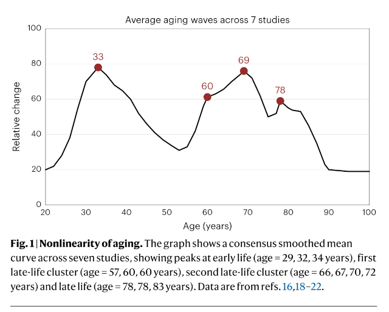
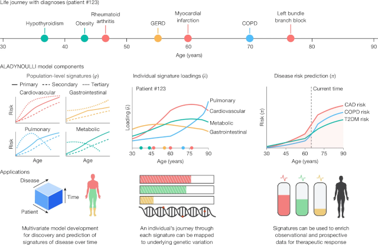
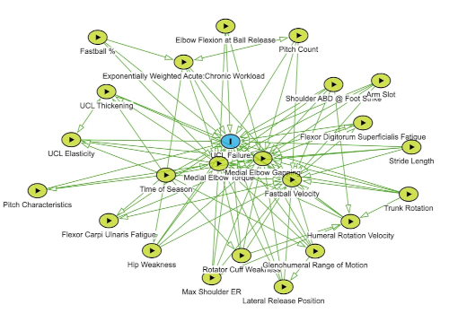

### Clocks, Not Calendars, with Sensors

Eric Topol argues that medicine should put less emphasis on calendars and put more emphasis on clocks. Calendars are unreliable, [he writes](https://erictopol.substack.com/p/medicine-is-moving-from-calendars) in his Substack (which summarizes in his recent technical review article in *Nature Medicine*). Different tissues age at different rates, with all the usual reasons why (genetics, environment, habits, etcetera). 

The right thing to do for an individual with lower brain age, higher heart age, plus some extra wear and tear on other organs, according to Topol, is to take advantage of the good and compensate for the bad while monitoring what is potentially at risk.

Ultimately, age is not a progression. For a full-grown adult, it is a series of tissue-specific cascades. Topol has a graphic in the review paper showing how aging occurs in three major waves: mid-30s, 60s, and right before the finish line (78 on average).

More evidence comes from a *Nature* [paper](https://www.nature.com/articles/s41586-026-10780-5) by Urbut et al. where genetics and longitudinal EHR constitute a Bayesian predictive model for future disease trajectory. Genes are not destiny. That is known. But your health events and genes put your health on a trajectory, and now it can be modeled with increasing accuracy as you age.

Topol's idea is relevant to athletes' trajectories. The longer-term consequence is apparent. Football players ([soccer players too](https://www.cnn.com/2026/07/12/health/soccer-brain-health-wellness)) can experience dramatic declines in brain health, but that won't be every single player, given all the different things that can happen before, during, and after playing careers. 

Retired NFL players get free health screenings carried out by the Living Heart Foundation and supported by the NFL Players Association. Scott Perryman from Living Heart [told](https://www.ajc.com/news/2026/04/former-nfl-players-face-their-health-head-on-at-atlanta-event/) the *Atlanta Journal-Constitution* that one reason for the screening is the higher risk for heart disease among larger-bodied people such as football players.

Justin Verlander is the oldest athlete in U.S. major professional sports at 43 years old. Though he'd hoped to last a few years longer, he now plans to retire. "I feel like I've been like plugging holes in a leaky boat," he [told](https://www.usatoday.com/story/sports/mlb/columnist/bob-nightengale/2026/07/14/justin-verlander-all-star-game-tigers-injury/90908713007/) Bob Nightengale of *USA Today*, "I know what I need to do mechanically to be healthy and compete at this level, but my body's not letting me do that."

Verlander badly wanted to win 300 games, but it looks like he will retire with 266. According to Nightengale, "he wonders if anyone will ever win 250 again." A 2022 [video analysis](https://www.youtube.com/watch?v=UhNwZFq8M3o&t=221s) of Verlander's 39-year-old, post-Tommy John, Cy Young-winning mechanics showed a pitcher who knew how to compensate for lack of mobility (2 previous core/groin surgeries) with efficiency and timing of hip rotation to generate power for 95-99 mph fastballs. He started to run out of runway then, and he is [just about out of runway now](https://www.mlb.com/news/justin-verlander-set-to-return-from-injured-list).

Does a theory of clocks, not calendars, hold up for young athletes who have yet to hit that first aging wave?

Devin Gordon documented the injury-rehabilitate-reinjury cycle that affects more and more young athletes. Gordon writes in *The New York Times Magazine* that advances in biomechanics and sports science have raised the physical limits for what's athletically possible, and then beyond it, to where something inevitably breaks. At that point surgical advances kick in, and today's athletes are confident that "no matter what breaks, modern medicine can fix it."

If the risk of major injury is pervasive in elite sport but the financial incentive makes the risk worthwhile, who expresses the downside? 

There is a proposal to calculate a fuller, life-long economic estimate for an athlete's injury ([called DASY](https://newsletter.bradstenger.com/posts/ADCN_23/index.html#the-disability-adjusted-sporting-year-dasy), Disability-Adjusted Sporting Year). I have also heard analysts who would like to adopt an engineering risk perspective, similar to how regulators might determine when a bridge can no longer support x-number of cars and needs to be retired and replaced.

The calendar in performance analysis is the [aging curve](https://www.google.com/search?q=pro+sports+aging+curves&oq=pro+sports+aging+curves), a fundamental aspect of lots of sports data analytics. DASY and engineering risk are approaches that can capture more complexity and utilize more of the facets that play roles in athlete injuries.

Lucas Seehafer [drew up](https://bsky.app/profile/seehafer.bsky.social/post/3mqsamadl222j) 400+ interactions that could play a role in a pitcher's ulnar collateral ligament (UCL) tear at his Bluesky.

The bigger hope for progress probably isn't the modeling. It's the data. Biological sensing advances will change how we understand the working condition of brains and other organ tissues. *Nature Sensors* has a [roundtable future of sensing conversation](https://www.nature.com/articles/s44460-026-00093-5.epdf?sharing_token=4AjEfRptbM4ytjbsW5IfeNRgN0jAjWel9jnR3ZoTv0PctMVIdL1qH0h_JI5WhOBg7kh5rDiWhKiBbW-b83mE55WEDPT9HLSlGH62Qjj5kpxXmCsrj6ANx6cdyY-VV-5szWCbrhuBe9ftVUqDZrhz2D2FBaYMDY4_wU1c5sqig28%3D) with a set of five sensing research experts. 

They say that exciting times are close at hand. Progress toward sensors that also compute puts intelligence right there with the collected signals. The brain, body, and home will all have far greater sensor exposure.

One expert said that it will be possible to read cellular states for all manner of tissues, not just neurological bioelectrics, adding that it "is not merely a technical step but an ethical inflection." The ability to know a 22-year-old point guard has 37-year-old ankles might help some people, and those some people might not be the athlete.

### Rehabilitation and the Biopsychosocial Model

The biopsychosocial model of athlete development is something that latched onto for our college athletes research. We took it to mean that athletic success requires all three: physical work, mental well-being, and positive interpersonal relationships.

When I see anything biopsychosocial, I check to see if there's more to it that I can take away.

Damian Keter is a physical therapist and rehabilitation researcher with the U.S. Veterans Administration. He recently appeared on [the podcast](https://podcasts.apple.com/ca/podcast/ep-273-why-does-my-treatment-work-with-dr-damian-keter/id1522929437?i=1000775618911) for the *Journal of Orthopaedic & Sports Physical Therapy* to discuss his recent editorial, [Musculoskeletal Treatment Mechanisms: A Puzzle That May Never Be Fully Solved](https://www.jospt.org/doi/abs/10.2519/jospt.2026.14486) (not free).

Keter argues that patients who need musculoskeletal treatment are best viewed through a biopsychosocial lens. A biomedical cause-and-effect perspective is likely to fail because it oversimplifies what is many times a complex, multifactorial collection of evidence for therapies that is best determined through trial and error. Engaging with patients holistically draws them into a collaborative process that makes communication easier, something that improves clinical decision-making and patient compliance.

Biopsychosocial models are important for understanding pain, where human experience can exaggerate or diminish aspects in ways that vary among groups of people and vary in a lone individual depending on lots of circumstances. 

Whether it's pain or physical therapy, referencing biopsychosocial is a cue for personalization, which Keter does in a [second paper](https://www.sciencedirect.com/science/article/abs/pii/S2468781226001074). Personalized treatments also come with the need to manage athletes' data in order to have the best possible collection of evidence in order to minimize (in the present or future) the trial and error that patients have to experience.

### Surveilling Data Workers

Nurses feel that one side effect of the data-rich triage work that their job requires has been workplace surveillance. According to Khari Johnson in an [article](https://themarkup.org/artificial-intelligence/2026/07/09/kaiser-permanente-nurses-say-technology-is-making-their-jobs-and-patient-care-worse) at *The Markup,* Kaiser Permanente nurses do not like the AI systems that were put in place to help them and to help patients. The systems help management to keep tabs on the nurses, and the systems are of no benefit to other users. 

Nurses regularly decide to override the automated care recommendations. The automation is not just there to provide helpful information. It is also designed to reduce call times between nurses and patients.

Athletes will not be the only targets of data-enabled surveillance. Coaches, like medical caretakers, also need to understand their situation.

### News

[How Cycling Solved Sleep](https://defector.com/how-cycling-solved-sleep) in *Defector* by Patrick Redford on July 14, 2026

[Do you know your 'sweat score'? The rise of hydration tech](https://www.bbc.com/news/articles/c5yz5z72lqgo) in *BBC Technology* by Chris Baraniuk on June 22, 2026

[MLB cracks down on using AI via dugout iPads to help shape in-game decisions](https://www.nytimes.com/athletic/7448900/2026/07/16/mlb-bans-ai-dugout-ipads/?source=athletic_thewindup_newsletter&campaign=18913693&userId=15448478) in *The Athletic* by Eno Sarris on July 16, 2026

[This World Cup sealed it: Messi is the best male athlete of all time](https://www.espn.com/soccer/story/_/id/49379413/messi-best-player-2026-world-cup-best-male-athlete-ever) in *ESPN.com* by Ryan O'Hanlon on July 17, 2026

[When you speak to someone about Chris Cenac Jr., two traits that those who know him rave about are his work ethic & determination](https://x.com/BobbyKrivitsky/status/2077521954660364551) in X/Twitter by Bobby Krivitsky on July 15, 2026

[Study finds high school track experience gives baseball players an edge MLB teams overlook](https://news.ufl.edu/2026/07/baseball-players-study/) in University of Florida, *UF News* by Karen Dooley on July 16, 2026

[Nature research paper: Food systems transformation would reshape global agriculture](https://bsky.app/profile/nature.com/post/3mqthqevigr2n) in Bluesky, *Nature* by Matthew Gibson et al on July 15, 2026

[2026 Care of the Athletic Heart Take-Home Points](https://www.acc.org/Latest-in-Cardiology/Articles/2026/07/08/16/58/2026-Care-of-the-Athletic-Heart-Take-Home-Points) in American College of Cardiology, *Latest in Cardiology* by Christopher Lee and Merije Chukumerije on July 14, 2026

[Home is Where the Heart or ‘Love’ is](https://www.theclemsoninsider.com/2026/07/16/home-is-where-the-heart-or-love-is/) in *The Clemson Insider* by Ashby Mixon on July 16, 2026

[My financialtimes.com profile of Lamine Yamal](https://bsky.app/profile/simonkuper.bsky.social/post/3mqtya2qdq222) in Bluesky, *Financial Times* by Simon Kuper on July 17, 2026

[Could this machine change football training?](https://www.bbc.com/reel/video/p0nz6qyy/watch) (video, 3:55) in *BBC* by Paul Carter on July 17, 2026

[Honored to be featured by Harvard Law School for an analysis of the Brendan Sorsby legal saga](https://bsky.app/profile/mccannsportslaw.bsky.social/post/3mqu2lsyp3k2w) in Bluesky by Michael McCann on July 17, 2026
