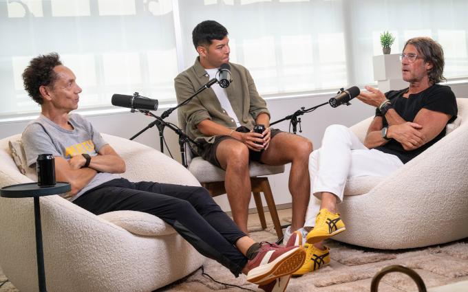

Brad Stenger produces the Athletes Data Community Newsletter (ADCN). He is a PhD student in Computer Science at the University of Vermont and researches athletes' data privacy and athletes' data sharing.

### Zipfs Law and Talent Pipelines

Bill Self described his process for filling spots at the end of his roster. I was in the audience. He held open tryouts, and if he saw that a walk-on had a chance to earn a spot, he would tell them exactly what the person needed to do. Self would tell the player that he needed to be better than that guy, usually a player that he and the program had committed to, but not so much that the program would not move on to something better. And sometimes it would happen.

This was before NIL. The commitment between player and program is more substantial. Bill Self would probably agree that it's more complicated now. I think he would also agree that intra-team competition still exists, that it is crucial for individual athlete development, and that it is fundamental to a team's culture.

Athletes themselves will have competitive goals. As data and goals occupy social contexts, whether in a team or in a public Strava, social comparison can simultaneously motivate and pressure athletes. (Women feel the dual extremes more acutely, according to a newly published [interview study](https://www.sciencedirect.com/science/article/pii/S1469029226000774) in the *Psychology of Sport and Medicine* journal.)

There's a conversation between Rich Roll, Malcolm Gladwell, and Chris Chavez [out this week](https://richroll.com/podcast/malcolm-gladwell-chris-chavez-1002/) on the Rich Roll podcast feed. Strava, Gladwell mentions at one point, underplays the popularity of the platform's aspirational appeal. Everyday endurance athletes relish when elite athletes post their workout data. But everyone is different.

Behavior is inherently unpredictable with younger athletes whose circumstances change frequently. Tom Stafford has an excellent [backgrounder](https://mastodon.online/@tomstafford/116968387737698230) on why it is difficult. His evidence comes from efforts to build AI technology called human surrogates, which are basically simulated people for the purpose of predicting human behavior.

How do sports teams manage the unpredictability? If a team can combine stable culture (to manage circumstance) and effective training, then an athlete's development trajectory will exist within a sensible framework, where norms and expectations define useful bounds. That's what Bill Self was doing, setting bounds and expectations.

*Odd Lots* is a podcast produced by *Bloomberg* that deals with quantitative aspects of finance. The World Cup gave the show hosts [an opportunity to talk about soccer and analytics](https://www.youtube.com/watch?v=tqDcrOiKUuY) with a couple of former investment trading analysts. Portfolio strategy and roster construction go hand in hand, according to Mike Treacy, who consults for Austin FC in MLS.

The task of roster construction affects athletes and coaches who have more choices to make at lower and lower levels of sport. Fortunately, "sorting mechanisms are getting a lot more efficient," according to Gladwell. To which Rich Roll followed up, so why isn't the U.S. great at soccer?

Things got interesting. Gladwell explained that there are two ways to develop more elite talent in any field. You can improve "scale" by increasing the number of athletes in the talent pool and then reasonably expect more successful high-level athletes to come out the bottom of the talent funnel.

The idea that a big population automatically generates talent just by being big is wrong. This is because of Gladwell's second talent-manufacturing method. He calls it "exploitation." Instead of raising the quantity of the talent pool, raise the quality of the talent pool.

Be more selective, but also, at the same time, be smart. Hotbeds of talent are places that have become good at picking who to include and who to exclude. They know where to set the bar and then how to apply the standard, like Bill Self during tryouts.

Or like Arsene Wenger, who [told](https://www.theguardian.com/football/2026/jul/16/arsene-wenger-us-soccer-development) *The Guardian* about how he developed soccer academies in France, starting in the 1980s, "You have to be consistent, and one of the things that is the most neglected is an identification of talent. It demands an eye. It demands an education. It demands consistency, to always give a chance to young players, to identify who has talent in five years—not now—and that is not easy to develop in every country."

*Goal.com* [expanded on](https://www.goal.com/en-ng/lists/we-want-to-be-argentina-we-want-to-be-spain-how-u-s-soccer-plans-to-ride-the-world-cup-wave-to-change-development-education-and-pay-for-play/bltd1d28ea495a487d3) Wenger's role in a U.S. youth soccer project, stressing the importance of early training: "Feet demand to be educated at five, six, seven years old, and that's why the identification of talent is so important. That's why we want to cover the whole country and give a chance to everybody."

The U.S. has an opportunity to raise the talent level with scale and with exploitation. It won't be easy. 

Complex systems math makes it possible to [compare adjacent ranking systems](https://compstorylab.org/allotaxonometry/papers/rank-turbulence-divergence/). For example, consider California youth soccer and Texas youth soccer. The distributions for teenage soccer players should follow Zipf's Law, where frequencies drop proportionally to the inverse of their rank. The distributions should have [a heavy tail](https://www.google.com/search?q=heavy-tailed+Zipfian) with very small numbers in the upper ranks and massive numbers in the lower ranks.

Each state's youth soccer is its own complex system. When you do the system comparisons, the highest-ranking players in each state will have many characteristics in common. Player characteristics become less uniform and more "turbulent" as you progress down the heavy tail to the lower-ranked players.

Wenger seems to be saying that U.S. Soccer needs to understand the turbulence in order to look past what's obvious among the top-ranked players. 

Smaller distributions have less turbulence. Smaller communities and nations have an easier time cultivating talent when they know what they're looking for. It also helps if there's a biological advantage circulating through that particular gene pool.

Exploitation talent hotbeds are usually not big nations like the United States. Gladwell made the point that 60+ of the top 200 marathon times are runners from three nations: Kenya, Ethiopia, Japan. Marathons' results and rankings are known to be [heavy-tailed Zipfian](https://www.sciencedirect.com/science/article/abs/pii/S0378437105010344).

### Tour de France Innovation

[Tadej Pogacar won](https://www.theguardian.com/sport/2026/jul/26/relentless-tadej-pogacar-wins-fifth-tour-de-france-to-equal-record) his record-tying fifth Tour de France on Sunday. He dominated, finishing six minutes ahead of the runner-up.

Pogacar had his sleep interrupted for [a drug test](https://cyclingmagazine.ca/sections/news/2026-has-been-very-strange-tadej-pogacar-puzzled-by-anti-doping-tests/) following Stage 15 a week earlier. French media reports later in the week said that a judge had authorized the tests to take place outside the normal testing window. Tests outside the normal window need evidence-based justification to occur.

The extra testing is a countermeasure that race officials took to catch riders who microdose blood-thinning EPO. A microdose can be ingested just after the normal window and clear the body before the next window starts. 

EPO is the same substance that Lance Armstrong and his team [used](https://www.youtube.com/watch?v=JMaV-e1woGc). Same material, now used in a more sophisticated manner.

How sophisticated? Writer James Witts calls one part of this approach to doping [the altitude alibi](https://x.com/Roadman_Podcast/status/2079574797948772464) ([more](https://en.brujulabike.com/altitude-could-conceal-a-new-almost-undetectable-doping-system-according-to-the-new-book-by-james-witts/) and [more](https://www.threads.com/@cyclingnews_feed/post/DbNQO7FFuFj/an-altitude-alibi-does-cyclings-anti-doping-system-have-a-major-loophole/)).

Altitude training has a fundamental tradeoff. Endurance athletes can maximize their blood oxygen capacity by training at altitude, but they won't be able to do quite as much work in training, and so they sacrifice a small amount of fitness.

The reverse also occurs. Endurance athletes can do more work at lower altitude to gain fitness but lose some of the blood oxygen capacity.

Athletes who microdose EPO gain both blood oxygen capacity and fitness. No sacrifice required. Witts says that endurance athletes don't go up to the mountains to train. They go there to dope.

Lance Armstrong provides Tour de France commentary at [THEMOVE podcast](https://www.youtube.com/watch?v=vLibQ-4dBFU&list=PLVxvkgh82tFopMoCcV4AgNqvgeBj2JfPq&index=7). He said the only next possible increase in surveillance available for race authorities is to put 24-hour watches on athletes.

Separate but interesting: This year's Tour also saw the arrival of new [lactate gel fueling products](https://www.bikeradar.com/news/enervit-c21-pro-lactate-gel-mix). Lactate can fuel muscles, and the body delivers it through a different pathway from fructose, glucose, or another sugar. It might also contribute to shifting blood chemistry, acting as an acid-base buffer like sodium bicarbonate does. 

Without buffering, acid levels spike during extended periods of work by athletes. Spiking blood acid signals fatigue to endurance athletes' brains.

### News

[OSU Human Performance and Nutrition Research Institute receives transformational gift from George and Janice Thompson](https://news.okstate.edu/articles/communications/2026/hpnri-receives-gift-from-george-and-janice-thompson) in Oklahoma State University, OSU News and Media by Jennifer Kinnard on July 15, 2026

[What if Starting Pitchers HAD to Finish?](https://www.joeposnanski.com/p/what-if-starting-pitchers-had-to) in *JoeBlogs* by Joe Posnanski on July 20, 2026

[Practical Steps for Lowering an Athlete’s ACL Injury Risk and Increasing Knee Stability](https://humanperformancealliance.org/playbook/practical-steps-for-lowering-an-athletes-acl-injury-risk-and-increasing-knee-stability/) in Wu Tsai Human Performance Alliance, *Human Performance Playbook* by Sydney Covitz and Seth Sherman on June 30, 2026

[Cortisol Could Be the Next Frontier for Wearables](https://spectrum.ieee.org/cortisol-continuous-monitor-wearable) in IEEE Spectrum by Elie Dolgin on July 19, 2026

[Code is like a house, and people have to live in it, often for much longer than you expect. You may not be able to predict how it will be used in the future, but you can decide whether those future changes will be painful or straightforward](https://mastodon.acm.org/@ACM/116963762923750733) in mastodon.acm.org by ACM, Paul Callaway on July 22, 2026

[Prime Minister Mark Carney announces $1-billion investment in sport](https://runningmagazine.ca/the-scene/prime-minister-mark-carney-announces-1-billion-investment-in-sport/) in *Canadian Running Magazine* by Hayden West on July 22, 2026

[Ode to Spain, Our Competent Kings of the World Cup](https://www.theringer.com/2026/07/19/world-cup/world-cup-soccer-final-2026-spain-argentina-score) in *The Ringer* by Brian Phillips on July 19, 2026

[Situational characteristics of muscle strains in sport](https://blogs.bmj.com/bjsm/2026/07/21/situational-characteristics-of-muscle-strains-in-sport/) in *British Journal of Sports Medicine*, BJSM blog by Luca Sophie Finnern et al. on July 21, 2026

[One thing this World Cup has shown - teams don’t need to be the top physical performers to progress](https://x.com/drpetertierney/status/2077269889069256729) in X/Twitter by Peter Tierney, STATSports on July 14, 2026

[Today in Apple history: Nike+iPod Sport Kit puts fitness tracking in your pocket](https://www.cultofmac.com/apple-history/nike-ipod-launch) in *Cult of Mac* blog by Luke Dormehl on July 13, 2026