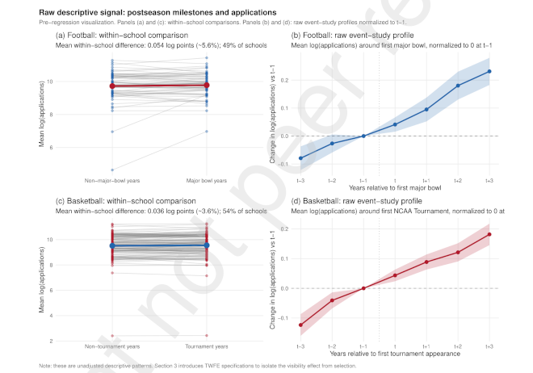

### Athletes' Data, AI, and Coaching

Garmin is the company that makes my GPS watch for running, and it bought Training Peaks, an online coaching company for endurance athletes. DC Rainmaker (Ray Maker), the authority on all things Garmin, [wrote up](https://www.dcrainmaker.com/2026/07/garmin-acquires-training-trainheroic.html) the transaction. The answer to the question, why?, according to Maker (and I agree), probably has a lot to do with Garmin's efforts to add value to athletes' data.

All the health-tracking and athlete-tracking companies sit on a mountain of athlete data. Unlocking the value of all that data requires offering services that benefit individuals and athletes. So far, most of those services revolve around presenting the data, mostly via dashboards. 

Garmin has every financial reason to create more and better services, and its not-free Connect+ data services have failed to take off, according to Maker. Training Peaks is a popular, proven coaching service that could breathe life into Connect+. 
 
The soccer performance coach Jim Malone has a Substack newsletter. He recently [explained his process](https://maloneperform.substack.com/p/from-testing-to-training-profiling) for going from athletes' training data to athletes' training plans. Most of the work goes into profiling each player, keeping in mind their position and role on the team. New data informs the assessment of athlete profiles and leads to high, medium, and maintenance targets for training. 

A lot goes into athletes' data profiles, and every expert, like Malone, will likely have differences in their priorities and their synthesis. Any software that does similar work is going to be just as opinionated.

David Wallace-Wells [interviewed](https://www.nytimes.com/2026/07/29/opinion/health-data-trend-body.html) Rachael Bedard, a geriatrics doctor, for The New York Times. They talked about self-tracking in the context of public health, and together they presented a counterpoint to the idea that more data is better when it comes to personal health. The more-is-better perspective relies on advances in AI and believes that if the data doesn't improve health right now, then it will eventually, either as a useful diagnostic or recommendation. 

Bedard feels that the data and its AI interpretation are prone to error and prone to amplifying signals that would be better to disregard. But there is also some fundamental utility to gauging basic heart rate and activity indicators. When every health data consumer is their own n=1 experiment, the weak signals can be interesting, but what is useful are the regular reports on the basics. 

There is no evidence that population-wide benefit from health trackers is imminent. The n-of-1 cases are nothing more than guesses.

Wallace-Wells and Bedard acknowledge that owners of health trackers have, in many cases, already made an investment in their health. These people are more fit than a standard population. The same can be said for athlete populations. Evidence from Maker and Malone suggests that weak signals and conclusions about individual athletes will be just as difficult to generalize and predict on.

So, how to interpret an AI optimist's confidence? How does AI work best in terms of health tracking and athlete training? 

Bruce Schneider is a data security expert and blogger. He [recently quoted](https://www.schneier.com/blog/archives/2026/07/should-you-use-ai-for-a-task-heres-a-simple-way-to-decide.html) Daniel Meissler, saying that AI is best used when "a task has to be done and no one cares how." When *how* the task is done matters, then it is better not to use AI.

Schneider's analogy is what happens during training, athletic training, and not intentionally ironic. At the gym, tasks are difficult, and shortcuts defeat the purpose. "The point of weightlifting isn’t to move heavy things across the room; it’s to actually lift those heavy things," he writes.

The role that coaches play in interpreting athletes' data complicates how AI gets put to use. Training Peaks (using both human coaches and AI) and Jim Malone (100% human) both provide a service to filter and interpret athletes' data and then produce recommendations. 

A coach could be leveraging AI, but that would make sense if the hands-on work with athletes' data is a shortcut not worth taking. Or, a coach is replacing a direct AI-athlete interaction. Then there is a third path: A coach helps the athlete to interpret the AI.

Helping coaches to work with AI, in place of AI, or alongside athletes dealing with AI, those are all different types of computing projects, with different endpoints and different user interfaces. Athletes' data is the basis for collaboration in sports, but without something to connect the people and the data, there is no collaboration. AI makes it more important to get those connections right.

### Flutie Effect

Researchers from Texas Tech authored [a new economics paper](https://papers.ssrn.com/sol3/papers.cfm?abstract_id=7207454) that revisits "the Flutie Effect," the famous enrollment bump that Boston College experienced when quarterback Doug Flutie reinvigorated the school's football program. They found that the Flutie Effect still exists, and the magic also works for basketball, not just football, in the 21st century.

Enrollment is a major issue at American universities. At Syracuse University, dependence on tuition for revenue combined with fewer incoming students [led to a](https://www.highereddive.com/news/a-new-normal-syracuse-faces-enrollment-dip-first-deficit-in-years/822832/) financial deficit and budget cuts. The same thing is [forecast](https://www.reddit.com/r/burlington/comments/1tcaj4t/uvm_faces_enrollment_decline_12_million_budget/) to happen next year at the University of Vermont.

While demographics are mostly predictable, the Flutie effect is not. Roster construction for the Flutie sports, [football](https://sports.yahoo.com/articles/john-garrett-approaching-roster-construction-140129922.html) and [basketball](https://www.espn.com/mens-college-basketball/story/_/id/49489716/college-basketball-roster-construction-coaches-challenges-ncaa-eligibility), is a mystery or a work in progress for many teams.

The research makes it apparent that in the new world of college sports, sports-related enrollment bumps will be stratified. Bigger, better-resourced schools will have more Flutie potential. Smaller schools may not have the chance to raise their profiles when their teams win. 

The added uncertainty around [athletes' eligibility](https://www.espn.com/college-football/story/_/id/49501415/judge-grants-injunction-class-22-athletes-seeking-play-5th-ncaa-season) and [NCAA rulemaking](https://www.espn.com/college-sports/story/_/id/49501752/big-ten-sec-support-college-sports-bill-reviving-senate-chances) makes for chaos.

One last wrinkle is the growing presence of video camera surveillance at U.S. universities. Security investments seem sound in the wake of the [increasing number](https://www.usnews.com/news/us/articles/2025-12-13/a-list-of-deadly-shootings-on-college-campuses-in-the-us) of campus shootings. These projects [can be difficult](https://campussecuritytoday.com/articles/2026/07/16/campus-security-projects-rarely-fail-because-of-technology-they-fail-because-of-coordination.aspx) to coordinate, and the high cost might just be what it takes to get these systems done right.

Some student newspapers have noticed the changes, and the students do not seem to appreciate the surveillance. ([San Diego State](https://thedailyaztec.com/128272/news/student-life/is-sdsu-watching-see-where-the-university-put-its-ai-enabled-cameras/), [Swarthmore](https://swarthmorephoenix.com/2026/04/23/a-look-inside-swarthmores-350-camera-surveillance-network/), [Harvard](https://www.thecrimson.com/article/2026/7/6/harvard-to-add-security-cameras/), [Stanford](https://stanfordreview.org/the-stanford-surveillance-state/))

Targeted athlete surveillance is not something that has been reported. It has become a possibility, though. The stakes are high, and so is the uncertainty and the risk.

### News

[Injury and illness in non-football collegiate athletics: a single university, 8-year descriptive retrospective analysis](https://www.nature.com/articles/s41598-026-61105-5?fromPaywallRec=false) in *Scientific Reports* journal by Dani Gonzalez et al. on July 17, 2026

[Injury prediction in elite women’s football: an integrative machine learning-based decision-support framework](https://www.nature.com/articles/s41746-026-02937-3?fromPaywallRec=false) in *npj digital medicine* journal by Manuel Huth et al. on July 8, 2026

[Are female athlete concerns being considered in preparticipation examinations? A needs assessment in Canadian University Sport (U SPORTS)](https://www.jsams.org/article/S1440-2440(26)00290-2/fulltext) in *Journal of Science and Medicine in Sport* by J.M. Schulz et al. on July 16, 2026

[Our new paper presents the first global census of researchers in Sports Statistics](https://x.com/SchuckersM/status/2077035226417549544) in X/Twitter by Marti Casals on July 13, 2026

[What makes muscles contract? A physiologist explains how muscles move](https://theconversation.com/what-makes-muscles-contract-a-physiologist-explains-how-muscles-move-283652) in *The Conversation* by Kiki Crawford on July 27, 2026

[A handheld breath test can accurately measure when the body is burning fat in real time](https://bsky.app/profile/nature.com/post/3mrkbqmrnvv2n) in X/Twitter, *Nature* by Mohana Basu on July 26, 2026

[Short-Term Workload Patterns Before Achilles Tendon Rupture in National Basketball Association Players: A Descriptive Epidemiology Study](https://journals.sagepub.com/doi/10.1177/23259671261463385) in *Orthopaedic Journal of Sports Medicine* by Vineet Kumar et al. on July 24, 2026

[Fed up with missing medical histories, a former IU athlete and a Howard athletic director built an app to address the gap](https://technical.ly/entrepreneurship/my-health-data-app-student-athlete-medical-records/) in *Technical.ly* by Maria Eberhart on July 29, 2026

[‘The Math is Not Fair’](https://cacm.acm.org/opinion/the-math-is-not-fair/) in *Communications of the ACM* by Leah Hoffman on July 31, 2026

[Is Your Young Athlete Eating Enough? The Hidden Risks of Under-Fueling](https://www.urmc.rochester.edu/news/publications/health-matters/reds-underfueling-athletes) in University of Rochester Medicine Newsroom by Kathleen Rock on July 31, 2026

[Jump Tests Can Help Predict Athlete Injury Risk](https://medicine.yale.edu/news-article/jump-tests-can-help-predict-athlete-injury-risk/) in Yale School of Medicine, New Research by John Ready on July 28, 2026

[New in the Hudl Statsbomb API: Phases of Play](https://www.hudl.com/blog/phases-of-play-hudl-statsbomb) in *Hudl Blog* on July 29, 2026

[This is probably my favorite book in terms of teaching you the best practices of data visualization. … No matter what you use to visualize your data with, this book is for you."](https://bsky.app/profile/nadiehbremer.com/post/3mrmvghlxc22b) in Bluesky by Nadieh Bremer by July 27, 2026