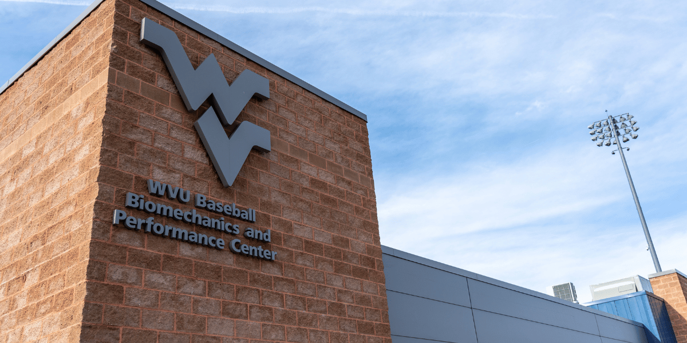

Brad Stenger is a PhD student in Computer Science at the University of Vermont where he researches athletes' data sharing and privacy. The Athletes Data Community Newsletter follows changes in technology, policy, and practices for collecting, managing, and reporting athletes' data.

### TAP: The Adjacent Possible

Stuart Kauffman is a theoretical biologist and complexity scientist. He was founding faculty at the Santa Fe Institute and, for a time, visiting faculty at the University of Vermont. Born in 1939, he is still at the University of Calgary. One of Kauffman's best-known ideas is *the adjacent possible*, his explanation for how new things materialize when the number of possible things is ever-increasing.

"We cannot prestate what the adjacent possible contains. We discover it by moving into it," is the description that Jim Rutt, a former Santa Fe colleague, [puts forward](https://jimrutt.substack.com/p/the-adjacent-possible-how-everything). 

Kauffman himself introduced his [2023 TED talk](https://www.ted.com/talks/stuart_kauffman_the_adjacent_possible_and_how_it_explains_human_innovation) on the subject by saying, "What is actual now enables what is next possible, the adjacent possible." 

Author Steven Johnson featured the idea in his book, [Where Good Ideas Come From](https://www.ted.com/talks/steven_johnson_where_good_ideas_come_from), and Adjacent Possible is the title of his Substack [newsletter](https://adjacentpossible.substack.com/).

Rutt's essay on the adjacent possible explores the challenge it presents for planners who want to get out in front of a dynamic, changing field. According to Rutt, the task is not impossible. Planning horizons degrade with distance. In the near term, maybe one or two moves ahead, we can plan with reasonable precision. Further out than one or two steps and the number of combinations explodes, and then no one knows anything.

Translational research is an exercise in adjacent possible planning, and it describes the state of lots of sports science and biomechanics related to athlete development. 

Darren Tuason is a PhD student and technician at the West Virginia University Biomechanics and Performance Center (BPC). [He describes](https://wvubaseballbiomechanics.org/why-hands-on-experience-is-non-negotiable-for-the-modern-sports-scientist/) the "shifting landscape of performance science" and emphasizes the importance of hands-on experience of collecting, managing, and reporting athletes' data.

The BPC environment has been, for Tuason, "a vital bridge between being a student of performance and becoming a practitioner capable of delivering objective, evidence-based solutions to elite athletes."

Every young professional at the start of a career comes face-to-face with the adjacent possible. They might have an objective that requires leaps forward in knowledge or skill or both. The key to getting ahead is finding that place where current work leads to advanced work, leads to more advanced work, and, in time, leads to future expert work and a career.

Putting something like a [BPC](https://wvubaseballbiomechanics.org/) at the intersection of a research university and its athletic teams creates a compelling set of possibilities, far greater than what one student or one athlete can accomplish. How should West Virginia make the most of its combined intellectual and athletic talent? What should the school invest in, and how should it position opportunities and objectives that produce positive outcomes for researchers and for athletes? 

Those are leadership questions that require future planning under uncertainty. The situation asks decision-makers to understand and assess the adjacent possible. At West Virginia, [BPC's technical leader](https://wvusports.com/news/2025/5/13/baseball-courtney-semkewyc-joins-staff-as-biomechanist) is Courtney Semkewyc. Semkewyc has a PhD in bioengineering from Rutgers and played central roles in creating pitching laboratories for the New York Yankees and at Tread Athletics.

A research engineer like Semkewyc has the depth of knowledge to oversee Tuason's early-career development. She can just as easily help other students from a range of backgrounds (computing, engineering, medicine, statistics, business, kinesiology) who come from different schools across the WVU campus. They can all make meaningful contributions to Mountaineer sports and to their own academic progress, in large part because of what Semkewyc understands about innovation. 

I met and spoke with Semkewyc a few years ago at a conference she spoke at. I noticed from her bio that we both studied engineering as undergraduates at the University of Rochester. Rochester is a school that encourages young minds to explore, to connect ideas, and to experience what the researchers in other parts of the university work on. You don't come to appreciate the adjacent possible by working in a silo.

The scope of what's possible at universities that combine high-level research and high-level sports is extraordinary. The richest professional teams cannot match the throughput of experimentation that an environment like BPC offers, as long as the spigot stays all the way open and nothing gets in the way to slow down the flow.

Not that they haven't tried. The Dodgers and a couple of other professional teams [launched startup incubators](https://www.sportico.com/business/tech/2024/sports-tech-accelerator-history-startups-1234820366/). Remember the 76ers Innovation Lab. [It closed](https://www.whoop.com/us/en/thelocker/innovation-labs-the-new-trend-for-pro-sports-teams/) in 2023. The Dodgers incubator [reformed as Global Sports Venture Studio](https://www.lasource.io/podcasts/2-rga-global-sports-venture-studio-the-origin-of-sports-accelerator-programme-podcast), a larger enterprise that includes other sports teams and leagues, plus retailers and media companies.

There should be a place for both, for living labs based at universities and for venture-backed incubators and startup cohorts. The bottleneck does not seem to be money. It looks more like a human resources bottleneck. 

### Behavioral Profiling for User Engagement

TikTok, Google, and Meta asked the Federal Court in Northern California to judge whether social media feeds are protected speech. The court [said no](https://epic.org/judges-sides-with-epic-and-ag-telling-google-tiktok-and-meta-their-addictive-social-media-features-are-not-1a-speech/).

These companies' social media feeds are personalized, based on behavior profiles the companies develop on users, and they can be addictive. California state law prohibits companies from providing addictive social media to minors. The companies were seeking exemption from the law in court.

Behavior profiling to generate engagement with either media or an app is a clear indicator that information has crossed a line and become surveillance. Addictive methods to activate dopamine responses in the brain are what maximize engagement, [according to Stanford researchers](https://med.stanford.edu/news/insights/2021/10/addictive-potential-of-social-media-explained.html).

Sign off, and the brain plunges into a dopamine-deficit state. Social media often feels good while we're doing it but horrible as soon as we stop. The methods can be applied to apps that athletes use for performance training. 

Maxu is a mental performance platform geared toward young athletes that uses a behavioral profile to personalize content. The company's [partnership with USA Archery](https://www.usarchery.org/article/usa-archery-and-maxu-partner-to-offer-access-to-mental-performance-platform-for-all-members) landed it in my newsfeed.

I cannot say whether Maxu uses behavioral profiles to amplify engagement. I have not seen or used the platform. I will say that it is important to be careful. As I said, one indicator that performance data has crossed into surveillance data is when platform developers use that data to increase engagement.

### News

[How Did the NBA Analytics Discourse Get So Stupid?](https://www.theringer.com/2026/08/03/nba/jaylen-brown-trade-analytics-stats-eye-test) in *The Ringer* by Michael Pina on August 3, 2026

[Off-the-ball behaviors in elite football using spatiotemporal tracking data: a scoping review](https://www.tandfonline.com/doi/full/10.1080/24733938.2026.2713521) in *Science and Medicine in Football* journal by Francesco Esposito et al. on August 4, 2026

[Summer Project Update: Lineup optimizer for West Virginia University Baseball Team!](https://www.linkedin.com/feed/update/urn:li:activity:7490838445439922177/)  in LinkedIn by Kornelia Buszka on August 6, 2026

[High-level hockey training exercises that regular people (like me) shouldn’t try](https://www.nytimes.com/athletic/7478621/2026/08/08/nhl-hockey-training-exercises-workouts/) in *The Athletic* by Fluto Shinzawa on August 8, 2026

[Does Pre-Season Really Matter?](https://jeddevereux.substack.com/p/does-pre-season-really-matter) in Substack, *The Set Piece* newsletter by Jed Devereux on August 6, 2026

[Is football AI-proof? Why tech investors wanted a slice of the World Cup](https://www.aol.com/articles/football-ai-proof-why-tech-123633000.html) in AOL, *BBC News* by Michael Race on August 9, 2026

[What critics of college athletes making money get wrong about name, image and likeness policies](https://theconversation.com/what-critics-of-college-athletes-making-money-get-wrong-about-name-image-and-likeness-policies-256958) in *The Conversation* by Brennan Berg on August 5, 2026

[How Brighton Are Building One of the Most Exciting Projects in the WSL](https://theanalyst.com/articles/brighton-transfers-wsl-exciting-project) in *Opta Analyst* by Emily Clogg on August 8, 2026

[The Global Physical Literacy Action Framework: Process and Outcomes](https://link.springer.com/article/10.1007/s40279-026-02485-6) in *Sports Medicine* journal by Johannes Carl et al. on August 8, 2026

[Women must not leave AI transformation to men](https://www.druckerforum.org/blog/women-must-not-leave-ai-transformation-to-meninterview-with-katy-george/) in *Peter Drucker Forum*, *Der Standard* by Michaela Ernst, Katy George on August 7, 2026

[The Endless (and Maddening) Quest to Make a Good Biosensor](https://www.medscape.com/viewarticle/endless-and-maddening-quest-make-good-biosensor-2026a1000phc?src=) in *Medscape* by Sarah Amandalore on July 28, 2026

[Three-Point Shooting Research Using #Theia3D](https://x.com/theiamarkerless/status/2084733143672623107) in X/Twitter by Theia on August 4, 2026

[Editorial: Investigating VR in sports training: cognitive and performance impacts](https://www.frontiersin.org/journals/sports-and-active-living/articles/10.3389/fspor.2026.1937195/full) in *Frontiers in Sports and Active Living* journal by Florian Heilman et al. on August 2, 2026

[How Can Athletes Care and Advocate for Themselves After Injury?](https://truesport.org/preparation-recovery/athlete-care-after-injury/) in *TrueSport* by Dennis Coonan on August 1, 2026