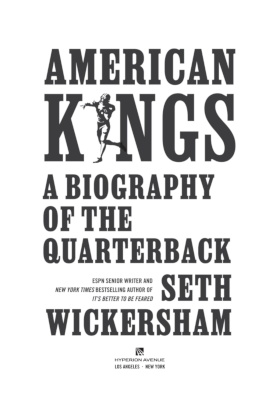

### How Me-First Quarterbacks Benefit Their Teams

Jay van Bavel, a neural-based psychologist, tells a story about Ohio State football in an old *Harvard Business Review* [article](https://www.linkedin.com/pulse/problem-rewarding-individual-performers-jay-van-bavel/). Ohio State football invented the helmet sticker in 1968 when one of the coaches started giving stickers to players for great individual playmaking. The team won the national championship. 

Some years later another Ohio State coach, Jim Tressel, changed the sticker rules. Stickers were earned for group accomplishments. Win, and every player gets a sticker. Tressel's team won the national championship in 2002.

Individual contributions are crucial to team success. Evaluating and recognizing what one person does in a team context is a management task. The Ohio State anecdote shows that what works is not a simple heuristic.

New [business school research](EBSCO-FullText-08_13_2026.pdf) shows that the individual-team dynamic can benefit from individual assessments (and rewards) via relative performance evaluations (RPE). Professors from the University of Arizona and Indiana University made those tradeoffs mathematically discrete and measured them.

An RPE increases individual effort and decreases cooperation. RPE also reduces uncertainty about other team members' effort and their buy-in for collaborative incentives. The reduced uncertainty from RPE about teammates improves coordination to a greater degree than the RPE decreases cooperation.

Playmakers get individual stickers. Win, and everyone gets stickers. Make it clear what it takes to earn a sticker. Coordination gives everyone the best chance to get individual results. And if a team can build a culture where individuals find joy in the success of others. Buddhism has a word for this: [mudita](https://www.psychologytoday.com/us/blog/mindfully-doing-what-matters/202511/cultivating-joy-in-others-joy).

The quality of a football team's quarterback matters more than sticker distribution rules. The modern QB has to navigate a gauntlet of individual accomplishments within a team setting. Seth Wickersham, the ESPN journalist, wrote a book about quarterbacks and what distinguishes the very best among them. 

There are 16,000 high school quarterbacks that reduce to 32 NFL quarterbacks, out of which 3 or so might be worthy of the NFL Hall of Fame. "How do you survive that winnowing, and what does it do to you, and what kind of mentality does it take to survive? Those are the questions I try to get at in the book," Wickersham told *The Athletic* in [an article](https://www.nytimes.com/athletic/6595875/2025/09/04/nfl-qb-book-seth-wickersham-column/) last September.

Louisa Thomas of *The New Yorker* magazine [asked](https://www.newyorker.com/sports/sporting-scene/consider-the-quarterback) Wickersham "if, by isolating quarterbacks instead of focusing on the collective, we were all missing something. Was there a chance to reimagine the position, as part of a whole?" He said, "They inherently know that they need other people" but they didn’t have the luxury of thinking of themselves as just one of the guys. "They are going to be the ones who are the face of failure. They have to set themselves apart."

In [another article](https://heavy.com/sports/nfl/chicago-bears/seth-wickersham-exclusive-interview-caleb-williams/) at *Heavy.com*, Wickersham reveals that Bill Belichick bases his first impression of a young quarterback on two things: decision-making and accuracy. Decision-making, not accuracy, is where individuals and teams are in tension.

Van Bavel [says that](https://psyche.co/ideas/there-are-three-lenses-through-which-to-weigh-any-decision) decision-making can be viewed through three distinct lenses: moral, pragmatic, and hedonic. Morals come with social norms and value judgments. Pragmatic evaluations are practical cost and benefit. Hedonic choices are personal and pleasure-seeking (or pain-avoiding).

Wickersham's book describes a fundamental pragmatism among quarterbacks. Joe Montana and Tom Brady would assess a defense before taking the snap and formulate a short list of 2, maybe 3, best options.

Understanding when and how to make pragmatic quarterback decisions is, it seems, a skill. The Pittsburgh Steelers, if one preseason game is evidence, will be leveraging Aaron Rodgers mentorship of two young quarterbacks, Will Howard and Drew Allard, this coming season. Howard [credits](https://steelersdepot.com/2026/08/aaron-rodgers-played-key-role-in-will-howards-first-big-play/) Rodgers for help making an important 4th and 1 conversion before halftime.

*Esquire* magazine [profiled](https://www.esquire.com/sports/a70869708/fernando-mendoza-interview-2026/) Fernando Mendoza, quarterback of last season's college football champion and the first pick in the NFL draft, selected by the Las Vegas Raiders, a team whose ownership group includes Tom Brady. For Mendoza to become a 1-in-3 Hall of Famer like Brady, he'll have to become a "ruthless competitor who has to have a Brady-like level of unbreakable self-belief."

It is, according to profile author Ryan D'Agostino, me-first all the way. "This is Fernando Mendoza’s life and Fernando Mendoza’s story, and he’s doing it his way, which means, yes, listening to his trainers and his agent and his coaches and his parents and his brother and God but mostly to Fernando Mendoza."

The quarterback has to be selfish for the team to win. But he also has to gain trust and expect sacrifice from teammates. If the b-school research holds up, then expectations for quarterbacks should be based on their pragmatic decision-making, consistent with any other roster spot on the team. Coordination among players follows, which appears to be more important than all-out, all-for-one collaboration. 

### Context and Biometrics

A [new preprint](https://arxiv.org/abs/2608.03251) from Harvard computer science researchers looks at using annotations that complement biometric data collected using wearables. The annotations provide context that goes a long way toward identifying causes of stress that lead to otherwise undifferentiated changes to biometrics.

Sports contextualizes stress. The availability of multiple athletes' data collected in a common scenario coordinates the parameters. Useful extra information comes with the biometrics data collected in a sports context. 

According to the authors of [a new paper](https://www.nature.com/articles/s41746-026-03106-2) in *npj Digital Medicine*, context-awareness will be crucial for Bayesian prediction. Context is what can deliver population-wide personal medicine accuracy while reducing false positives. 

One author, David Shaywitz, describes the end goal in [another recent editorial](https://www.aei.org/commentary/wellness-tech-dont-use-as-directed/), "Much of today’s data-driven personalization looks like theater, the same companies patiently collecting reams of biometric data may be building something genuinely valuable: a longitudinal asset that assesses each individual against their own trajectory rather than against population norms."

The methods align closely to what athletes in training experience, meaning athletes' data is a step ahead of where personalized health is likely headed.

The scenario might oversell the actual potential of added context, however. 

Harvard biostatistician, Alex Luedtke, has spent a decade working on clinical personalized medicine, first related to infectious disease and currently in mental health.

AI predictions are less realistic than what causal inference seeks to explain. "Causal inference asks: If we were to go in and change something in the world—introduce a new treatment or make a treatment more widely available—what will happen?," Luedtke said in [a Harvard press release](https://hms.harvard.edu/news/harnessing-statistics-improve-personalized-medicine). "The challenge is that we’re changing something. Even if we have data from the world as it is now, we won’t have data from the world as we want it to be."

Then there's privacy. Context can also be synonymous with surveillance, depending on the circumstances. Restrictive regulations might hold back technical progress. Loose regulation might make users reluctant to participate. Either way, context and privacy are important to figure out.

### The Adjacent Possible (Soccer version)

Devin Pleuler [explored the idea of the adjacent possible](https://www.centralwinger.com/p/unexpected-origins-and-the-fermi) in the context of soccer analytics at his *Central Winger* blog a while back. Soccer analytics, he felt, hadn't reached its full potential even though research had been progressing for more than a decade. There have been developments.

The Premier League has seen clubs like Brentford, Brighton, Fulham, and Bournemouth establish themselves based on analytics prowess. The economic incentive to seek competitive advantage is high, which stands to drive progress going forward.

The U.S. university research environment for soccer analytics also appears to be in a good place. The annual [American Soccer Insights Summit](https://americansoccerinsights.com/) at Rice University will take place on March 26-27.

Entrepreneurial pathways for young soccer analysts may not be as lucrative as other sports.  It's a complex game, and the analytics can be a steep learning curve. Soccer leagues and owners in North America are not as well-resourced as other U.S. sports leagues. 

### News

[AI Operationalization Inside Sports Leagues](https://www.effgen.us/?p=3882) in *That's How I Rollerboard...* blog by Max Effgen on August 9, 2026

[NCAA and FBI announce partnership to combat athlete sexploitation](https://www.espn.com/college-sports/story/_/id/49555079/ncaa-fbi-announce-partnership-combat-athlete-sexploitation) in *ESPN.com* by Paula Lavigne on August 7, 2026

[College football 2026: How much does each position cost?](https://www.espn.com/college-football/story/_/id/49568548/college-football-2026-position-cost-transfer-portal) in *ESPN.com* by Max Olson on August 11, 2026

[Swole ballgame: Should quarterbacks be jacked? An ESPN investigation](https://www.espn.com/college-football/story/_/id/49581777/john-mateer-college-football-your-quarterback-too-swole) in *ESPN.com* by Dave Wilson on August 12, 2026

[GAO Report: Athletic Programs Bleed Money](https://www.insidehighered.com/news/business/financial-health/2026/08/07/gao-report-athletic-programs-bleed-money) in *Inside Higher Ed* by Josh Moody on August 7, 2026

[Mental health in elite athletes: International Olympic Committee consensus statement (2026)](https://bjsm.bmj.com/content/60/15/1083) in *British Journal of Sports Medicine* by Claudia Reardon et al. on August 12, 2026

[Using Driveline’s AI-planning framework to model Bat Speed with Biomechanical data](https://medium.com/@ntoohey_30970/using-drivelines-ai-planning-framework-to-model-bat-speed-with-biomechanical-data-5474a00d932e) in *Medium* by Nick Toohey on August 4, 2026

[College Sports Eligibility and Antitrust Law](https://papers.ssrn.com/sol3/papers.cfm?abstract_id=7266363) in *SSRN* by Marc Edelman and Sam Ehrlich on August 13, 2026

[USF researchers develop AI system that predicts ACL injuries before they happen](https://www.usf.edu/news/2026/usf-researchers-develop-ai-system-that-predicts-acl-injuries-before-they-happen.aspx) in University of South Florida, USF Health by Anna Mayor on August 11, 2026

[Data visualisation for reporting epidemiological data on injury and other health conditions in sport](https://www.jsams.org/article/S1440-2440(26)00322-1/fulltext) in *Journal of Science and Medicine in Sport* by Pascal Edouard et al. on August 6, 2026

[Higher-income families more likely to enroll kids in organized sports, an AP-Ipsos poll finds](https://apnews.com/article/poll-youth-sports-parents-cost-1bb4f4f02f46bf728b6748a485e11b96) in *Associated Press* by Linley Sanders and Amelia Thomson-Deveaux on August 13, 2026

[Understanding working conditions in elite women’s football: a scoping review](https://www.tandfonline.com/doi/full/10.1080/24733938.2026.2713527?af=R) in *Science and Medicine in Football* journal by Christina Le et al. on August 12, 2026

[Patriots Officially Unveil New State-Of-The-Art Training Facility](https://sports.yahoo.com/articles/patriots-officially-unveil-state-art-183406275.html) in Yahoo Sports, *NESN* by Rodney Knuppel on August 12, 2026

[The Science of “Ramping Up”: Why Aaron Glenn Playing Starters is a Calculated Risk Worth Taking](https://sports.yahoo.com/articles/science-ramping-why-aaron-glenn-120000906.html) in Yahoo Sports, *SBNation* by Matthew Mauro on August 12, 2026

[What Can We Learn From VALD’s First WSL Football Report?](https://www.globalperformanceinsights.com/post/what-can-we-learn-from-vald-s-first-women-s-super-league-report) in Global Performance Insights by Jo Clubb on August 12, 2026