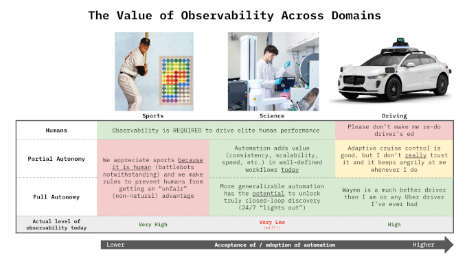

Brad Stenger produces the Athletes Data Community Newsletter (ADCN). He is a PhD student in Computer Science at the University of Vermont and researches athletes’ data sharing and privacy.

### Tacit Knowledge and Translating Reseach

Carl Zimmer, science writer at *The New York Times*, has [an article](https://mastodon.social/@Carl_Zimmer/117167918363926343) this week, a profile of a startup company, Transfyr.ai, based in Cambridge, Mass. Transfyr uses optical tracking and think-aloud verbalization to capture the human workflow details for bench scientists who work in life science laboratory research. 

"Magic hands" is the term Zimmer uses for skilled experimentalists who, in many cases, cannot fully describe how their excellence occurs. Transfyr, by capturing and accounting for wet lab human workflows, attempts to accurately describe the tacit knowledge that normally remains embodied but not articulated by workers.

Anna Marie Wagner, a Transfyr co-founder, compared what the company does to athletes' individual skill acquisition or team performance in [a newsletter post](https://thehardthing.substack.com/p/on-observability) earlier this year. Observability, like post-game film, creates opportunities to "see what went wrong, what could've been optimized, and think about what to do next," she wrote. 

Science does not have video replay. "If there's any post-mortem at all, it's nearly impossible to build a shared reconstruction of what actually happened," according to Wagner.

*The Economist* has [a short article](EconomistBartleby.pdf) in a June issue reviewing European startups Celonis (Germany, business admin) and Monumental AI (Holland, bricklaying) that are also capturing tacit knowledge in workflows that are not life science.

The article mentions [work](https://www.hbs.edu/faculty/Pages/item.aspx?num=68816) by Harvard and MIT researchers into "Labor as Capital" that distinguishes between individual and collective data ownership in relation to a company's "knowledge supply." Individual workers have control over contributing their knowledge and more often choose to restrict shared expertise, even though there could be gains for them and their colleagues from analytically driven enhancements. The situation arises regularly between individual athletes and their teams.

The magazine article also raises issues: "Who owns uncodified know-how? How much surveillance is acceptable? And as machines learn more and more, how will that affect the way that people acquire, practise and pass on the expertise?"

Not everyone believes that tacit knowledge can be captured. Peter Denning is a giant in computing research who contributed work in the 60s that led to the first operating systems and then, in the 70s, to the Internet. [He thinks](https://dl.acm.org/doi/10.1145/3822515) that artificial intelligence will not ever be as intelligent as humans because machines are "unlikely to learn human tacit knowledge." Human tacit knowledge is not explicit, and that fact keeps it from being a viable training resource for an LLM.

Tacit knowledge abounds in sports, in athletes, in coaches, in health professionals, in management, and increasingly, in the other analysts and scientists working throughout sports.

Jammie Hsueh is a sports scientist who works with the Southern Methodist University women's soccer team. Coming into her job, she had to adapt quickly to what the head coach, the strength coach, and the athletic trainer wanted in their athlete information. No one asked for, or would even use, anything like the data dashboards she originally thought she would be producing.

It wasn't until her second season with the team that the key to winning soccer games was scoring more goals than the other team. An optimized training plan only goes so far. "The sport itself must remain at the center of everything we do," [she writes](https://www.globalperformanceinsights.com/post/what-data-couldn-t-tell-me-reflections-on-applied-sports-science-in-elite-soccer) at the *Global Performance Insights* blog.

Randy Bates, age 70, with 40 years of football coaching experience, had a player who couldn't get his act together. He called his daughter, Samantha, a social worker, for advice. Samantha Bates [researches](https://csw.osu.edu/blog/2025/08/04/august-faculty-highlight-dr-samantha-bates/) the impact of mental health training for coaches on athlete well-being at Ohio State.

Coach Bates wanted to rip the athlete. His daughter suggested, "Catch him on the day he's there on time and looks like he's got it together, and ask him what he's doing on that day." It was, he admitted, a better strategy. The anecdote comes from a *USA Today* [article](https://www.usatoday.com/story/sports/2026/07/25/million-coaches-challenge-susan-crown-exchange-ohio-state-positive-quality/91042058007/) on the [Million Coaches Challenge](https://www.millioncoaches.org/).

Angela Duckworth, a psychology professor at the University of Pennsylvania, [recently wrote](https://www.nytimes.com/2026/08/28/opinion/successful-people-help.html) that the research shows that asking for help is crucial to achievement. "It’s not just stoically making the best of a bad situation—it's proactively making your situation more supportive."

The thing about tacit knowledge is that gaps can be filled, but only if they are recognized. Wagner and Denning are, I think, both right. Tacit knowledge might never be fully captured with computers, but using computers to identify process gaps that can then lead to improvements, that seems worthwhile.

Tacit knowledge is crucial for translating research. It's a selling point in the Transfyr [business plan](https://www.transfyr.ai/technology). The smaller, localized context of a research project rarely (realistically never) fits real-world workflows. The path to success is simple, however. Just ask for help.

### Early-Season Military Workouts = Ineffective

The Arizona State men's hockey team was subject to a punishing military-style workout for its first practice of the year. One athlete, a transfer new to the ASU program, collapsed and was hospitalized. As of Saturday, August 29, he was in a coma.

The temperature exceeded 100 degrees. [Reports](https://sports.yahoo.com/articles/shocking-details-emerge-military-style-191123754.html) said that NCAA heat safety guidelines warn that players adjusting to a new program and hotter climate are at higher risk.

[An investigation](https://bsky.app/profile/nkalamb.bsky.social/post/3mu5x2jwuic24) into the incident by *The Athletic* describes the risks of bringing in outside trainers. An outsider does not know anything about athletes' limitations. Even team trainers may not know much about athletes right after they return to campus.

Hard workouts are something to build up to. In the best cases, data informs that build-up. Starting out with the team's most challenging workout is dumb.

The other reason cited for this is team-building. Again, it is best to build up cohesion and to not expect much on day one.

Paul McCarthy, a sports psychologist, [writes](https://www.drpaulmccarthy.com/post/the-relationship-between-cohesion-and-performance-what-psychology-reveals-about-winning-teams) that trust and psychological safety are important operating principles for high-performing teams. The Arizona State hockey workout contributed neither.

McCarthy also says, "Building strong team culture isn't about a single activity at the start of the season. It requires daily effort."

### News

[Youth sports programs, once community-based, have become a privatized $40 billion industry](https://www.npr.org/2026/08/30/nx-s1-5945275/youth-sports-programs-once-community-based-have-become-a-privatized-40-billion-industry) in NPR, *Weekend Edition Sunday* by Ayesha Rascoe on August 30, 2026

[NASA-backed study reveals key to teamwork under pressure](https://msutoday.msu.edu/news/2026/06/nasa-backed-study-reveals-key-to-teamwork-under-pressure) in Michigan State University, *MSU Today* by Alex Tekip on June 23, 2026

[How Darrick Yray Brought the NFL Front Office Blueprint to Westwood](https://teamworks.com/blog/darrick-yray-westwood-player-personnel) in Teamworks blog on August 27, 2026

[How To Throw Hard As A Short Pitcher](https://www.youtube.com/watch?v=nXaUKGHuE7c) in *YouTube* by Tread Athletics on August 24, 2026

[Feasibility and Preliminary Effectiveness of a Sleep and Circadian Intervention in Female Athletes](https://papers.ssrn.com/sol3/papers.cfm?abstract_id=7363280) in *SSRN* by Elie Walsh et al. on August 28, 2026

[Sports Analytics course](https://learn.mit.edu/courses/course-v1:MITxT+2.980x) in *MIT Learn* by Christina Chase and Peko Hosoi, starts September 14, 2026

[Planar-SfM: Camera Pose Estimation via Homography Graph Embeddings](https://arxiv.org/abs/2606.31979) in *arXiv*, Computer Science > Computer Vision and Pattern Recognition by Gabi Pragier et al. on July 1, 2026

[Replication Project-ish: Projecting MLS Performance based on MLS Next Pro Data](https://www.americansocceranalysis.com/home/2026/8/22/replication-project-ish-projecting-mls-performance-based-on-mls-next-pro-data) in American Soccer Analysis by Kieran Doyle on August 23, 2026

[U.S. Soccer is on the verge of taking over the U.S. Youth Soccer Association.](https://bsky.app/profile/henrybushnell.bsky.social/post/3mu5pqsuj722j) in Bluesky, *The Athletic* by Henry Bushnell on August 28, 2026

[Experiences Conducting Randomised Controlled Trials in Sport & Exercise Science as an Early Career Researcher](https://sportrxiv.org/index.php/server/preprint/view/1036/version/1278) in *SportRxiv* by Louise Marvin et al. on August 21, 2026

[What the NHL’s tracking data says about the Utah Mammoth](https://sports.yahoo.com/articles/nhl-tracking-data-says-utah-213523565.html) in Yahoo Sports, Deseret News by Brogan Houston on August 27, 2026

[Decreased change of direction angle, increased ACL load: angle-dependent anterior cruciate ligament loading across different change of direction sprints in male soccer players](https://buff.ly/eZYDf5a) in *Journal of Biomechanics* by Markus Huthofer et al. on August 26, 2026

[Beyond the coach: contextual, community, and organizational predictors of coaches’ perceived impact on athlete life skill development](https://www.frontiersin.org/journals/sports-and-active-living/articles/10.3389/fspor.2026.1901614/full?=) in *Frontiers in Sports and Active Living* journal by Samantha Bates et al. on August 25, 2026

[Methods of Calculating Energy Availability in Current Research: A Standardised Audit](https://link.springer.com/article/10.1007/s40279-026-02526-0) in *Sports Medicine* journal by Alicia Walker et al. on August 26, 2026

[Technology rules approved for baseball](https://www.ncaa.org/technology-rules-approved-for-baseball/) at NCAA.org by Greg Johnson on August 25, 2026

[Loughborough University announces partnership with Runna to bring the latest sports science to runners globally](https://www.lboro.ac.uk/news-events/news/2026/august/loughborough-and-runna-partner/) in Loughborough University, News and events on August 25, 2026

[Meet the Toronto scientist helping MLB pitchers avoid career-ending elbow injuries](https://ca.news.yahoo.com/meet-toronto-scientist-helping-mlb-100004413.html) in Yahoo News, *Be Giant* by Kaitlyn McGrath on August 24, 2026