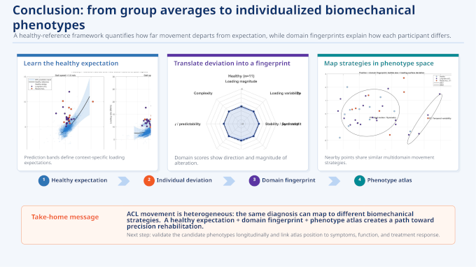

### Engineering/Statistical Analysis at 2026 JSM 

The 2026 Joint Statistical Meetings took place a few weeks ago in Boston. A quick check of the sports analytics presentations showed that, for a handful of papers (three), biomechanics and statistics have converged. JSM 2025 had one biomechanics presentation, and not in sports. JSM 2024 had zero.

Two of the three 2026 JSM biomechanics papers were from Scott Powers' group at Rice. The other paper was by Kristin Morgan at UConn. The important difference: all the authors on Powers' group papers are statisticians, while Morgan is a biomedical engineer. 

The two authors offer a window into the difference between sports statistics and the statistical analysis for applied biomechanical engineering. 

The engineering analysis shows what the data looks like in terms of injured and healthy gait patterns and then shows how the analysis characterizes personalized, precision rehabilitation strategies. 

The sports statistical analysis was more tell than show. The Powers paper, [Safer, Not Slower: Actionable insights from a large-scale survival analysis of baseball pitching mechanics](https://ww2.amstat.org/meetings/jsm/2026/onlineprogram/session.cfm?id=5805#:~:text=Safer%2C%20Not%20Slower%3A%20Actionable%20insights%20from%20a%20large%2Dscale%20survival%20analysis%20of%20baseball%20pitching%20mechanics), had the data sets, the research questions, and the survival analysis methods all on display. Most of the results are to be expected: biomechanical factors for velocity, for spin rate, and for location all contribute to pitchers' injury risk.

The one positive predictor for both reduced injury hazard and for increased velocity is glove arm momentum. I asked Eric Hernandez, a UVM professor of risk engineering whose son pitches on his college team, for thoughts about why.

We both felt the glove arm momentum was a timing problem. Lower glove arm momentum means that the glove-side limb failed to keep up with the rotating torso that was transferring force to the pitching arm. It is not enough to produce angular momentum through the torso but to make sure that force is conserved throughout the kinetic chain. Glove arm problems mess up timing and cost a pitcher velocity.

Compensating for the lost velocity puts the pitchers in an even worse place. Hernandez recalled [the inverted W](https://drivelinebaseball.com/blogs/blog/strasburg-the-inverted-w-and-pitching-mechanics), where the glove arm rises above the shoulder, a frightening and debilitating mechanic flaw in some excellent but short-lived pitchers (Mark Prior, Stephen Strasburg).

My thought is that a more athletic pitcher with a stronger core maintains glove-arm momentum better than a pitcher with one or zero of the two characteristics.

The basic biomechanics of tendon and ligament injuries are something that Keith Baar spent an hour-plus discussing on Eric Cressey's [podcast](https://www.youtube.com/watch?v=dPkQkP0L6B0) last year. At approximately minute 50 Baar explains how "jerk" does a number on soft tissue. Jerk is magnitude of change in acceleration. (Acceleration, which is more familiar, is magnitude of change in velocity.)

Extreme jerk occurs when joints undergo rapid, dramatic reversals of direction. An example is a tennis backswing that comes from arm movement instead of from rotating the hips and shoulders. Pull the racquet back. Stop. Acceleration equals zero. Snap the racquet forward. Between pull and snap, jerk.

Scott Powers' group has a second paper, [Bayesian Hierarchical Change Point Model for Pitcher Biomechanics](https://ww2.amstat.org/meetings/jsm/2026/onlineprogram/abstract.cfm?sid=7077&tid=7171), that uses change point analysis to assess starting pitchers' fatigue. Change point analysis is another tool in the engineer's risk management toolbox. The lead author, Rose Graves, had 180,000 pitches from 124 pitchers to use as data points, all from the 2024 MLB season.

Measurable pitch biomechanical and performance characteristics start a game high and decline gradually at first but do eventually arrive at a change point (at 31.8 pitches for pitch velocity). After that interim plateau, velocity declines more rapidly.

According to Graves, "Each player is unique in the types of pitches they throw, their biomechanics, and how they fatigue. Our hierarchical framework allows us to capture these differences between pitchers in terms of locations of when their mechanics change and the slopes of the trends before and after the change point during an outing, allowing us to develop a robust understanding of physical changes in a player's mechanics throughout a game."

More of this work is a matter of matching research questions to data sets, which sounds easy but isn't. It will take ingenuity to do the matching, whether the data already exists or if it needs to be collected experimentally. The analysis of the data will be as complex as the data and the biomechanics, but I predict that the results will be impactful, like these JSM papers.

### Funding for Sports Research

University research funding is, at present, uncertain, and the same is true for athletes' data research.

Traditional government research sources like the National Institutes of Health (NIH) and National Science Foundation (NSF) have changed how they review and execute grants differently. The NSF dramatically reduced the number of new grants it issues. NIH plans to revamp methods for scoring research grant proposals.

The response from major research universities has been to accept significantly fewer PhD students. 

These traditional funding sources have not dried up. What counts for a compelling, fundable university research program is, however, unpredictable and not something to plan for in a medium- or long-term time frame. In the short-term, for me as a PhD student, it is a challenge to latch on to research collaborators who have substantial funding.

There are two sources that give me, and should give anyone, doing research on or with athletes' data confidence. 

First, the inherent value of translating research into practice at a time when demand for usable data in service of athletes' health and performance is substantial and growing. 

Professional sports teams have become landing spots for university research. The [recent Saberseminar](https://www.saberseminar.com/schedule/) in Chicago was a parade of university-based analysis projects.

For the undergraduate and graduate student researchers who produce high-quality work, career opportunities follow. And those careers have optionality. Work for a pro team. Join or found a consultancy or a startup. Stay on an academic track with a postdoc or professorship. Combine academic research and also pursue applied professional projects.

At some point teams will experience a shift in the demand and supply for top talent. It happens with every technology industry, whether that is [biotech](https://academia.stackexchange.com/questions/43375/why-do-companies-fund-academic-research) or [computing research](https://cacm.acm.org/federal-funding-of-academic-research/from-university-research-to-global-impact/).  Leagues and teams will inevitably have to increase their stakes in university research. 

The second scenario currently playing out is major increase in social science research funding. These are private research dollars. OpenAI has committed $250 million to "projects for understanding and supporting the transition to an A.I.-centered economy and sharing its gains" according to [an opinion piece](https://x.com/AlisonGopnik/status/2096628557024030883) by leading social scientists. Anthropic has $200 million set aside.

If it's true that the best way to predict (and understand) an AI future is to [invent it](https://www.salesforce.com/news/stories/inventing-future-of-ai-agents/), there will be as much construction as there is investigation, sometimes both together. Progress will come as researchers situate AI in a personal or community problem context.

Lots of universities have [chatbots](https://ascode.osu.edu/news/rise-chatbots-higher-education-transforming-teaching-learning-and-student-support) that deliver answers to basic questions about student services and large intro classes.

The university setting is a good place for a living laboratory for interesting human-AI collaboration. Some of that work will include athletes. The social science around psychological aspects of individual and team performance is where social science and sports research connect.

Examples might look like recent computer science research at the University of Washington.  Ashish Sharma and Tim Althoff developed prototype interfaces for a mental health chatbot ([book](https://dl.acm.org/doi/book/10.1145/3749728), [thesis](https://digital.lib.washington.edu/researchworks/items/2007a024-6383-4b15-b2c8-f97986558500/full)).

Automated versions of sports psychology can only be as good as their contextualization and the delivery that follows. As with sports medicine, the [athletic population is a useful, if extreme, model for the general population](https://stanmed.stanford.edu/innovative-therapy-injured-athletes-helps-everyone/).

### News

[Injuries Derailed Their Seasons. The Recovery Was Good Content.](https://www.nytimes.com/2026/08/29/well/move/injury-recovery-social-media.html) in *The New York Times* by Lindsay Gellman on August 29, 2026

[Alfred P. Sloan Foundation Award Will Let NICO Researchers Listen in on Scientific Brainstorms](https://www.nico.northwestern.edu/news-events/articles/2026/sloan-brain-storm.html) in Northwestern University by Northwestern Institute on Complex Systems on September 2, 2026

[Inspired by the cell network of the retina, a new photonic computing system described in #ScienceAdvances can rapidly learn to solve complex visual tasks](https://bsky.app/profile/science.org/post/3mupn22enul2a) in *Bluesky*, *Science Advances* journal by Wai Kit Ng et al on September 4, 2026

[Rams Have Crazy Plan to Beat Jet Lag, Here’s What the Science Says](https://lindyssports.com/nfl/rams-have-crazy-plan-to-beat-jet-lag-heres-what-the-science-says) in *Lindy Sports* by Tony Owusu on September 4, 2026

[For the October issue of @theatlantic.com, I wrote about optimization culture—and wonder, its antidote](https://bsky.app/profile/ibogost.com/post/3mup2mtynts2r) in *Bluesky*,*The Atlantic* by Ian Bogost on September 4, 2026

[How a struggling JUCO player worked with Driveline to reach his dream of becoming a Division I player](https://drivelinebaseball.com/blogs/blog/michael-clarkson-juco-to-division-1) in *Driveline Baseball blog* by Travis Sawchik on September 4, 2026

[Are We Measuring Training Load Without Knowing What Works?](https://maloneperform.substack.com/p/are-we-measuring-training-load-without) in Substack, *The Football Scientist Newsletter* by James Malone on September 4, 2026

[Oura's S-1 reveals the platform numbers behind the ring: 99% heart-rate accuracy, 96% sleep accuracy, 65% daily active use, and a 350k-person blood pressure study.](https://bsky.app/profile/the5krunner.bsky.social/post/3muongy474s2c) in *Bluesky* by the5krunner on September 4, 2026

[Self-Report Health Screening Tools in Female Athletes: A Systematic Review of Domain Coverage, Validation, and Use Across Participation Levels](https://link.springer.com/article/10.1007/s40279-026-02532-2) in *Sports Medicine* journal by Charlotte Steele et al. on September 4, 2026

[Keeping elite women’s basketball players healthy during international competition](https://www.uclahealth.org/news/article/keeping-elite-womens-basketball-players-healthy-during) in *UCLA Health* by Nicole Gregory on September 3, 2026

[PODCAST: A deeper look at the Matthew Mayich tragedy at ASU](https://www.uscho.com/2026/09/03/podcast-a-deeper-look-at-the-matthew-mayich-tragedy-at-asu) in *USCHO Weekend Review Offseason* podcast by Ed Trefzger, Jim Connelly, and Robert Morris on September 3, 2026

[Temporal trends in the relative age effect in five major European men’s football leagues, 2000–2025](https://www.tandfonline.com/doi/full/10.1080/24733938.2026.2728065) in *Science and Medicine in Football* journal by Jeremy Torrent and Loric Rossier on September 2, 2026

[Women’s football across codes: A scoping review of sports science, medicine, and female-health research themes](https://www.jsams.org/article/S1440-2440(26)00525-6/fulltext) in *Journal of Science and Medicine in Sport* by Charlotte Steele et al. on August 14, 2026

[Why Does Novak Djokovic’s Body Keep Breaking Down on Court?](https://humanlimits.substack.com/p/why-does-novak-djokovics-body-keep) in Substack, *Human Limits* newsletter by James Smoliga on September 1, 2026

[A new study looks at NFL football and traumatic brain injuries](https://www.npr.org/2026/08/31/nx-s1-5944383/football-nfl-cte-brain-injury) in NPR, *Short Wave* by Hannah Chin on August 31, 2026

[A ‘potential coper’ in elite freestyle skiing: an Olympic bronze to confirm that surgery is not the “only way” to win](https://blogs.bmj.com/bjsm/2026/08/28/a-potential-coper-in-elite-freestyle-skiing-an-olympic-bronze-to-confirm-that-surgery-is-not-the-only-way-to-win/) in *British Journal of Sports Medicine blog* by Gabriele Thiebat et al. on August 28, 2026