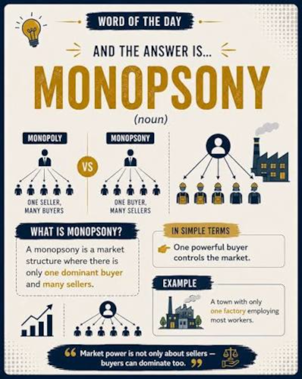

### NCAA Labor Market is a Mess but may not be Total Chaos

The Ninth Circuit federal appeals court upheld the NCAA's 5-in-5 eligibility rule, where student-athletes get five consecutive years of college sports athletic eligibility. Sort of.

The 3-judge panel stayed consistent with precedent, acknowledging that 5-in-5 restrains competition with its unilateral decisions on labor criteria and enforcement. The NCAA is is a monopsony (the opposite of a monopoly), the singular buyer in a market (as opposed to seller). Still, the NCAA, and not the defendant, won this appeal judgment.

The appeals court decided that while the defendant had been excluded from continuing a college baseball career due to the end of his NCAA-determined eligibility, his exclusion was not anti-competitive in terms of the college baseball labor market. The judge who authored the opinion, Gabriel Sanchez, [wrote](https://www.courthousenews.com/ninth-circuit-chimes-in-on-pair-of-appeals-over-ncaa-eligibility-rules/) (via *Courthouse News Service*) that labor markets differ from sport to sport, so, in legal terms, "Markets are not interchangeable."

The situation reveals how difficult it will be to determine college athlete employee rights. If each intercollegiate sport is its own labor market, then each sport will probably need its own collective bargaining agreement or, if the decision forum is courts, lots of case-by-case legislation.

The American Bar Association [lays out how](https://www.americanbar.org/groups/litigation/resources/newsletters/corporate-counsel/ncaa-monopsony-power-center-latest-eligibility-rule-antitrust-case/) (paywall), in another recent 10th Circuit court ruling, college athletes who graduated last spring should, in fact, be fifth-year eligible, "From a monopsony perspective, the district court suggested, the fact that some workers may benefit from restricted competition does not justify buyer-side coordination that harms the labor market overall."

As a result of the court rulings, the labor market for college football has become a lot more stable after a few turbulent weeks leading up to the season. Conferences have opportunities to set and enforce rules that affect who can and cannot play, and because those rules only apply to part of the labor market, they are not anti-competitive. A [good rundown](https://www.linkedin.com/posts/professormichaelmccann_the-secs-legal-battle-with-lsu-and-the-share-7503484353046446080-_4QN/) comes from Michael McCann at *Sportico*. 

LSU might want dubious athletes to play for the school, but, unless they want to leave the Southeastern Conference, they [will not risk](https://www.espn.com/college-football/story/_/id/49897284/no-sanctions-lsu-sec-meeting-expulsion) violations of the conference's member-agreed rules. And conferences are now [quite willing](https://bsky.app/profile/mccannsportslaw.bsky.social/post/3mv3wh3z5xc2s) to use [court actions](https://frontofficesports.com/newsletter/sec-escalates-lsu-legal-fight/) to enforce those rules.

The universities, the athletic conferences, and the NCAA all have business models. The decision-making by universities and conferences that differentiate one from the next is apparent. Student populations, alumni resources, media markets, long-held traditions, organizational structures, and institutional priorities are factors.

The NCAA does not seem to have quite so many different levers to pull. It will be far easier for the NCAA to operate if federal legislation provides it with an anti-trust exemption that will keep its monopsony intact.

Athletes have the right to choose a school. Their decisions often comes down to compensation, NIL opportunities, and relationships with coaches and teammates. What passes for student-athlete employment and employment rights are still to be determined.

Both the NCAA and college athletes face complications and, possibly, hardship if each sport and with it, each gender, have to figure out a path forward.

Randy Levine, part of President Trump’s Saving College Sports roundtable, spoke with McCann after federal legislation failed. Levine [said](https://www.sportico.com/law/analysis/2026/pcsa-congress-colleges-ncaa-follow-rules-1234941457/) that without laws in place, “The disparity between big and small schools will multiply in record speed, and student athletes will continue to lose scholarships, health protections and not get paid for their services.”

In reality, the chaos is exaggerated. With each court judgment, the challenge that college sports faces clears up. Not that it makes any of it easier. The legal judgments actually show the enormous amount of work it will take to put viable, sustainable, fair employment rights for student-athletes in place.

### Data Supply and Quality Issues

The Carnegie Mellon Sports Analytics Conference, happening in October, will again feature a reproducible research contest. [Get your submissions in](https://www.cmsaconference.com/). Reproducibility is important, but it has its challenges.

A [new report](https://bsky.app/profile/nature.com/post/3muzk3wsyb72g) from the World Bank shows that reproducibility failures have inhibited policy advances that could, in theory, improve populations' health and well-being.

The Institute for Replication checked data repositories that were set up for research studies' reproductions. The organization [found](https://bsky.app/profile/i4replication.bsky.social/post/3muz3q2fkok2x) that 21% of the repositories contained personal identifiable information.

The UK Biobank is a gigantic human health information resource (500,000+ participants). The data is de-identified, and access to the data is controlled. But there have been [large-scale leaks](https://bsky.app/profile/nature.com/post/3muzez2deoc2f), and re-identification of the data is possible.

Openness, privacy, and security are not the only supply-side quality measures for data. The European Conference on Computer Vision will hold a [workshop on curated data](https://bsky.app/profile/serge.belongie.com/post/3mv3nhhzsxc27). Smaller, higher quality data sets can improve machine learning objectives.

Synthetic data is also finding a role in many analysis pipelines. Industry consultant Kathy Lange [says](https://www.nojitter.com/data-management/synthetic-data-best-for-common-patterns-struggles-with-edge-cases) that it is best used as a supplementary tool for real-world data and not as a replacement.

[For example](https://cnr.ncsu.edu/news/2026/09/ai-generated-images-conservation-real-data-essential/), synthetic data improves image-recognition models when real-world data is limited. Synthetic images improved a North Carolina State research model’s ability to recognize trees when real images were limited, But synthetic data miss subtle details and lack nature's variation.

Data sharing increases the importance of data quality measures like these. Sports does not share data as much as it could. The reason might be, in part, because the benefit has not been spelled out, while the inconvenience of sharing is more obvious.

### News

[The Price of Exit: Why Buyouts Fail in College Athletics](https://papers.ssrn.com/sol3/papers.cfm?abstract_id=7282679) in *SSRN*, *California Law Review Online* by Noah Henderson on August 17, 2026

[Are College Athletes Employees of Multimedia Rights Companies? A Whack-a-Mole Employment Relationship](https://papers.ssrn.com/sol3/papers.cfm?abstract_id=7335978) in *SSRN*, *Marquette Sports Law Review* by Michael H. LeRoy on August 25, 2026

[Apple Watch’s new AI features are normalizing the idea that technology is always listening](https://mastodon.social/@Sarahp/117243017901803308) in Bluesky, *TechCrunch* by Sarah Perez on September 9, 2026

[Introducing Our Multi-Year Injury Risk Model](https://www.sportsinfosolutions.com/2025/09/10/introducing-our-multi-year-injury-risk-model/) in *Sports Info Solutions* by Chris Lee on September 10, 2026

[Neuromechanical models deepen our understanding of animal motor control](https://www.thetransmitter.org/motor-behavior/neuromechanical-models-deepen-our-understanding-of-animal-motor-control/) in *The Transmitter* by Auke Ijspeert on September 9, 2026

[Suunto Smart Heart Rate Belt 2 adds running dynamics and claims a cleaner heart rate and HRV trace](https://the5krunner.com/2026/09/09/suunto-smart-heart-rate-belt-2/) in *the5krunner* on September 9, 2026

[For years Cavan Sullivan has been more a prophecy than a player. That changed this summer. We have pro data on him now and it's very, very exciting](https://bsky.app/profile/johnspacemuller.com/post/3muyz2ep4q22a) in Bluesky,*The Guardian* by John Muller on September 8, 2026

[ACL Injury Alters Brain’s Movement Control, Scoping Review Finds](https://bioengineer.org/acl-injury-alters-brains-movement-control-scoping-review-finds/) in *Bioengineer.org* by Cassandra Pierce on September 8, 2026

[A big assumption has kept women out of health and fitness studies for years. What if it’s wrong?](https://theconversation.com/a-big-assumption-has-kept-women-out-of-health-and-fitness-studies-for-years-what-if-its-wrong-260055) in *The Conversation* by Maureen MacDonald on September 7, 2026

[The masters runner who turned his comeback into an AI experiment](https://runningmagazine.ca/the-scene/the-masters-runner-who-turned-his-comeback-into-an-ai-experiment/) in *Canadian Running* by Hayden West on September 10, 2026