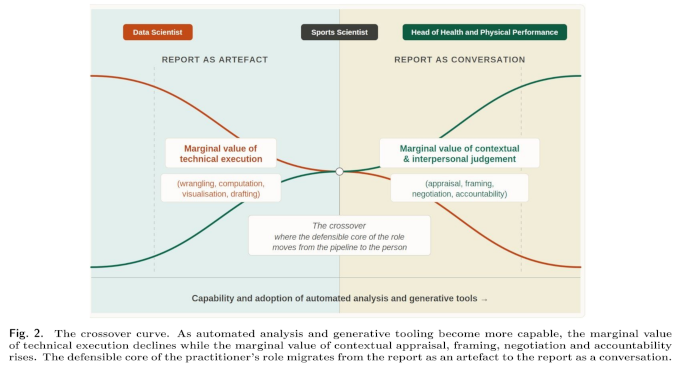

### Blurry Line Between Athletes and Non-athletes

College student-athletes have a lot of the same habits that college students have. And a lot of those habits, good and bad, that come out during college years stick into adulthood.

What does change is the habits that each new generation of young adults adopt. Anyone who has been to Chapel Hill knows Franklin Street, and its bars right next to campus. The University of North Carolina student newspaper [reports](https://dailytarheel.com/249399/city-state/city-franklin-street-nightlife-trends/) that the nightlife is no longer as intense, that it never bounced back after COVID chilled all social activity.

The social and personal habits of today's college-age population is different from past generation. Scientists who know more than I do can argue the finer points, but there seem to be performance-oriented behaviors that the entire cohort, not just the athletes, have gravitated toward.

In a [recent study](https://theconversation.com/we-paid-college-students-about-5-a-night-to-sleep-at-least-7-hours-and-their-grades-quickly-improved-289935), researchers monitored students at the University of Pittsburgh with Fitbit wearables. And they paid a subset $5 dollars for getting at least seven hours of sleep. Students slept more. Grades improved. The largest increases came to students who were paid daily. Incentives work.

The pull of Franklin Street cannot be very strong if all it takes is a couple of dollars to stay home and get some rest. Universities and students tend not to view sleep as part of their educational investment. These researchers believe that they should. If universities make it easier to sleep more, then today's students will.

Wegmans, the grocery chain, [recently started](https://www.grocerydive.com/news/wegmans-athletes-health-catering-meals/827513/) a catering program for sports teams, improving their access to healthy prepared food. Demand exists for services, not just products, that save time and lead to improved performance.

The growth of consumer wearable health and performance tracking is poised to explode. [Market research estimates](https://www.marketsandmarkets.com/Market-Reports/geography/wearable-electronics-market/US) point to double the amount of sales for wearables in 5-6 years. Screenless tracking with a wearable like Oura or Whoop have demonstrated [mainstream viability](https://gizmodo.com/screenless-wearables-forecast-a-minimalist-health-tracking-future-2000810042) and will contribute to [widespread adoption](https://news.southernct.edu/2026/09/17/helping-runners-make-sense-of-wearable-technology/).

A wearable tracker is a habit that also offers feedback on the sum total of personal habits and behaviors. All of that data is attractive to [researchers and clinicians](https://www.nature.com/articles/d41586-026-02844-3). New form factors (like [contact lenses](https://bsky.app/profile/science.org/post/3mvnztw5faz26), [microneedles](https://www.youtube.com/watch?v=W96sXB6LGPw)), materials ([graphene hydrogels](https://drexel.edu/news/archive/2026/July/breathable-graphene-hydrogel-biosensors)), collection modes ([always on](https://mastodon.social/@Sarahp/117243017901803308)), and validations for different measurements ([sweat](https://www.usmagazine.com/entertainment/news/could-your-sweat-tell-you-how-hydrated-you-really-are/)) represent continuing technical progress. Wearables are also part of [the gear set](https://www.frontiersin.org/journals/public-health/articles/10.3389/fpubh.2026.1867796/full) for workers operating in challenging environments.

Privacy and data security become [larger issues](https://www.nature.com/articles/d41586-026-02671-6) as the popularity, utility and total amount of collected data increases. These habits, as we have seen, have value.

Performance habits may well become intrinsic to up-and-coming generations of consumers. When that happens the line differentiating athletes and non-athletes has less meaning, and then the relationship between population wellness and healthcare is open to redefinition.

### Using AI in Research and in Writing

Two science journalists, Bruce Lewenstein and Chris Mooney, [describe](https://theconversation.com/is-science-journalism-dying-comparing-a-science-crash-40-years-ago-to-today-289652) the current lack of science journalism. That is the lack of traditional science journalism, as read in magazines, newspapers plus their online versions. Traditional journalism has experienced structural change, and is a much smaller profession, according the two. At the same time, Substack and YouTube are thriving as science communication platforms.

Read this article and you experience science journalism. My work here is an experiment in using journalism methods to explore the larger subjects that touch on my research into athletes' data. The process is to read as much as I can about what goes on, then write up the things that I want to read but don't exist. As traditional journalism vanishes or lands behind paywalls, the void calls for those willing to fill it.

Writing for an audience and writing for academic publishing has mutual benefits. I can include technical details from research for my audience. I can also make my academic work readable, enjoyably so I hope. 

The journalism and the research I work on have the opportunity to break new ground. The lack of precedent makes AI mostly unavailable for what I am trying to learn and write about. Still, AI has dramatically affected the research and writing workflows going on all around me.

Colleagues of mine rely heavily on AI, using large language models to draft research questions and then to code much of their technical work. They are far more productive than I am. I won't go so far as to say that do not understand the results and conclusions in their work. One conference [spot checked submissions](https://bsky.app/profile/yoshitomo-matsubara.net/post/3mvocjv7p5s2f) and were disappointed to see how many authors failed to answer basic questions about their work.

Other colleagues of mine depend on AI for interpreting and editing technical articles and drafts. English is not their native language and the work becomes far easier with help from AI, and the situation is not appreciably different from the [students who sacrifice learning for speed](https://www.nytimes.com/2026/09/15/us/universities-ai-warnings-enthusiasm.html) by using AI. 

The more troubling aspect of AI use in research is when work becomes a prompt and then becomes text for LLM training. These are privacy violations, the modern equivalent of posting something on the Internet without permission.

The less said about AI slop and journalism the better, but it comes down the same set of issues around sacrificing quality for speed.

Sports science researcher Martin Bucheit recently wrote [guidelines](https://martin-buchheit.net/2026/09/10/if-artificial-intelligence-is-writing-your-report-why-are-you-required/) for where and how to use AI in the athletes' data management and reporting pipeline. Bucheit sees valuable productivity gains early in the pipeline in terms of automating, checking, and otherwise processing the data for reporting. He emphasized the importance of personal accountability and the high stakes for accuracy as the pipeline moves into analysis and report generation, the stuff that collaborators will see. 

And these are a few of the better explainer articles that I have read about AI:
* [Anthropic and Microsoft Researchers Weigh Limits of Artificial Intelligence at Berkman Klein Panel](https://www.thecrimson.com/article/2026/9/16/ai-panel-harvard-law/) in *The Harvard Crimson* student newspaper by Francesco Palma on September 16, 2026
* [The AI Inference Revolution Is Here](https://spectrum.ieee.org/inference-hardware-revolution) in *IEEE Spectrum* by Matthew Smith on September 15, 2026
* [As AI enters health care, are we ready?](https://sph.cuny.edu/life-at-sph/news/2026/09/16/researchers-call-for-health-literate-ai/) in *CUNY SPH Press Releases and Announcements* by Ariana Costakes on September 16, 2026
* [An M.I.T. Report Warns A.I. Is Causing ‘Cognitive Surrender.’ Universities Are in a Bind.](https://www.nytimes.com/2026/09/15/us/universities-ai-warnings-enthusiasm.html) in *The New York Times* by Mark Arsenault, Dana Goldstein, Alan Blinder and Sarah Mervosh on September 15, 2026

### News

[Women athletes’ physical, mental health is focus of large new study](https://hsph.harvard.edu/news/women-athletes-physical-mental-health-is-focus-of-large-new-study/)  in *Harvard T.H. Chan School of Public Health News* by Maya Brownstein on September 10, 2026

[Physical literacy: unlocking its inclusive potential in schools and beyond](https://www.frontiersin.org/journals/sports-and-active-living/articles/10.3389/fspor.2026.1866837/full) in *Frontiers in Sports and Active Living* journal by Myriam Berube et al. on September 15, 2026

[Preliminary evidence of a circadian rhythm effect on English premier league match outcome](https://journals.sagepub.com/doi/10.1177/22150218261470130) in *Journal of Sports Analytics* by Poppy Smith et al. on September 8, 2026

[‘All about developing American athletes’: How passage of proposed bill would help American student-athletes](https://www.deseret.com/sports/2026/09/16/bill-proposed-to-cap-internaional-student-athletes-commentary/) in *Deseret News* by Doug Robinson on September 16, 2026

[New US Bill Could Devestate NCAA Women's Hockey](https://thehockeynews.com/womens/college/new-us-bill-could-devastate-ncaa-womens-hockey) in *The Hockey News* by Ian Kennedy on September 15, 2026

[New Bill Restricting International Spots on College Rosters](https://www.reddit.com/r/MLS/comments/1wgeip9/new_bill_restricting_international_spots_on/) in *reddit/r/MLS* by TheFifthPhoenix on September 14, 2026

[If the Protect College Sports Act becomes law, it could be challenged in court on several grounds](https://bsky.app/profile/mccannsportslaw.bsky.social/post/3mvoo4rs5z224) in Bluesky, *Sportico* by Michael McCann on September 16, 2026

[Science Immunology: Busy Tissues Need Bigger Cleanup Crews to Work at Their Best](https://www.cnic.es/en/noticias/science-immunology-busy-tissues-need-bigger-cleanup-crews-work-their-best) in *Spanish National Center for Cardiovascular Research News* on September 4, 2026

[Protect College Sports Act nears Senate vote. Why not everyone wants it passed](https://www.usatoday.com/story/sports/college/2026/09/14/protect-college-sports-act-senate-vote-athletes-college-bargaining-union/91766683007/) in *USA Today Sports* by John Brice and Mitchell Northam on September 14, 2026

[OpEd: College football kicks off over Labor Day weekend, but players are still not employees](https://spokesman-recorder.com/2026/09/03/college-football-players-employee-status-protect-college-sports-act/) in Minnesota Spokesman-Recorder by Michele Roberts and Ellen Staurowsky on September 3, 2026

[NCAA Bill Would Fend Off Antitrust Litigation, Thwart Plaintiffs](https://news.bloomberglaw.com/antitrust/ncaa-bill-would-fend-off-antitrust-litigation-thwart-plaintiffs) in *Bloomberg Law* by Katie Arcieri on September 14, 2026

[Association Between Playing Surface and Anterior Cruciate Ligament (ACL) Injury Risk in the National Football League: A Systematic Review and Exploratory Meta-Analysis](https://www.cureus.com/articles/513494-association-between-playing-surface-and-anterior-cruciate-ligament-acl-injury-risk-in-the-national-football-league-a-systematic-review-and-exploratory-meta-analysis#!/) in *Cureus* journal by Vivek Vemugunta et al. on August 5, 2026

[Assessing Return to Performance After Surgery in National Football League Quarterbacks: A Comparative Analysis of Performance Metrics](https://www.cureus.com/articles/500316-assessing-return-to-performance-after-surgery-in-national-football-league-quarterbacks-a-comparative-analysis-of-performance-metrics#!/) in *Cureus* journal by William Gadbois et al. on August 18, 2026

[Love this article. Talked to one of my friends who played on the Sol, and she says it all checks out.](https://bsky.app/profile/katestarbird.bsky.social/post/3mvodnk6exc2u) in Bluesky, *Defector* by Kate Starbird, Frankie de la Cretaz on September 16, 2026

[Researchers have observed how neuronal circuits in the human brain resolve such a dilemma in real time, revealing a ‘tug of war’ between rival neuronal groups](https://bsky.app/profile/nature.com/post/3mvpykrk4js2n) in Bluesky, *Nature* on September 17, 2026

[Line-breaking passes have become an important metric for teams and analysts, but collection methods and definitions differ between providers.](https://bsky.app/profile/gradientsports.bsky.social/post/3mvnn6bjgbc2q) in Bluesky by Gradient Sports on September 16, 2026

[Is the Player Carrying the Team or the Team Carrying the Player?](https://thexgfootballclub.substack.com/p/is-the-player-carrying-the-team-or) in Substack, *The xG Football Club* by Alex Marin Felices on September 16, 2026

[Wearable Sensors Accurately Track Knee Osteoarthritis Mobility](https://medicine.yale.edu/ortho/news-article/wearable-sensors-accurately-track-knee-osteoarthritis-mobility/) in *Yale School of Medicine New Research* by John Ready on September 14, 2026

[Why Is It So Hard to Find an NFL Quarterback?](https://freakonomics.com/podcast/why-is-it-so-hard-to-find-an-nfl-quarterback/) in *Freakonomics Radio* by Stephen Dubner on September 11, 2026

[CalMatters sues UC Berkeley to force university to disclose student-athlete pay data](https://calmatters.org/education/higher-education/2026/09/nil-california/) in *CalMatters* by Mikhail Zinshteyn on September 14, 2026

[How the ‘Skubal scope’ could change pitching injuries — and Tigers ace's season](https://richmond.com/sports/professional/mlb/article_1924f8ab-63c9-52a9-bdf1-f05edf398cae.html) in *Richmond Times-Dispatch*, *USA Today Sports* by Kristie Ackert on September 12, 2026

