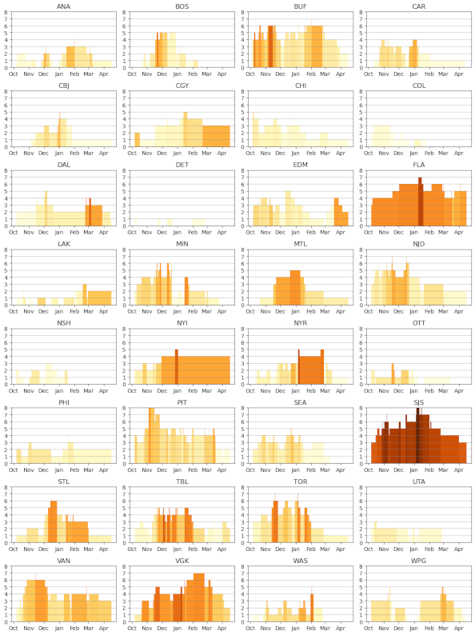

### Disaster Cascades in the Form of Injuries

Arnold Schwarzenegger was governor of California when I lived in San Francisco. At some point during his time in office I became aware of disaster cascades. To live in California is to live with risk from earthquakes, fires, floods, mudslides, terrorism, gangs, sharks, lions, bears, and snakes. One disaster makes the next one more likely, not less likely (not true for animals). The hallmark of state government under Arnold was legislative gridlock and no safety net for natural disasters. I moved in 2009.

There is [an article](https://bsky.app/profile/altice.bsky.social/post/3mvssioacis2y) by Ian Bogost in *The Atlantic* that reminded me of California. He describes the disaster cascade at American universities: enrollment, research funding, AI, college sports, wokeness, and all at the same time.

In sports, the classic disaster cascade is when a rash of injuries hits a team. The phrase [next man up](https://www.google.com/search?sca_esv=080dae4805299e94&sxsrf=APpeQnslH6WW83ea2ufdc1b7Qqg29kWhGQ:1790598022319&q=next+man+up&tbm=nws) hangs in the air. ([Next woman up](https://www.google.com/search?q=next+woman+up&sca_esv=080dae4805299e94&tbm=nws) means something different, something more career-oriented.) Of course, when teams lose players to injury, the missing players' work gets picked up by teammates, either their frontline peers or by untested reserves. The extra work with its added wear and tear increases injury risk for those athletes.

Hockey analyst Stephen Burtch coined the term "injury cascade" in a 2015 *Sportsnet* [article](https://www.sportsnet.ca/hockey/nhl/injury-cascades-which-teams-are-most-at-risk-to-lose-more-players/). The Columbus Blue Jackets had lost eight of their top players, a total of $21 million in combined salaries, at the start of their season. 

Burtch looked at five seasons of NHL injury and salary. He noticed that injuries ticked up when injuries consumed $6.5 million in salary (9% of the $71.9 million salary cap in 2015). A second upward inflection point happened at $15 million (20% of cap).

You can see lower threshold injury cascades in the 25-26 NHL season in Buffalo, Minnesota, and New Jersey. Higher threshold cascades describe the injury dumpster fires in Florida, San Jose, and Las Vegas. Injury and salary data come from [spotrac.com](https://www.spotrac.com/nhl/injured/_/year/2025/view/player). Injury counts are bars. Darker colors are higher ratio values for injured player salary:cap. 

Injuries are rare events. Perfectly healthy athletes in every sport have some risk of injury. The risk increase does not necessarily manifest itself with incidents that require more players' time on the injury report. Talking to Clemson professor Reed Gurciek this week about athletes' return to play after injury, he said that the best you can do is an honest appraisal of that injury risk and then see what happens.

Early-season football and late-season baseball are prime time for "next man up."

A handful of games into the season, and many college and pro football teams are on the precipice of injury cascades that could determine the success of their seasons. 

The San Francisco 49ers are undefeated, but they have been [piling up injuries](https://www.usatoday.com/story/sports/nfl/49ers/2026/09/27/san-francisco-49ers-vs-cardinals-winners-and-losers-analysis/91978206007/). Injury cascades have been a regular occurrence for the team. [A theory](https://sports.yahoo.com/articles/pablo-torre-finds-concludes-49ers-133058417.html) that electromagnetic radiation from an electric substation adjacent to the practice facility contributes to player injuries.

The physicist Richard Feynman has [a famous commencement speech](https://calteches.library.caltech.edu/51/2/CargoCult.htm) where he describes "Cargo Cult Science." He described how native South Seas islanders wanted stuff, and they noticed how the stuff they wanted came from airplanes. So they built low-tech versions of runways and control systems. This was their best effort to get stuff by getting airplanes. "I call these things Cargo Cult Science, because they follow all the apparent precepts and forms of scientific investigation, but they’re missing something essential, because the planes don’t land," said Feynman.

What the islanders are missing is an honest appraisal of the evidence. Feynman calls it "scientific integrity."

Playoff baseball has little misconception about the role injuries play. Teams pretty much know what they have. Teams like the San Francisco Giants and Baltimore Orioles fell from contention as injuries mounted. Other teams like the Tampa Bay Rays [rely on player development](https://sports.yahoo.com/articles/rays-option-top-prospect-recall-172813481.html) to fill gaps despite being experiencing the third-most injuries in MLB this season, [according to](https://www.rotowire.com/baseball/article/most-injured-mlb-teams-ranked-by-severity-score-111870) *Rotowire*.

When it comes to MLB playoffs, teams appear to have a certain number of high-quality pitches and favorable hitting matchups. Young talent can be an x-factor, but it is a guess when teams like the Dodgers have more of what they need than the other teams. Injuries and return to play are huge factors. The Yankees are American League favorites if Aaron Judge [can return](https://blogs.fangraphs.com/yankees-face-judge-dread/) to 100 percent, or they are in a dogfight with the Red Sox to advance.

### Technology in Charge of People

I have enjoyed the work of Cory Doctorow for years, going back to his founding role creating the legendary *Boing Boing* [group blog](https://boingboing.net/). He is talking all over the place about [his new book](https://shop.craphound.com/), *The Reverse Centaur’s Guide To Life After AI*. This book follows up to his last zeitgeist-changer, *Enshittification*.

A reverse centaur is a situation where people act in service of technology. One example would be Uber drivers, where the boss is essentially algorithms that the ride-sharing app needs to operate its business. Centaurs, according to Doctorow, are technologies in service of people, like a bicycle or a household appliance. Centaurs are also mythical creatures, a human torso that transitions to a beastly set of lower limbs.

I looked for reverse centaurs in sports. Laz Diaz, an MLB umpire who retires after the postseason, [recently described](https://www.usatoday.com/story/sports/mlb/columnist/bob-nightengale/2026/09/20/laz-diaz-retiring-mlb-umpires-2026/91855875007/) what his job has become and how little he enjoys the experience. The automated judgment and the scrutiny put him directly in service to automatic ball-strike and video replay systems.

Lots of automation and optimization systems track toward reverse centaur-ing. It is something to be careful with when it comes technology designed to help manage athletes and their sports.

Doctorow [spoke with](https://www.youtube.com/watch?v=_0xR3uEgGcc) privacy expert Daniel Solove about the book and his work. The two spent the last few minutes talking about privacy, something that Doctorow also knows well from his years working with the Electronic Frontier Foundation (EFF).

Asserting privacy rights, according to both Solove and Doctorow, are foundational legal mechanisms for preserving autonomy against invasive technology. Employment rights are more frequently cited in these cases, but that may be because of the advantages that entrenched wealthy and powerful organizations have to negotiate those rights. Privacy rights can, in practice, deliver greater leverage than employment rights.

### News

[ROI of Athlete Performance Technology: A Framework for Sports Directors](https://svexa.com/roi-of-athlete-performance-technology-a-framework-for-sports-directors/) in *svexa blog* on September 8, 2026

[Inside Keely Hodgkinson’s Custom Nike Speed Suit: A Hood, 3D-Printed Aerodynamics + Six Months Of Design](https://citiusmag.com/articles/keely-hodgkinson-custom-nike-speed-suit-800m) in *Citius Mag* on September 18, 2026

[Arsenal Don’t Take Risks, and That’s What Makes Them So Strong](https://theanalyst.com/articles/arsenal-dont-take-risks-passing-stats) in *Opta Analyst* by Ali Tweedale on September 19, 2026

[Human brain is two separate organs, Stanford Medicine-led research finds](https://med.stanford.edu/news/all-news/2026/09/two-separate-brains.html) in *Stanford Medicine News Center* by Krista Conger on September 18, 2026

[Why this 3-week international break is longest ever (and why that's a good thing)](https://www.espn.com/soccer/story/_/id/49940653/why-3-week-international-break-longest-ever-why-thats-good-thing) in *ESPN.com* by Chris Wright on September 21, 2026

[From the NCAA to the World Cup, Clemson’s inaugural Sports Business and Analytics cohort turns data into impact](https://news.clemson.edu/from-the-ncaa-to-the-world-cup-clemsons-inaugural-sports-business-and-analytics-cohort-turns-data-into-impact/) in *ClemsonNews* by Bea Bates on September 17, 2026

[What Is Lost When Artificial Intelligence “Exercises” Our Scientific Skills for Us?](https://nata.kglmeridian.com/view/journals/attr/61/9/article-p593.xml) in *Journal of Athletic Training* by Eric Post and Travis Anderson on September 2, 2026

[SSI Spotlight on Performance Technologies](https://www.youtube.com/watch?v=wnQxIBo7tEI&list=PLTvR_SYrP4Y1evrFMbKEbAs81qBxYo3aJ&index=1) in *YouTube* by NCAA Resources on September 14, 2026

[Did You Notice: Brighton and Fabian Hurzeler broke the pressing rules against Arsenal](https://www.nytimes.com/athletic/7617405/2026/09/22/did-you-notice-brighton-press-arsenal/) in *The Athletic* by Jon Mackenzie on September 22, 2026

[The NHL’s new CBA bans team fitness tests. Not everyone is happy with the change](https://www.reddit.com/r/hockey/comments/1wn5tqq/the_nhls_new_cba_bans_team_fitness_tests_not/) in *reddit.com/r/hockey* by TheAthletic on September 22, 2026

[What is the Protect College Sports Act? What would the bill do?](https://www.espn.com/college-football/story/_/id/50001346/protect-college-sports-act-truths-myths-congress) on *ESPN.com* by Dan Murphy on September 23, 2026

[OU researcher examines how heavy training affects elite soccer athletes](https://ou.edu/news/articles/2026/September/ou-researcher-examines-heavy-training-elite-soccer-athletes) in University of Oklahoma, *OU News* by Jacob Munoz on September 23, 2026

[University to work with FIFA to advance football health research](https://news.liverpool.ac.uk/2026/09/22/university-to-work-with-fifa-to-advance-football-health-research/) in *University of Liverpool News* press release on September 22, 2026

[10 Things I Wish I Knew as a High School Runner](https://therundownbytherunningeffect.substack.com/p/10-things-i-wish-i-knew-as-a-high) in Substack, *The Run Down* newsletter by Alex Ostberg on September 3, 2026

[Almgren: "It still feels surreal that I've gone from 400m to half marathons"](https://athleticsweekly.com/news/almgren-it-still-feels-surreal-that-ive-gone-from-400m-to-half-marathons-1040013223/) in *Athletics Weekly* by Jason Henderson on September 20, 2026

[Five Things I’m Thinking About in Football Performance This Week](https://sportscienceguy.substack.com/p/five-things-im-thinking-about-in) in Substack, *Simon Brundish* on September 22, 2026

[THE 2026 TILT TABLE](https://tilt.ac/tilt-table-2026/) in *Tilt.ac* by Oliver Bierhoff on September 23, 2026

[The New Athletics Enterprise: Leadership, Risk, and Institutional Strategy Certificate](https://www.gse.upenn.edu/professional-development/new-athletics-enterprise-leadership-risk-and-institutional-strategy) in University of Pennsylvania, Graduate School of Education on October 9, 2026

[Behind the Scenes at the U.S. Olympic & Paralympic Training Center](https://springsmag.com/behind-the-scenes-at-the-u-s-olympic-paralympic-training-center/) in *Springs* magazine on August 17, 2026

[Auburn Baseball, College of Education lab leverage data to develop athletes and researchers](https://wire.auburn.edu/content/education/2026/09/031044-sports-medicine-and-movement-lab-plainsman-park.php) in Auburn University, *Auburn Today* by Miranda Nobles on September 3, 2026

[JJ Gabriel and the 'nightmare' battle for Premier League academy talent](https://www.espn.com/soccer/story/_/id/50006976/jj-gabriel-nightmare-battle-premier-league-academy-talent) in *ESPN.com* by Rob Dawson on September 27, 2026

[MLB Teams Need Too Many Innings From Not Enough Arms](https://www.theringer.com/2026/09/25/mlb/mlb-too-many-innings-not-enough-arms-starters-relievers-bullpens-playoffs) in *The Ringer* by Ben Lindbergh on September 25, 2026